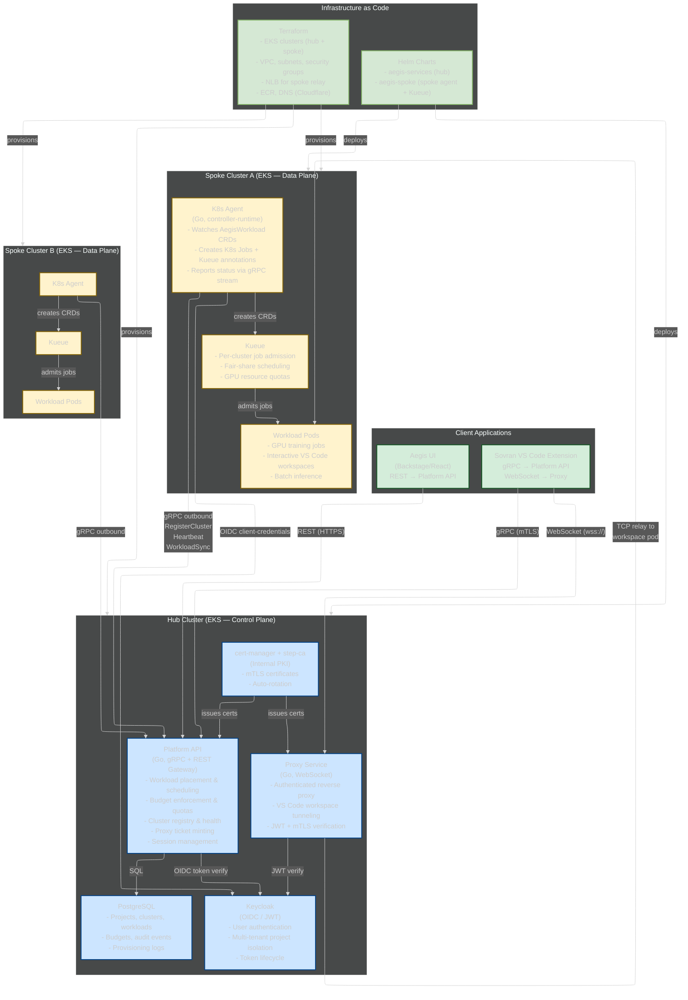

# Aegis Side Project — How to Present It

> **When to use:** If Andy asks about passion projects, side work, or what excites you. Also if the K8s conversation naturally leads to "I actually built my own control plane." This is your ACE — use it to show depth and initiative, but keep it brief unless Andy probes.

---

## The 60-Second Pitch (memorize this)

"On my own time, I've been building Aegis — a multi-cluster Kubernetes control plane for GPU workload orchestration in regulated environments. Hub-and-spoke architecture written in Go: the hub handles scheduling, budget enforcement, and compliance controls. Spoke clusters run the actual GPU workloads with a K8s operator I wrote using controller-runtime. gRPC for all service-to-service communication, mTLS for security, Helm charts for deployment, Terraform for AWS infrastructure. FedRAMP High and NIST eight-hundred-one-seventy-one compliance baked in from the start — Iron Bank base images, audit logging, session management. Even built a VS Code extension so engineers can connect to remote GPU workspaces through authenticated WebSocket tunnels. Nobody asked me to build it — I saw the problem from my DoD work and wanted to solve it properly."

---

## Architecture Overview

---

## What to Know for Each Component (Level 1-4)

### Platform API (the brain)

| Level | If Andy asks | You answer |
|-------|-------------|-----------|
| 1 | "What does the API do?" | "Central orchestration — receives workload requests, decides which spoke cluster to place them on based on GPU availability and health, enforces budget limits, manages cluster registry." |
| 2 | "What's it built in?" | "Go with gRPC for service-to-service and a REST gateway for the UI. Protocol buffers define the service contracts — auto-generated Go bindings. PostgreSQL for state. FIPS-compliant via boringcrypto for Iron Bank certification." |
| 3 | "How does placement work?" | "When a workload request comes in, the API checks: which spoke clusters have the right GPU flavor available, which have fresh heartbeats (meaning they're healthy), and which are within the project's policy domain — region and classification level. It picks the best match and sends the workload spec to that spoke's agent via gRPC stream." |
| 4 | "What happens if a spoke goes down?" | "The agent sends heartbeats every 30 seconds. If the hub misses three heartbeats, the cluster is marked unhealthy — no new workloads placed there. Existing workloads keep running because the spoke operates autonomously. When the spoke reconnects, it re-syncs state with the hub." |

### K8s Agent (the spoke operator)

| Level | If Andy asks | You answer |
|-------|-------------|-----------|
| 1 | "What's the agent?" | "A Go binary running on each spoke cluster as a K8s operator. It watches for AegisWorkload custom resources and reconciles them into actual K8s Jobs with Kueue annotations for fair-share scheduling." |
| 2 | "How does it connect to the hub?" | "OUTBOUND only — the agent initiates a gRPC connection to the hub's API. Registers the cluster, sends heartbeats, receives workload assignments. The hub NEVER reaches into the spoke. This is the key architectural decision — zero inbound firewall rules on the spoke network." |
| 3 | "Why outbound-only?" | "In DoD environments, opening inbound ports triggers a months-long process: network change request, risk assessment, ATO impact review. With outbound-only, you deploy the spoke Helm chart and the agent calls out — no firewall changes, no security review, no ATO reassessment. For multi-site deployments, that's the difference between 5 Helm installs vs 5 separate network approval processes." |
| 4 | "What's controller-runtime?" | "It's the Go framework for building K8s operators. You define a custom resource (AegisWorkload CRD), write a reconciler that watches for changes to that resource, and controller-runtime handles the event loop, caching, and leader election. When the hub sends a workload, the agent creates an AegisWorkload CR — the reconciler picks it up, creates a K8s Job with Kueue queue annotations, and watches until it's running or failed." |

### Hub-and-Spoke Architecture (the key differentiator)

| Level | If Andy asks | You answer |
|-------|-------------|-----------|
| 1 | "Why hub-and-spoke?" | "Decouple control plane from compute. Hub handles scheduling and policy, spokes handle workloads. Spokes can be in different regions, different classification levels, different networks." |
| 2 | "How's that different from just K8s federation?" | "Federation shares API access across clusters — every cluster can see every other. Hub-and-spoke is hierarchical: hub knows about all spokes, spokes only know about the hub. Simpler security model, easier to reason about data flow, and the hub is the single point of policy enforcement." |
| 3 | "Why does this matter for classified environments?" | "Each spoke can sit in a different classification boundary. The hub never needs to reach into the spoke — the spoke calls out. So you can have an IL-4 spoke, an IL-5 spoke, and a commercial spoke all managed by one hub, with policy domains controlling which workloads go where. No cross-classification data flow." |
| 4 | "What happens if the hub goes down?" | "Spokes operate autonomously. Running workloads keep running — the agent is a K8s operator, it doesn't need the hub to reconcile existing CRDs. New workload requests queue until the hub recovers. Heartbeats stop, so the hub marks spokes as 'unknown' when it comes back — then re-syncs. Designed for DDIL: denied, disrupted, intermittent, limited connectivity." |

### Compliance-First Design

| Level | If Andy asks | You answer |
|-------|-------------|-----------|
| 1 | "What compliance?" | "FedRAMP High and NIST eight-hundred-one-seventy-one baked in from the start. Session management, audit logging, budget enforcement, policy domain isolation." |
| 2 | "What does 'baked in' mean?" | "Every API call is audit-logged with user identity, timestamp, resource affected. Sessions have idle timeouts and forced re-auth — AC-11 and AC-12 controls. Budget enforcement prevents over-spending on GPU hours. Policy domains restrict which regions and classification levels a project's workloads can touch." |
| 3 | "How do you handle Iron Bank?" | "Base images are UBI9-minimal from Iron Bank — hardened RHEL containers. Go compiles with boringcrypto for FIPS-validated crypto. Images are scanned, signed, and pushed to ECR. No public images, no Docker Hub pulls." |

---

## The Outbound-Only Architecture — Why It's Brilliant

This is the single most impressive architectural decision in Aegis. If Andy understands DoD networks, this will CLICK immediately.

**The problem:** Every other GPU platform (Run:ai, Kubeflow, Domino) requires INBOUND firewall rules on the spoke network. In DoD, opening inbound ports triggers:
1. Network change request (weeks)
2. Risk assessment (weeks)
3. ATO impact assessment (could trigger full reassessment)
4. Firewall rule implementation (coordinated across teams)
5. Ongoing monitoring and justification

**Your solution:** The spoke initiates ALL connections. The agent makes an OUTBOUND gRPC call to the hub. Outbound HTTPS (port 443) is already allowed on virtually every network. No firewall changes. No security review. No ATO impact.

**For multi-site:** 5 DoD sites with inbound requirements = 5 separate network approvals. With Aegis = 5 Helm installs. Done.

**How to explain to Andy:**
"The key architectural decision is outbound-only spoke connectivity. Every other platform requires inbound firewall rules on the spoke — in DoD, that's a months-long approval process per site. With Aegis, the spoke calls out to the hub over standard HTTPS. No inbound rules, no network changes, no ATO impact. For five sites, that's five Helm installs instead of five network approval processes."

---

## What to Study (to go Level 4 deep)

Read these files in your codebase if you have time:

| File | What it teaches you | Priority |
|------|-------------------|----------|
| `README.md` | Architecture overview, component table | HIGH — read first |
| `docs/networking-architecture.md` Sections 1-3 | Hub-and-spoke topology, outbound-only rationale, zero-trust model | HIGH — the killer differentiator |
| `docs/k8s-crd-and-controller-reference.md` | How AegisWorkload CRDs work, reconciler flow | MEDIUM — if Andy asks about the operator |
| `docs/keycloak-auth-readme.md` | OIDC flow, token lifecycle, how auth works | MEDIUM — if Andy asks about security |
| `charts/aegis-services/` | Hub Helm chart — see what gets deployed | LOW — only if you want to see the Helm structure |
| `terraform/README.md` | What Terraform provisions | LOW — skim for awareness |

---

## Bridging to Anduril

"The hub-and-spoke pattern I built for Aegis is directly applicable to what you're doing. If you're deploying to multiple air-gapped sites via diode, each site is a spoke — runs autonomously, calls out when connectivity exists. The hub manages scheduling and policy centrally. The outbound-only design means no inbound firewall rules on the classified side — the spoke just calls out. And the whole thing is Helm-deployed, Terraform-provisioned, compliance-first. If you ever need multi-site orchestration for your programs, this is the architecture."

---

## What NOT to Get Into (unless specifically asked)

- Database schema details (15 migrations, table structures)
- NIST control specifics (AC-11, AC-12, AU-2)
- Pulumi vs Terraform for spoke provisioning
- VS Code extension internals (Sovran)
- Backstage UI plugin architecture
- Kueue fair-share algorithms
- WebSocket tunneling protocol details
