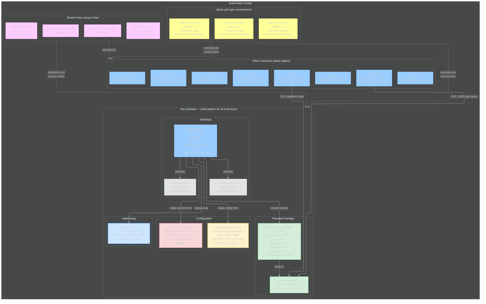

# Architecture Practice: IBM Helm Migration

## Exercise: Draw and Narrate

**Instructions:**
1. Draw the BEFORE state, the migration plan, and the AFTER state
2. Narrate as if Andy asked: "Have you migrated a team to Kubernetes before?"
3. Time yourself: 8-10 minutes for the full story

---

## Coaching: How to Present This

### Opening Line
"At IBM Federal, I inherited a dev tool platform running on Docker Compose and Swarm — nine services serving six hundred users, deployed through Makefiles, Python scripts, shell scripts, and a custom templating engine called Gomplate. Five layers of indirection, no rollback, no drift detection. I led the migration to Kubernetes with Helm charts, cut release prep forty percent, and hardened it to STIG/FIPS baselines."

### Drawing Order

**Step 1 — Draw the BEFORE (top half of whiteboard):**

Draw two big boxes side by side:

Left box — **"Config Layer":**
- Inside: Git Repo, values.yaml, config files, templates
- All feed into a box labeled "Gomplate (custom templating)"
- Gomplate outputs to "make command"

Right box — **"Build Layer":**
- "make command" is the central node (big, draw it prominent)
- Branching off make: Makefiles, Shell scripts, Python scripts
- All feed down into "docker-compose / docker stack deploy"

Below both — **"Docker Swarm":**
- Draw a box with the 9 services inside: Jira, Bitbucket, Confluence, Jenkins, Artifactory, Crowd, Accounts-API, Mailman, HTTPD-UI
- Write "600+ users" next to it

Draw a dotted line from the services back up to make — label it "manual monitoring (docker logs)"

Write pain points on the side:
- No rollback — if deploy fails, SSH in and fix manually
- No drift detection — running state might not match code
- Gomplate is custom — nobody else uses it
- Five layers of indirection — config change touches everything
- Every release = multi-hour manual checklist

Say: "This is what I inherited. A single Git repo, per-service configs and templates that feed through Gomplate — a custom templating engine nobody outside this team uses. Gomplate generates config files that feed into the make command, which is the single entry point for everything. Make triggers per-service Makefiles, Python scripts, and shell scripts, which eventually call docker-compose up or docker stack deploy. Five layers of indirection before a container starts. Nine services, six hundred users, no rollback, no drift detection. If something broke, you'd docker-log your way through, trace back through the scripts, and fix by hand."

**Step 2 — Draw the AFTER (bottom half — two parts: the K8s architecture + the workflow):**

This step has two pieces. First draw what each service BECAME in K8s (the architecture), then draw the workflow (how developers and CI/CD interact with it).

**Step 2a — The K8s Architecture (what each service looks like):**

Draw the K8s architecture showing what each service became — use Jira as the detailed example:



Say: "Each service became the same pattern in Kubernetes. Take Jira: a Deployment defines the container image, replicas, resource limits, and health checks — liveness and readiness probes that didn't exist in Swarm. A Service gives it a stable DNS name so other services find it without hardcoded IPs — replaces Compose's depends_on. A ConfigMap holds the non-sensitive config that used to be in Gomplate templates. A Secret holds passwords and license keys — no more plain text in env files. And a PersistentVolumeClaim for data that survives pod restarts — this was the hardest part for stateful services like Jira and Bitbucket.

I built a shared library chart with common templates — health checks, resource limits, standard labels — so every service chart inherits the same patterns. No copy-paste between charts."

**The Compose-to-K8s translation (know this for when Andy asks "how did you actually make it work?"):**

| Docker Compose field | K8s equivalent | Notes |
|---------------------|----------------|-------|
| `image:` | Deployment `.spec.containers[].image` | Same image, just referenced differently |
| `ports:` | Service (ClusterIP or NodePort) | Service provides stable DNS name + load balancing |
| `volumes:` | PersistentVolumeClaim + PersistentVolume | Hardest part — need StorageClass, reclaim policy |
| `environment:` | ConfigMap (non-sensitive) + Secret (sensitive) | Replaces .env files and Gomplate substitution |
| `depends_on:` | Not needed — K8s services use DNS discovery | `jira` calls `postgres-jira.default.svc.cluster.local` |
| `restart: always` | Default in K8s (restartPolicy: Always) | Plus health checks that Swarm didn't have |
| `deploy.replicas:` | Deployment `.spec.replicas` | Same concept, but K8s adds HPA for auto-scaling |
| `deploy.resources:` | Deployment `.spec.containers[].resources` | requests + limits — K8s enforces these, Swarm didn't |

**What was hardest:**
"Persistent storage for stateful services. In Compose, a named volume is one line. In K8s, it's a PersistentVolumeClaim bound to a PersistentVolume with the right StorageClass and reclaim policy. Wrong reclaim policy and you lose the database on pod restart. I had to design the storage layer carefully — Retain policy for production databases, Delete for ephemeral test data. And migrating existing Jira data from Docker volumes into K8s PVs without downtime required a data sync script I wrote specifically for the migration."

**Step 2b — The Workflow (how developers and CI/CD interact):**

Draw the workflow flow:

```
[Developer] → [Git Repo] → [Helm Charts] → [CI/CD Pipeline] → [Dev Cluster] → [Test Cluster]
                             values.yaml     build/lint/          auto-deploy     promote
                             per env         test/package
```

Say: "The workflow is clean now. Developer clones, modifies Helm chart values, runs helm lint and helm template locally to validate, pushes to Git. CI/CD triggers on push — builds the image, lints the chart, packages it, deploys to the dev cluster automatically. After tests pass on dev, promote to the test cluster. Production promotion is a single helm upgrade command with the production values file."

**Step 3 — Draw the migration plan (side or separate area):**

```
[1. Planning] → [2. Service Migration] → [3. Testing] → [4. Training]
 2 weeks          18 weeks (2/service)     parallel        2 weeks
 standards        service by service       per service     brown-bags
 chart template   controlled blast         + full stack    runbooks
 shared library   radius                   at milestones
```

Say: "Four phases. Two weeks upfront defining Helm chart standards — chart structure, naming conventions, the shared library chart. Then eighteen weeks migrating one service every two weeks — Mailman first as the simplest pilot to prove the process, then Accounts-API, then the bigger ones like Jira and Bitbucket. Each service got two weeks: first week writing the chart and converting configs, second week testing — unit tests on Helm template output, integration tests for that service, then a stack test to make sure it works with everything else. Full system tests at major milestones. Final two weeks were training — brown-bag sessions, runbooks, self-healing guides so ops could handle eighty percent of incidents without me."

### What to Emphasize
1. **The before state mirrors Anduril** — "Your Podman Compose and manual deploys? That's exactly where IBM was."
2. **Service-by-service, not big-bang** — "I never migrated everything at once. Two weeks per service, tested at every layer, validated before moving on."
3. **40% release prep reduction** — concrete metric
4. **600+ users never went down** — migration happened under live production
5. **Team training** — "I didn't just migrate and leave. Brown-bag sessions, runbooks, self-healing docs — eighty percent of incidents could be resolved without me."

### Component Deep-Dive Prep

**Helm Charts — study these concepts:**
- Chart structure: Chart.yaml, values.yaml, templates/, helpers
- Values override chain: default → per-environment → per-release
- Hooks: pre-install, post-install, pre-upgrade (used for DB migrations)
- Dependencies: how charts depend on other charts (requirements.yaml / Chart.yaml dependencies)
- Library charts: shared templates across services
- helm template (dry-run render), helm lint (validation), helm diff (show changes)
- helm rollback: how it works (reverts to previous release revision)

**CI/CD Pipeline — study these concepts:**
- Jenkins declarative pipeline (Jenkinsfile in YAML): stages, steps, post actions
- Build agents for running pipeline jobs
- Artifact storage: pushing Helm packages to a chart repo (Artifactory in our case — we used our own Artifactory instance as the Helm chart repository)
- Test harnesses at each stage:
  - **Unit:** `helm template` output validation — does the rendered YAML match expected output?
  - **Integration:** `helm install` to dev cluster — does the service start, pass health checks, connect to its database?
  - **System:** full 9-service stack test — do all services work together? Can a user log into Jira via Crowd SSO?
  - **UAT:** manual validation by the ops team before production promotion

**Why Jenkins (if asked):** "We had Jenkins as one of the nine services — it was already running on the platform for the engineering teams' builds. I leveraged the same Jenkins for the platform's own CI/CD pipeline. It made sense because we were already managing it, and the team knew how to write Jenkinsfiles."

**Why 2 weeks per service?**
"Each service has its own complexity — Jira has custom plugins and a complex database schema, Bitbucket has hundred-gig git repositories that need persistent storage, Artifactory has dependency chains where other services pull from it. Two weeks gives you one week to write the chart, convert configs, and handle service-specific quirks, and a second week to test at every layer. Trying to rush it into one week would mean cutting testing — and with six hundred users on the line, that's not acceptable."

**The 9 Services — know them:**
| Service | What It Does | Migration Notes |
|---------|-------------|-----------------|
| Bitbucket | Git hosting | Needed persistent volume for repos |
| Jira | Issue tracking | Complex config, custom plugins |
| Confluence | Wiki/docs | Large persistent storage |
| Jenkins | CI/CD | Pipeline configs as code |
| Artifactory | Artifact registry | Critical — other services depend on it |
| Accounts-API | User management | Custom app, needed health checks |
| Crowd | SSO/directory | Replaced later by Keycloak |
| Mailman | Email lists | Simple service, migrated first as proof |
| HTTPD-UI | Web frontend | Nginx-based, straightforward |

### Tradeoffs to Know

**"Why Helm over Kustomize?"**
"Helm gives us packaging — a chart is a self-contained artifact you can version, share, and deploy. Kustomize patches existing YAML but doesn't package it. For nine services with shared patterns, Helm's templating and library charts saved us from maintaining nine separate Kustomize bases."

**"Why two weeks per service?"**
"Each service has real complexity — Jira has custom plugins and database schemas, Bitbucket has hundred-gig git repos needing persistent storage, Artifactory has dependency chains. Two weeks gives one week to write the chart and convert configs, one week to test at every layer. Rushing into one week means cutting testing with six hundred users on the line."

**"Why not just Docker Compose to Docker Compose with better scripts?"**
"Compose doesn't give you orchestration — no auto-restart, no rolling updates, no resource limits, no health checks. K8s with Helm gives us all of that plus declarative state. The gap between 'working Compose' and 'reliable production' was what kept causing outages."

**"Why define Helm standards FIRST (the 2-week planning phase)?"**
"Because without standards, every chart looks different. The first thing I did was define: chart directory structure, naming conventions, how values.yaml is organized, which labels every resource gets, and the shared library chart with common patterns. This way, when the team starts working on their charts, everyone follows the same template. I saw what happens without this at the start — the first few services had duplicated patterns, inconsistent naming, different approaches to health checks. We refactored into the library, but it cost rework. Standards first, then execution."

**"What would you change?"**
"Honestly, I'd have started with the shared library chart during the planning phase instead of building it after the first few services revealed the pattern. We duplicated templates across Mailman, Accounts-API, and Crowd before I said 'wait, these all look the same — let me extract the common parts.' Starting with the library from day one would have saved a couple weeks of refactoring."

---

## K8s Fundamentals — Know These Mechanics Cold

> Andy will probe deeper than "we used Deployments." You need to explain HOW each K8s resource works, WHY you chose it, and what alternatives exist. Study this section until you can explain each concept without notes.

### Deployments + Probes

**What is a Deployment?**
A Deployment is a K8s resource that manages a set of identical pods. You declare: which container image, how many replicas, resource limits, and health checks. K8s ensures that many pods are always running. If one crashes, K8s replaces it. If you update the image, K8s does a rolling update — replacing pods one at a time so there's zero downtime.

**Liveness Probe vs Readiness Probe — what's the difference?**

| | Liveness Probe | Readiness Probe |
|-|---------------|----------------|
| **Question it answers** | "Is this container still alive?" | "Is this container ready to receive traffic?" |
| **What happens if it fails** | K8s KILLS the container and restarts it | K8s REMOVES it from the Service's endpoint list (stops sending traffic) but doesn't kill it |
| **Use case** | Detect deadlocks — app is running but stuck | Detect startup delay — app is booting, loading data, not ready yet |
| **Example for Jira** | `httpGet /healthz` — if Jira process hung, probe fails, container restarts | `httpGet /ready` — Jira takes 30+ seconds to load plugins. During that time, readiness fails so no traffic is sent to a half-started Jira |
| **Why Swarm didn't have this** | Swarm restarts on crash but can't detect a deadlocked process. No readiness concept at all — traffic hits containers immediately, even during startup |

**How to explain to Andy:**
"Liveness answers 'is it alive?' — if not, K8s kills and restarts it. Readiness answers 'is it ready for traffic?' — if not, K8s stops routing to it but doesn't kill it. Jira takes thirty-plus seconds to boot and load plugins. Without readiness, users would hit a half-started Jira and get errors. With readiness, K8s waits until the probe passes before sending traffic. Swarm had neither — containers got traffic the instant they started, even if the app wasn't ready."

### ConfigMaps vs values.yaml — Why Both?

**Why can't everything just be in values.yaml?**
values.yaml is a HELM concept — it defines variables for the chart TEMPLATE. ConfigMap is a KUBERNETES concept — it's an actual resource inside the cluster that pods read at runtime.

The flow:
1. `values.yaml` defines: `jira_db_host: postgres-jira`
2. Helm template generates: a ConfigMap YAML with `DB_HOST: postgres-jira`
3. `helm install` creates the ConfigMap as a real K8s resource
4. The Jira pod mounts the ConfigMap as environment variables or a file

**Why not just hardcode configs in the Deployment?**
Because configs change between environments. values.yaml says `jira_db_host: dev-postgres` in dev and `jira_db_host: prod-postgres` in production. The TEMPLATE is the same — only the values change. ConfigMap is where those values LIVE inside the cluster after Helm renders them.

**How to explain to Andy:**
"values.yaml is the input — what changes between environments. ConfigMap is the output — the actual K8s resource that pods read at runtime. Helm takes values.yaml, renders the template, and creates a ConfigMap inside the cluster. The pod then mounts that ConfigMap as environment variables. This replaces Gomplate entirely — Helm's templating does the same variable substitution, but it's industry-standard and the ConfigMap is tracked as a K8s resource, so you can see it, diff it, and roll it back."

### Services — Types and DNS

**What is a K8s Service?**
A Service gives a set of pods a stable network identity — a DNS name and IP that doesn't change even when pods restart or move to different nodes. Without it, you'd have to track individual pod IPs that change constantly.

**Service types:**

| Type | What it does | When to use |
|------|-------------|-------------|
| **ClusterIP** (default) | Internal-only IP. Only reachable from inside the cluster. | Service-to-service communication. Jira calling its PostgreSQL database. Most common type. |
| **NodePort** | Exposes the service on a port on every node (30000-32767). Reachable from outside the cluster via `<any-node-ip>:<nodeport>`. | Dev/testing when you need external access without a load balancer. Air-gapped environments where there's no cloud LB. |
| **LoadBalancer** | Creates an external load balancer (cloud provider specific — AWS ALB/NLB, GCP LB). | Production external access in cloud environments. |
| **Headless** (clusterIP: None) | No ClusterIP assigned. DNS returns individual pod IPs. | StatefulSets where each pod needs a unique identity (database replicas). |

**How DNS works in K8s:**
Every Service gets a DNS entry automatically: `<service-name>.<namespace>.svc.cluster.local`
- Jira calls `postgres-jira.default.svc.cluster.local` to reach its database
- Or just `postgres-jira` if they're in the same namespace (short name works)
- This replaces Docker Compose's `depends_on` — services find each other by name, not IP
- CoreDNS (running in kube-system namespace) handles all resolution

**How to explain to Andy:**
"In Compose, services find each other through depends_on and Docker's internal DNS. In K8s, every Service gets a DNS name automatically — jira just calls postgres-jira and K8s resolves it. No hardcoded IPs, no depends_on ordering. If the postgres pod restarts on a different node with a different IP, the Service DNS name still works because the Service tracks the pod by label selector, not by IP."

### Persistent Storage — PVCs, PVs, and Scaling

**The relationship: PVC → PV → Storage Backend**

```
[Pod] → mounts → [PersistentVolumeClaim (PVC)] → binds to → [PersistentVolume (PV)] → backed by → [Storage]
         |              "I need 50Gi"                  "Here's 50Gi"                    NFS / EBS / hostPath
         |                                                                                   / Ceph / etc.
```

- **PVC (PersistentVolumeClaim):** the REQUEST. "I need 50Gi of storage with ReadWriteOnce access." The pod declares this.
- **PV (PersistentVolume):** the PROVISION. "Here's a 50Gi volume backed by NFS at server:/exports/jira." The admin or StorageClass creates this.
- **StorageClass:** automates PV creation. Instead of an admin manually creating each PV, the StorageClass says "when someone requests storage, automatically provision it from this backend." Dynamic provisioning.
- **Binding:** K8s matches a PVC to an available PV that meets its requirements (size, access mode, storage class). Once bound, that PV belongs to that PVC until released.

**Reclaim Policies (critical — this is what makes or breaks data safety):**

| Policy | What happens when PVC is deleted | Use case |
|--------|--------------------------------|----------|
| **Retain** | PV and its data are KEPT. Admin must manually clean up. | Production databases. Jira data, Bitbucket repos. Never auto-delete production data. |
| **Delete** | PV and its backing storage are DELETED automatically. | Ephemeral test data. Dev environments where data doesn't matter. |
| **Recycle** (deprecated) | PV is wiped (rm -rf) and made available again. | Don't use — deprecated. |

**How to explain storage scaling to Andy (hundreds of GBs to TBs):**

"For the IBM migration, most services needed tens of gigabytes — Jira at fifty gig, Bitbucket at a hundred gig for git repos, Confluence at fifty. But the pattern scales the same way for terabytes. The key decisions are:

First, the storage backend. For on-prem — which is what matters for Anduril — you'd use NFS for shared storage that multiple pods can read, or a distributed storage system like Ceph or Longhorn for higher performance. For cloud, EBS gives you block storage per pod, EFS gives you shared. The choice depends on whether the service needs shared access (multiple pods reading the same data) or dedicated access (one pod owns it).

Second, StorageClass handles dynamic provisioning — you don't pre-create PVs for every service. The StorageClass defines: which provisioner (NFS, Ceph, EBS), what parameters (IOPS, encryption), and what reclaim policy. When a PVC requests 500Gi, the StorageClass automatically provisions it.

Third, for real scale — terabytes, high IOPS — you'd use StatefulSets instead of Deployments. A StatefulSet gives each pod its own PVC that follows it across restarts and reschedules. Database clusters (PostgreSQL replicas, Elasticsearch nodes) use this pattern. Each replica gets its own volume, its own stable hostname, and ordered startup.

Fourth, backup and recovery. PVs need a backup strategy independent of K8s — typically VolumeSnapshots (K8s-native) or external backup tools that snapshot the underlying storage. For the IBM migration, I set up a nightly snapshot job for all production PVs."

**Data migration from Docker volumes to K8s PVs (the hardest part):**

"The existing services had data in Docker volumes — Jira's database, Bitbucket's git repos, Confluence's pages. I couldn't just delete that data and start fresh — six hundred users' work was in there. The migration process for each stateful service was:

1. Create the PV and PVC in K8s with the right size and Retain policy
2. Mount the PV to a temporary migration pod
3. From the Docker host, rsync the Docker volume data into the K8s PV via the migration pod
4. Verify checksums — data integrity check
5. Deploy the service with Helm, pointing to the PVC
6. Validate the service starts and reads the data correctly
7. Keep the old Docker volume as a backup for one release cycle

The tricky part was Bitbucket — a hundred gig of git repos. The rsync took hours. I ran it during a maintenance window on a Saturday, with the old Swarm instance still running as fallback. Once the K8s service came up and users verified their repos were intact, we decommissioned the Swarm instance."

### Shared Helm Library Chart — How It Actually Works

**What is a library chart?**
A Helm library chart is a chart that contains ONLY templates — no deployable resources. It defines common patterns that other charts include and reuse. Think of it like a shared code library but for K8s YAML templates.

**How it works mechanically:**
1. The library chart (e.g., `common-lib`) defines named templates like:
   - `common-lib.deployment` — standard Deployment template with health checks, resource limits, labels
   - `common-lib.service` — standard Service template with ClusterIP, port mapping
   - `common-lib.labels` — standard label set (app, version, env, managed-by)
   - `common-lib.probes` — standard liveness/readiness probes with default timeouts

2. Each service chart (e.g., `jira-chart`) declares the library as a dependency in `Chart.yaml`:
   ```yaml
   dependencies:
     - name: common-lib
       version: "1.0.0"
       repository: "file://../common-lib"
   ```

3. Inside the service chart's templates, it CALLS the library templates:
   ```yaml
   {{- include "common-lib.deployment" . }}
   ```
   This renders the standard Deployment template but with the service's own values (image, replicas, etc.)

4. The service chart's `values.yaml` provides the service-specific values that the library template uses.

**Why this matters:**
"Without the library, every service chart duplicates the same patterns — health check definitions, label standards, resource limit structure. Nine services means nine copies of the same boilerplate. With the library, I define the pattern once, and every chart inherits it. If I need to change how health checks work — say, increase the timeout — I change it in the library and every service gets the update on next deploy."

**How to explain to Andy:**
"The shared library chart is like a base class. It defines common templates — Deployment structure, Service definition, standard labels, probe defaults. Each service chart inherits from it and just provides its own values: image name, port, storage size. If I need to update a pattern across all nine services — like adding a new standard label or changing probe timeouts — I change the library once, bump the version, and every chart picks it up."

### values.yaml — What Can It Contain?

**values.yaml is NOT just for environments.** It's the entire configuration surface of a Helm chart. It can contain:

- **Environment-specific:** DB_HOST, replicas, resource sizes (these change per env)
- **Service-specific:** image name, port, volume size, feature flags (these are constant across environments)
- **Operational:** log level, debug mode, maintenance mode flags
- **Integration:** URLs to other services, API keys (via reference to Secrets)
- **Chart behavior:** enable/disable optional components, toggle features

**The override chain (higher overrides lower):**
1. Library chart defaults (lowest priority)
2. Service chart's `values.yaml` (service-specific defaults)
3. Environment-specific values file (`values-prod.yaml`) — passed with `-f` flag
4. Command-line overrides (`--set replicas=3`) (highest priority)

**How to explain to Andy:**
"values.yaml is the full configuration surface — not just environment differences. The service chart's default values.yaml defines everything: image, ports, storage, feature flags. Then environment-specific files override just what changes — replicas, resource sizes, database hosts. Helm merges them with a clear precedence chain. This is what replaced Gomplate — same variable substitution concept, but standard tooling with a clear override order."

### Bridging to Anduril
"Your setup today — Podman Compose files, manual deploys, Makefiles maybe — that's exactly where IBM was when I started. The path I'd propose is the same: define standards, pick a pilot service, convert to Helm, validate, then service by service. With your pace, we could have the first service migrated in two weeks, and if it doesn't add value, we stop. No big-bang risk."

---

## Deep Understanding: Know This Cold

> If you can't answer these questions conversationally, you can't survive Andy's probing. Study this section until you can explain each concept without looking.

### The Config Layer — What Are All These Files?

**Q: What are .tmpl files?**
Template files — config files with placeholder variables like `{{ .Env.DB_HOST }}`. They're NOT the final configs. Gomplate reads these templates and substitutes the variables with real values to produce the actual config files that services use. Think of them as Jinja2 templates but in Gomplate's syntax.

**Q: What are "individual config files per service"?**
Each of the 9 services (Jira, Bitbucket, etc.) had its own config files — like `jira-config.yaml`, `bitbucket-settings.env`, etc. These contained service-specific settings: database URLs, ports, memory limits, feature flags. They were separate from the templates.

**Q: What is `config/local/values.yaml`?**
A single YAML file containing the variables that Gomplate substitutes into the templates. Things like: `DB_HOST: postgres-jira`, `JIRA_PORT: 8080`, `MEMORY_LIMIT: 4g`. Different environments (local, staging) had different values files — but the templates were the same.

**Q: So how does the config flow work?**
1. Templates (.tmpl files) define the STRUCTURE: "database host is {{ .Env.DB_HOST }}"
2. Values (values.yaml) define the DATA: "DB_HOST: postgres-jira"
3. Individual config files provide service-specific overrides
4. Gomplate reads all three, substitutes variables, outputs the FINAL config files
5. These final configs get used by the make/deploy process

**Q: What is Gomplate?**
Gomplate is a command-line template engine — like Jinja2 or Helm's Go templates, but standalone. You feed it a template file + data sources (env vars, YAML, JSON), it substitutes and outputs the result. The problem: it's niche. Nobody outside a few Go projects uses it. No community, hard to debug, hard to hire for. Kapitan (which you used at VivSoft) solves the same problem but with class inheritance and is more widely used in the DoD/platform space.

**Q: How to explain Gomplate if Andy asks:**
"Gomplate is a standalone template engine — think Jinja2 but for Go. You give it template files with placeholders and a data source like a YAML values file, and it outputs the final configs. The problem was it's extremely niche — no community, no IDE support, debugging was manual. When I migrated to Helm, Helm's built-in Go templating replaced Gomplate entirely. Same concept, industry-standard tool."

### The Dev & Config Layer — Where Does This Run?

**Q: Is the "Development & Configuration Layer" a developer's laptop or a server?**
Both. The Git repo lives on a remote server (Bitbucket — they used their own Bitbucket instance for source control). But the config layer (running Gomplate, running make) happens on a developer's local machine OR on a shared build server. There was no proper CI/CD for the Compose/Swarm setup — it was manually triggered.

**Q: What were the environments?**
Three environments, simple separation:
- **Dev (local machines):** Each developer clones the repo, runs `docker-compose up` on their laptop to bring up the services locally. Tests changes against the local stack. Pushes code to Bitbucket when ready.
- **Test (shared environment):** A shared server running the full 9-service stack via Docker Swarm. Used for integration testing and validation before production.
- **Production:** The live environment that six hundred engineers used daily. Same infrastructure as test but separate — production values, production data.

**Q: How did the 2-week release cycle work?**
Releases happened every two weeks on a sprint cadence:
1. **Weeks 1-2:** Development. Changes accumulate in Git. Developers test locally with `docker-compose up`.
2. **End of sprint:** Code freeze. I pull the latest code on the test server, run `make deploy` with test environment values. Gomplate generates the test configs, scripts execute `docker stack deploy`. All nine services come up on the test instance.
3. **Validation (1-2 days):** Team validates — hit each service's web UI, verify integrations work (Jira connects to its database, Bitbucket syncs with Crowd SSO, Jenkins builds trigger correctly). Manual smoke testing.
4. **Production deploy:** After test passes, same process on the production infrastructure. Pull code, run `make deploy` with production values.yaml. Same Gomplate → Makefiles → scripts → `docker stack deploy` chain, just pointing at production.
5. **Verification:** Check all nine services are up — `docker ps`, hit each web UI, verify six hundred users can access everything.
6. **Rollback plan:** If something breaks — revert the Git commit, re-run `make deploy` with the previous code. Not automated, not fast, but it worked. The gap: no revision history on the deployment itself. You had to know WHICH commit to revert to.

**Q: How did `make deploy` know which environment to target?**
The values files. `config/local/values.yaml` for local dev, `config/test/values.yaml` for the test environment, `config/prod/values.yaml` for production. Gomplate reads the right values file based on an environment variable or a make target: `make deploy-test` vs `make deploy-prod`. Same templates, different values — that's the one thing Gomplate did well.

**Q: What was the pain with this release process?**
1. **Manual promotion** — a person had to SSH to the test server, pull code, run make. Then do it again on production. No pipeline, no automation.
2. **No atomic rollback** — reverting meant finding the right Git commit, re-running make, and hoping the same Gomplate configs generated the same output. No `helm rollback` equivalent.
3. **Config drift** — between the time you deployed to test and deployed to production, someone might have changed a config file. No way to detect it.
4. **Downtime risk** — `docker stack deploy` replaces containers one by one, but Swarm's rolling update strategy was basic. No health checks gating the rollout. If the new container crashed, users saw errors until someone noticed and rolled back manually.
5. **Release prep took hours** — manually checking each service, verifying configs, running make targets in order. This is the "forty percent reduction" metric: Helm made this a single command.

**Q: This was for DoD / TRMC — was this production?**
Yes. These nine services (Jira, Bitbucket, Jenkins, etc.) were the development infrastructure for the entire TENA program — six hundred engineers used them daily to write, build, and test code. It wasn't a customer-facing app, but it was production in the sense that if Jira went down, six hundred people couldn't file issues. If Jenkins went down, builds stopped. If Bitbucket went down, nobody could push code. Mission-critical internal tooling for the DoD Test Resource Management Center.

### The Build Layer — How Does It Actually Work?

**Q: What is a Makefile? What are .mk files?**
A Makefile defines "targets" — named commands you can run with `make <target>`. Example: `make deploy-jira` might call a shell script that runs docker-compose for Jira. The main `Makefile` at the repo root is the entry point. `.mk files` are include files — separate Makefiles per service or per concern that get included into the main one. So `jira.mk` has all Jira build targets, `bitbucket.mk` has Bitbucket targets, etc. `make` reads the main Makefile which includes all the .mk files.

**Q: What's a "build target"?**
A named command in a Makefile. Like `deploy-all`, `deploy-jira`, `build-images`, `clean`. You type `make deploy-jira` and it executes the commands defined for that target. The .mk files define per-service targets.

**Q: Why is `make` the central node?**
Because that's how it was designed — `make` was the single entry point for EVERYTHING. Want to deploy? `make deploy`. Want to build images? `make build`. Want to clean up? `make clean`. All roads went through make, which then called Makefiles, which called scripts, which called docker commands. It centralized control but also centralized fragility — if the Makefile broke, nothing worked.

**Q: What did the Python scripts do? Shell scripts?**
- **Python scripts:** config generation (reading values.yaml, producing env files), validation (checking configs before deploy), some data migration scripts
- **Shell scripts (Bash):** deployment glue — `docker-compose up`, `docker stack deploy`, health checks (`curl` the service, check status), log tailing, cleanup. Also rsync for moving files between environments.
- Both were called BY the Makefiles, not directly by developers. The chain: `make deploy-jira` → calls `scripts/deploy-jira.sh` → runs `docker-compose -f jira/docker-compose.yml up -d`

**Q: Was the build triggered by CI/CD or manual?**
**Manual for the Swarm deployment.** A developer or ops person would SSH to the build server, pull the latest code, and run `make deploy`. There was no CI/CD pipeline for the Compose/Swarm setup — that was one of the major problems. After the Helm migration, I set up a CI/CD pipeline that automated everything on git push.

### The Container Runtime — Docker Swarm

**Q: How did docker-compose / docker stack deploy actually work?**
The build chain produced the final config files and then called:
- `docker-compose up -d` for local dev (brings up all services on the developer's laptop)
- `docker stack deploy -c docker-compose.yml <stack-name>` for the shared environment (deploys to Docker Swarm)

The docker-compose.yml files defined: which image to use, which ports to expose, which volumes to mount, environment variables, restart policies. Swarm added basic orchestration: if a container died, Swarm restarted it. But no rolling updates, no health checks, no resource limits.

**Q: Did the build layer CREATE the Compose files, or were they static?**
The Compose files were mostly static — they lived in the Git repo. But Gomplate would substitute variables into them (like the database host, image tag, port numbers). So the TEMPLATE of the Compose file was in Git, Gomplate filled in the values, and then `docker-compose up` ran the result.

**Q: Would Nix have been better than Makefiles?**
Interesting question — if Andy asks this: "Nix solves a different problem. Makefiles orchestrate build steps. Nix provides reproducible builds — guaranteeing the SAME environment everywhere. For IBM's problem, the issue wasn't reproducibility — it was the lack of orchestration, rollback, and drift detection. Nix wouldn't have solved those. What solved them was moving from imperative scripting (Makefiles → scripts → docker) to declarative state management (Helm charts on Kubernetes). That said, if you combine Nix for reproducible image builds WITH Helm for deployment, you get the best of both worlds — which is actually what Anduril does with their Nix-based build system."

### Production and CI/CD — The Gaps

**Q: Where is CI/CD in the before state?**
**It didn't exist for platform deployment.** There was a Jenkins instance (one of the 9 services), but it was used by the engineering teams for THEIR application builds, not for deploying the dev tool platform itself. We maintained and managed Jenkins for the users, but the platform's own deployment was manual: SSH to the server, git pull, run `make deploy-test` or `make deploy-prod`. No pipeline for our own infrastructure, no gates, no automated testing of the platform itself. The 2-week release cycle was entirely human-driven.

After the Helm migration, I set up a CI/CD pipeline that automated: build images → lint charts → package → deploy to dev cluster → test → promote to test cluster. The promotion from test to production became a single `helm upgrade` command with the production values file — not a multi-hour manual process.

**Q: If Andy asks "what CI tool did you use?"**
"We used the CI tooling available on the platform — the migration focused on building the pipeline automation itself: build, lint, package, deploy, test, promote. The tool was less important than establishing the automated promotion path — before, deployment was entirely manual."

**Q: How would you summarize the before vs after release process?**
"Before: two-week sprints, end of sprint someone SSH'd to the test server, pulled code, ran make deploy, manually validated all nine services, then repeated the same process on production. Release prep took hours, rollback was a gamble. After: developer pushes code, pipeline automatically builds images, lints charts, packages, deploys to dev cluster, runs tests. Promotion to test is one command. Promotion to production is one command. Rollback is `helm rollback` to any previous revision. The same release that used to take hours now takes minutes."

---

## Answer Keys

- **Real architecture diagrams:** `ibm-migration-answers.md`
- **How to present this system:** this file's coaching section above
- **Related Anduril scenario:** `anduril-scenarios.md` Scenario 4 (Introduce K8s to Podman team)
