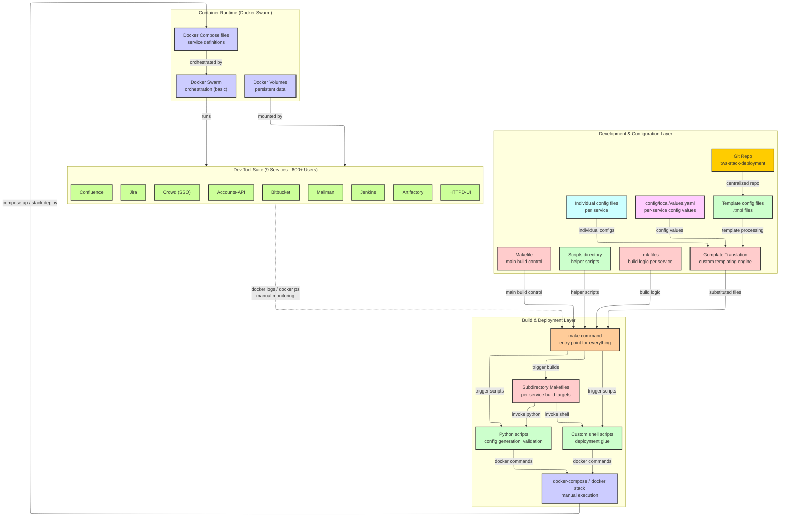
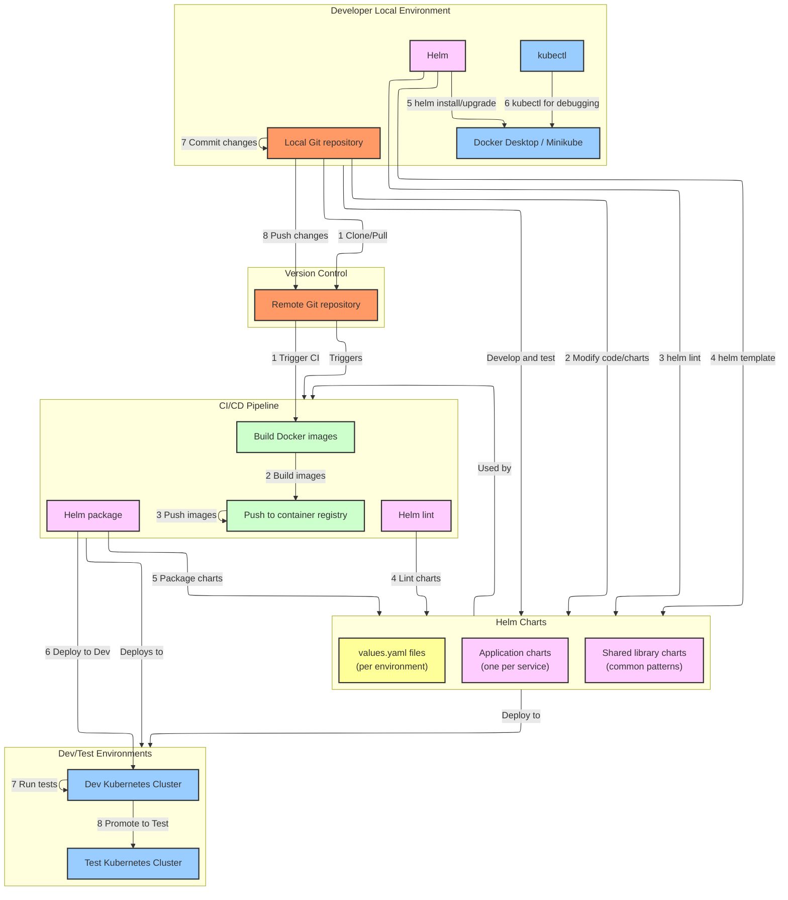
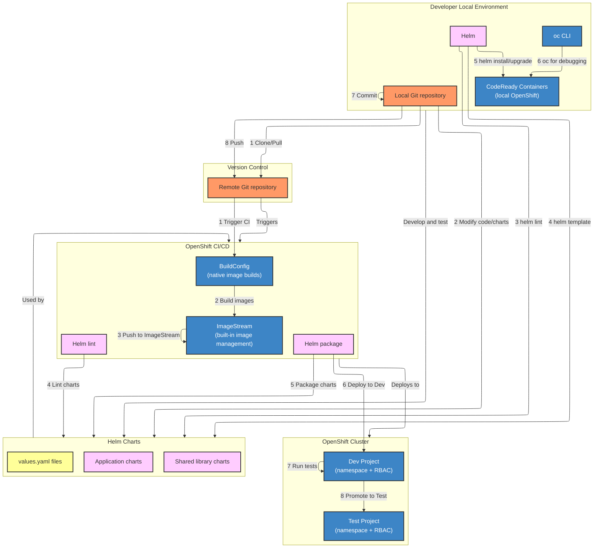

# IBM Helm Migration — Answer Keys (Mermaid Charts)

## 1. BEFORE State: Legacy Deployment System

> **This is the ACTUAL before state.** No Kubernetes, no kubectl. Docker Compose for local dev, Docker Swarm for deployment, Makefiles and scripts for orchestration. The diagram shows the relationships between components — this is what tells the story on a whiteboard.

### What This Diagram Shows (the story it tells)

**Layer 1 — Development & Configuration:** Everything starts in one Git repo. Config values and templates feed into Gomplate — a custom templating engine that nobody outside this team uses. Gomplate generates substituted config files that feed into the make command. Makefiles and .mk files define build logic per service. Helper scripts are scattered in a scripts directory.

**Layer 2 — Build & Deployment:** The `make` command is the single entry point for everything. It triggers subdirectory Makefiles (one per service), which invoke custom shell scripts and Python scripts. These scripts eventually call `docker-compose up` or `docker stack deploy` to push containers to Swarm. Every step is imperative — "do this, then this, then this."

**Layer 3 — Container Runtime:** Docker Compose defines the services. Docker Swarm provides basic orchestration (restart on failure, but no rolling updates, no health checks, no resource limits). Volumes are Docker volumes — not managed, not backed up automatically.

**Layer 4 — The 9 Services:** Jira, Bitbucket, Confluence, Jenkins, Artifactory, Crowd, Accounts-API, Mailman, HTTPD-UI. Six hundred engineers depend on these daily.

**The feedback loop (dotted line):** When something breaks, you `docker logs` and `docker ps` manually, trace back through the scripts, fix, re-run make. No alerting, no drift detection.

### Pain Points to Call Out on the Whiteboard

Write these next to or below the diagram:

1. **No rollback** — Compose/Swarm has no revision history. If a deploy breaks, you manually revert files and re-run.
2. **No drift detection** — what's running might not match what's in Git. Someone could `docker exec` in and change a config.
3. **Gomplate is custom** — custom templating syntax, no community support, hard to hire for, hard to debug.
4. **Five layers of indirection** — Git → Gomplate → Make → Scripts → Docker. A config change touches every layer.
5. **Manual release checklist** — each release requires running make targets in order, checking docker ps, verifying each service. Takes hours.
6. **600+ users at risk** — one bad deploy takes down the entire dev tool suite.

### How to Draw This on a Whiteboard

**Step 1:** Draw two big boxes side by side at the top — "Config Layer" (left) and "Build Layer" (right).

**Step 2:** Inside Config Layer, write: Git Repo, values.yaml, config files, templates, Gomplate. Draw arrows showing how values and templates both feed into Gomplate, and Gomplate feeds into the make command.

**Step 3:** Inside Build Layer, write: make command (big, central), then Makefiles, Shell scripts, Python scripts branching off it. Show make triggers all of them.

**Step 4:** Draw a box below labeled "Docker Compose / Swarm" with arrows from the scripts down to it.

**Step 5:** Draw a box at the bottom labeled "9 Services (600+ users)" and list them.

**Step 6:** Draw a dotted line from the services back up to the make command labeled "manual monitoring (docker logs)" — this shows the painful feedback loop.

**Step 7:** Write pain points in red on the side.

### Narration Script
"This is what I inherited at IBM Federal. A single Git repo with per-service config files and templates. Everything feeds through Gomplate — a custom templating engine — which generates config files that feed into make. The make command is the single entry point: it triggers per-service Makefiles, which invoke Python and shell scripts, which eventually run docker-compose up or docker stack deploy. Five layers of indirection before a container starts. Nine services — Jira, Bitbucket, Confluence, Jenkins, Artifactory, and four others — serving six hundred engineers. No rollback capability. No drift detection. If a deploy failed, you'd SSH in, check docker logs, trace through the scripts, and fix by hand. Every release was a multi-hour manual checklist."

---

## 2. The Bridge: How Docker Compose/Swarm Services Moved to Kubernetes

> **Andy WILL ask this:** "Before you used Helm, how did you actually get the services running on Kubernetes?" This section explains the bridge — the containers already existed, you just changed the orchestration layer.

### The Key Insight to Communicate

"The services were already containerized — Docker images existed for all nine services. The migration wasn't about building containers from scratch. It was about replacing the orchestration layer: going from Docker Compose files and Swarm to Kubernetes manifests managed by Helm."

### What I Actually Did (step by step)

1. **Analyzed the existing Compose files** — each service had a docker-compose.yml defining: image, ports, volumes, environment variables, dependencies, restart policies
2. **Translated Compose definitions to K8s manifests** — for each service:
   - `image:` in Compose → same image reference in K8s Deployment
   - `ports:` → K8s Service (ClusterIP or NodePort)
   - `volumes:` → PersistentVolumeClaim + PersistentVolume
   - `environment:` → ConfigMap or Secret
   - `depends_on:` → not needed in K8s (services discover via DNS)
   - `restart: always` → K8s handles this natively (restartPolicy: Always is default)
3. **Templatized the manifests into Helm charts** — turned hardcoded values into `{{ .Values.x }}` references, created values.yaml per environment
4. **Tested with `helm template`** (dry-run render) → verified output YAML matched what the Compose files produced
5. **Deployed to dev cluster with `helm install`** → validated services came up, connected to each other, and served traffic
6. **Built a CI/CD pipeline** around it — build image → lint chart → package → deploy → test → promote

### How to Explain It to Andy

"The containers already existed — Docker images for Jira, Bitbucket, Jenkins, all of them. The Compose files defined how they ran: ports, volumes, env vars, dependencies. What I did was translate each Compose definition into Kubernetes manifests — a Deployment for the workload, a Service for networking, PersistentVolumeClaims for storage, ConfigMaps for config. Then I templatized those into Helm charts so every environment uses the same template with different values. The hardest part wasn't Kubernetes itself — it was getting the persistent volumes right for stateful services like Jira's database, and making sure the service discovery worked without Compose's depends_on."

### If Andy Probes: "What was hardest about the migration?"

"Stateful services. Jira and Bitbucket have databases that need persistent storage. In Compose, that's just a named volume. In K8s, that's a PersistentVolumeClaim bound to a PersistentVolume, with the right storage class and reclaim policy so data isn't deleted on pod restart. I had to design the storage layer carefully — wrong reclaim policy and you lose the database on upgrade. The other challenge was config management: Compose uses .env files, K8s uses ConfigMaps and Secrets. I built a migration script that converted each service's .env into a ConfigMap YAML, then moved sensitive values to Secrets."

---

## 3. AFTER State: Helm-Based Deployment

> This diagram shows the relationships — how developers interact with Helm charts, how CI/CD flows through the pipeline, how environments connect. This is what the AFTER state looks like and what you draw on the whiteboard as the contrast to the BEFORE.

### What This Diagram Shows (the story)

**Developer Local Environment:** Developer clones the repo, modifies Helm charts locally, runs `helm lint` and `helm template` to validate, then `helm install` to test on Minikube/Docker Desktop. Uses kubectl for debugging. Commits and pushes.

**Version Control → CI/CD:** Push triggers the pipeline. Pipeline builds Docker images, pushes to registry, lints Helm charts, packages them, deploys to Dev cluster, runs tests, promotes to Test.

**Helm Charts (center):** The key differentiator. Application charts (one per service), shared library charts (common patterns like health checks, resource limits), and values.yaml per environment. Everything is templated, versioned, rollbackable.

**Dev/Test Environments:** Separate K8s clusters. Dev gets auto-deployed on every push. Test gets promoted after dev tests pass.

### Key Improvements vs. BEFORE State

| Before (Compose/Swarm) | After (Helm/K8s) |
|------------------------|-------------------|
| Docker Compose + Swarm | Kubernetes + Helm |
| Gomplate (custom templating) | Helm templates (industry standard) |
| Makefiles + Python + Shell scripts | CI/CD pipeline |
| Manual release checklist | Automated: build → lint → test → deploy |
| No rollback | `helm rollback` to any previous revision |
| No drift detection | Helm tracks release state |
| 5 layers of indirection | Push → CI → deploy (3 steps) |
| Hours per release | Minutes per release (40% reduction) |

### How to Draw the AFTER on a Whiteboard

**Step 1 (top left):** Box: "Developer" with Git, Helm, kubectl inside. Arrows to "Helm Charts" and "Git Repo."

**Step 2 (center):** Box: "Helm Charts" — application charts, shared library charts, values.yaml. This is the heart. Draw it prominent.

**Step 3 (top right):** Box: "Git Repo (Remote)." Arrow from developer to Git, arrow from Git triggering CI.

**Step 4 (right):** Box: "CI/CD Pipeline" — build images, push to registry, lint, package, deploy. Show the numbered flow.

**Step 5 (bottom):** Two boxes: "Dev Cluster" → "Test Cluster." CI deploys to Dev, test passes, promote to Test.

**Step 6:** Draw arrows showing how Helm Charts connect to EVERYTHING — developers use them, CI packages them, clusters run them.

Say: "Helm Charts are the center of everything now. One chart per service, shared library for common patterns, values.yaml per environment. Developer pushes, pipeline builds and deploys automatically. Rollback is one command. Release prep went from hours to minutes — forty percent reduction."

---

## 4. OpenShift Migration (Designed + Implemented)

> This was the NEXT evolution — from vanilla K8s/Helm to OpenShift. Shows architectural progression.

### What Changed from K8s/Helm to OpenShift

| K8s + Helm | OpenShift |
|------------|-----------|
| Separate CI for image builds | OpenShift BuildConfig builds natively |
| Manual image registry | ImageStream manages images + promotion |
| Namespaces + manual RBAC | Projects (namespace + RBAC built-in) |
| kubectl | oc CLI (wraps kubectl + OpenShift features) |
| Ingress for routing | Routes (simpler, built-in TLS) |
| Docker Desktop for local | CodeReady Containers (local OpenShift) |

### How to Explain to Andy

"After the Helm migration was stable, I designed and started implementing the next step — moving from vanilla Kubernetes to OpenShift. The Helm charts carried over — same charts, just deployed to OpenShift instead of vanilla K8s. The big wins were: BuildConfig gave us native image builds inside the platform — no separate CI needed for image creation. ImageStreams gave us built-in image promotion — no more manually pushing tags between registries. And Projects gave us namespace-level RBAC out of the box, which mattered for our multi-team setup with six hundred users."

### If Andy Asks: "Did you finish the OpenShift migration?"

"I designed the architecture, built the initial infrastructure — CodeReady Containers for local dev, the first two services migrated as proof of concept — and created the full roadmap for the remaining services. I left before completing the full migration but handed off the plan and the working prototype to the team. The Helm charts didn't change — that was the whole point of using Helm. The charts are platform-agnostic. What changed was the CI/CD layer and how images were managed."
