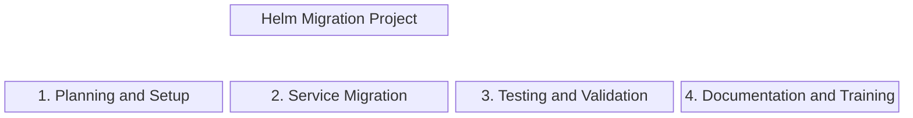
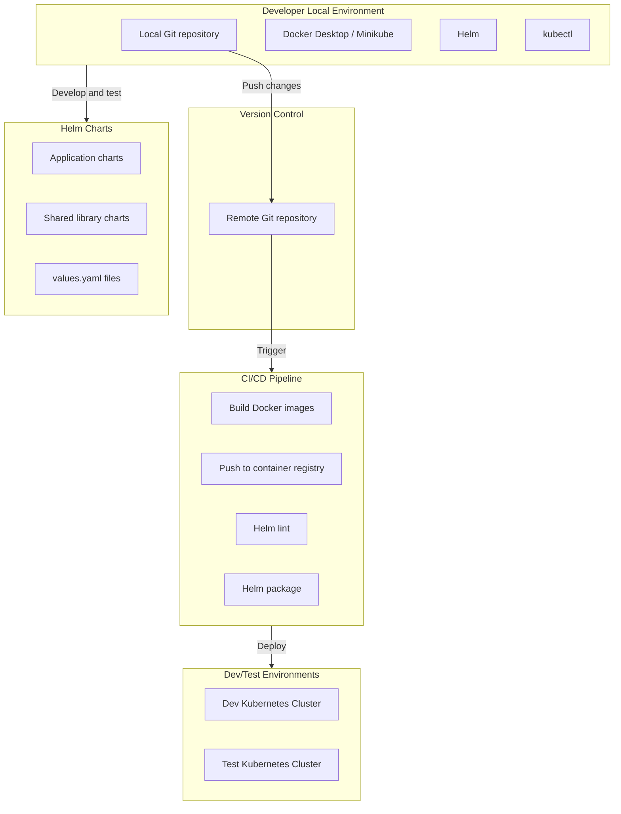
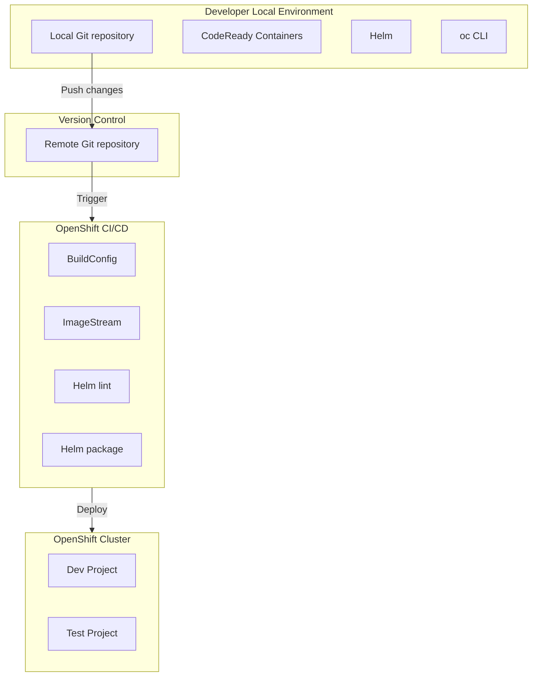

# IBM Helm Migration — Answer Keys (Mermaid Charts)

## 1. BEFORE State: Legacy Deployment System

```mermaid
---
config:
  theme: mc
---
graph TD
subgraph Dev_Config_Layer [Development and Configuration Layer]
    A1[Git repository: tws-stack-deployment]:::git
    A2[config/local/values.yaml]:::values
    A3[Individual configuration files]:::configFiles
    A4[Makefile]:::makefile
    A5[.mk files in 'make' directory]:::makefile
    A6[Scripts in 'scripts' directory]:::scripts
    A7[Template configuration files]:::templates
    A8[Gomplate translation]:::gomplate
end
subgraph Build_Deploy_Layer [Build and Deployment Layer]
    B1[make command]:::make
    B2[Subdirectory Makefiles]:::makefile
    B3[kubectl commands]:::kubectl
    B4[Custom shell scripts]:::scripts
    B5[Python scripts]:::scripts
end
subgraph K8s_Interaction_Layer [Kubernetes Interaction Layer]
    C1[kubectl apply]:::kubectl
    C2[kubectl port-forward]:::kubectl
    C3[kubectl exec]:::kubectl
    C4[kubectl logs]:::kubectl
    C5[kubectl describe]:::kubectl
end
subgraph K8s_Cluster_Layer [Kubernetes Cluster Layer]
    D1[Deployments]:::k8s
    D2[Services]:::k8s
    D3[ConfigMaps]:::k8s
    D4[Secrets]:::k8s
    D5[Pods]:::k8s
    D6[Persistent Volumes]:::k8s
end
Dev_Config_Layer -->|Configuration data| Build_Deploy_Layer
Build_Deploy_Layer -->|kubectl commands| K8s_Interaction_Layer
K8s_Interaction_Layer -->|Kubernetes API calls| K8s_Cluster_Layer
```

**Key pain points in the BEFORE state:**
- Docker Compose for local dev, Swarm for some deployments
- Gomplate templating for config generation — brittle, custom syntax
- Makefiles invoking Python scripts invoking shell scripts invoking kubectl — deeply nested
- No version control on deployment state — couldn't rollback
- No drift detection — manual verification only
- Each release was a manual checklist across 9 services
- 600+ users depending on these tools daily

---

## 2. Migration Plan (4 Phases)

**Phase 1: Planning and Setup (2 weeks)**
- Define scope: 9 services (Bitbucket, Jira, Confluence, Artifactory, Accounts-API, Crowd, Mailman, HTTPD-UI, Repository-postgres)
- Set up Helm environment, create chart template structure
- Define coding standards and naming conventions

**Phase 2: Service Migration (9 weeks)**
- One service per week: convert values → configure templates → assign variables → manage dependencies → test individual → test whole stack
- Service-by-service approach = controlled blast radius

**Phase 3: Testing and Validation (parallel with Phase 2)**
- Unit testing per chart, integration testing across services, system testing, UAT

**Phase 4: Documentation and Training (final 2 weeks)**
- Update tech docs, create user guides, train developers, train ops team

---

## 3. AFTER State: Helm-Based Deployment

**Key improvements in the AFTER state:**
- Helm charts for all 9 services — declarative, versioned, rollbackable
- CI/CD pipeline: build → lint → package → deploy → test → promote
- Shared library charts for common patterns
- values.yaml per environment — no more Gomplate
- Jenkins pipelines replaced Makefiles — 35% reduction in build failures
- Release prep cut ~40%

---

## 4. OpenShift Migration (Designed + Implemented)

**Key differences from Helm/K8s:**
- OpenShift BuildConfig replaces Jenkins for image builds
- ImageStream provides built-in image management and promotion
- Projects (namespaces with RBAC) replace manual namespace management
- oc CLI wraps kubectl with OpenShift-specific commands
- Routes replace Ingress for external access
