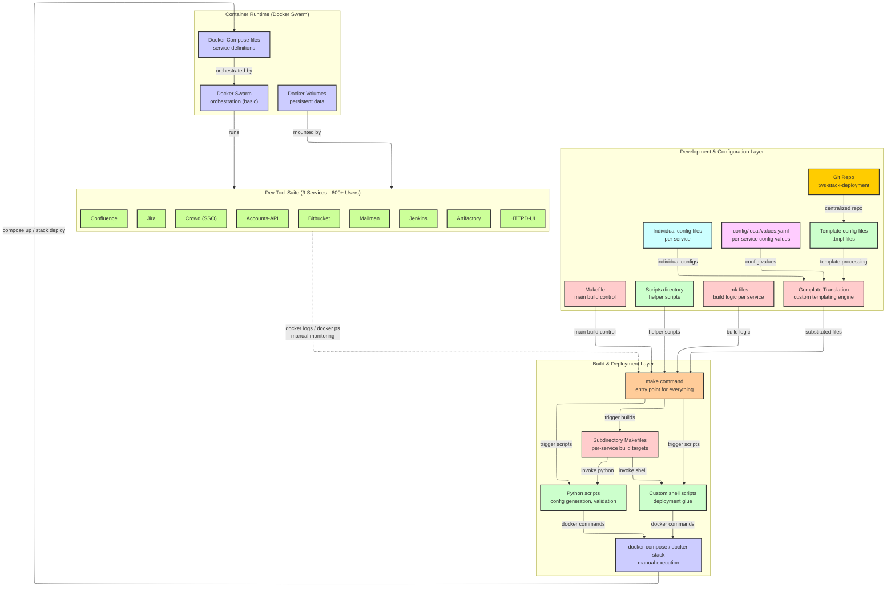
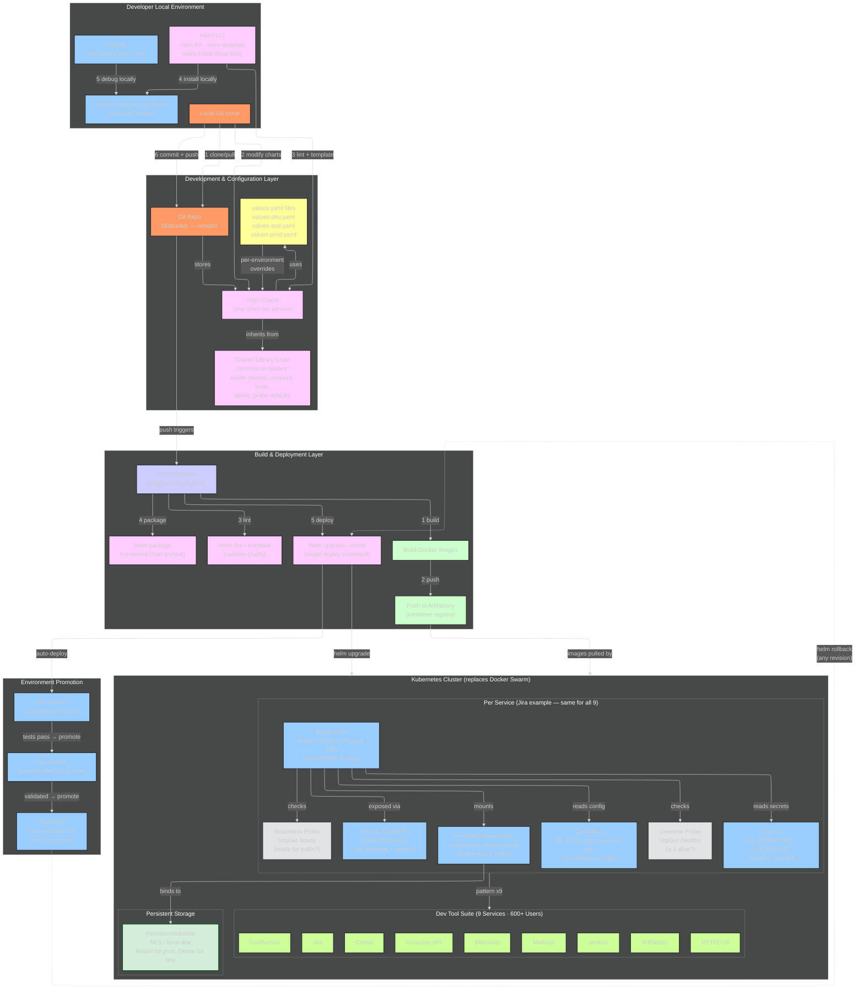
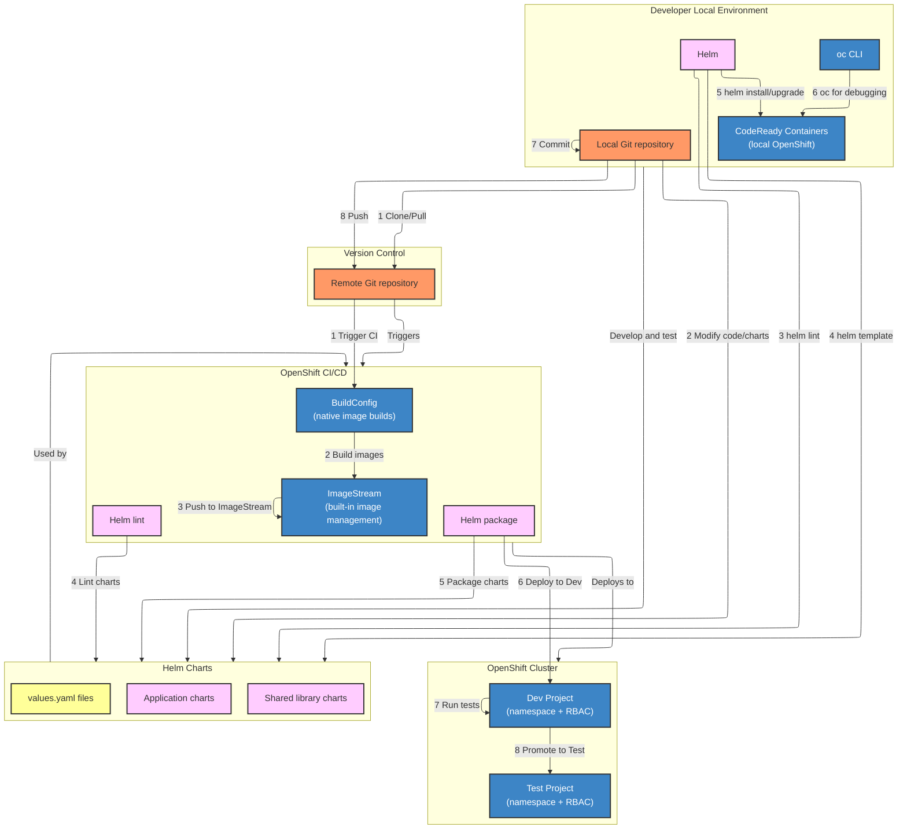

# IBM Helm Migration — Answer Keys (Mermaid Charts)

## 1. BEFORE State: Legacy Deployment System

> **This is the ACTUAL before state.** No Kubernetes, no kubectl. Docker Compose for local dev, Docker Swarm for deployment, Makefiles and scripts for orchestration. The diagram shows the relationships between components — this is what tells the story on a whiteboard.

### What This Diagram Shows (the story it tells)

**Layer 1 — Development & Configuration:** Everything starts in one Git repo. Config values and templates feed into Gomplate — a custom templating engine that nobody outside this team uses. Gomplate generates substituted config files that feed into the make command. Makefiles and .mk files define build logic per service. Helper scripts are scattered in a scripts directory.

**Layer 2 — Build & Deployment:** The `make` command is the single entry point for everything. It triggers subdirectory Makefiles (one per service), which invoke custom shell scripts and Python scripts. These scripts eventually call `docker-compose up` or `docker stack deploy` to push containers to Swarm. Every step is imperative — "do this, then this, then this."

**Layer 3 — Container Runtime:** Docker Compose defines the services. Docker Swarm provides basic orchestration (restart on failure, but no rolling updates, no health checks, no resource limits). Volumes are Docker volumes — not managed, not backed up automatically.

**Layer 4 — The 9 Services:** Jira, Bitbucket, Confluence, Jenkins, Artifactory, Crowd, Accounts-API, Mailman, HTTPD-UI. Six hundred engineers depend on these daily.

**The feedback loop (dotted line):** When something breaks, you `docker logs` and `docker ps` manually, trace back through the scripts, fix, re-run make. No alerting, no drift detection.

### Pain Points to Call Out on the Whiteboard

Write these next to or below the diagram:

1. **No rollback** — Compose/Swarm has no revision history. If a deploy breaks, you manually revert files and re-run.
2. **No drift detection** — what's running might not match what's in Git. Someone could `docker exec` in and change a config.
3. **Gomplate is custom** — custom templating syntax, no community support, hard to hire for, hard to debug.
4. **Five layers of indirection** — Git → Gomplate → Make → Scripts → Docker. A config change touches every layer.
5. **Manual release checklist** — each release requires running make targets in order, checking docker ps, verifying each service. Takes hours.
6. **600+ users at risk** — one bad deploy takes down the entire dev tool suite.

### How to Draw This on a Whiteboard

**Step 1:** Draw two big boxes side by side at the top — "Config Layer" (left) and "Build Layer" (right).

**Step 2:** Inside Config Layer, write: Git Repo, values.yaml, config files, templates, Gomplate. Draw arrows showing how values and templates both feed into Gomplate, and Gomplate feeds into the make command.

**Step 3:** Inside Build Layer, write: make command (big, central), then Makefiles, Shell scripts, Python scripts branching off it. Show make triggers all of them.

**Step 4:** Draw a box below labeled "Docker Compose / Swarm" with arrows from the scripts down to it.

**Step 5:** Draw a box at the bottom labeled "9 Services (600+ users)" and list them.

**Step 6:** Draw a dotted line from the services back up to the make command labeled "manual monitoring (docker logs)" — this shows the painful feedback loop.

**Step 7:** Write pain points in red on the side.

### Narration Script
"This is what I inherited at IBM Federal. A single Git repo with per-service config files and templates. Everything feeds through Gomplate — a custom templating engine — which generates config files that feed into make. The make command is the single entry point: it triggers per-service Makefiles, which invoke Python and shell scripts, which eventually run docker-compose up or docker stack deploy. Five layers of indirection before a container starts. Nine services — Jira, Bitbucket, Confluence, Jenkins, Artifactory, and four others — serving six hundred engineers. No rollback capability. No drift detection. If a deploy failed, you'd SSH in, check docker logs, trace through the scripts, and fix by hand. Every release was a multi-hour manual checklist."

---

## 2. The Bridge: How Docker Compose/Swarm Services Moved to Kubernetes

> **Andy WILL ask this:** "Before you used Helm, how did you actually get the services running on Kubernetes?" This section explains the bridge — the containers already existed, you just changed the orchestration layer.

### The Key Insight to Communicate

"The services were already containerized — Docker images existed for all nine services. The migration wasn't about building containers from scratch. It was about replacing the orchestration layer: going from Docker Compose files and Swarm to Kubernetes manifests managed by Helm."

### What I Actually Did (step by step)

1. **Analyzed the existing Compose files** — each service had a docker-compose.yml defining: image, ports, volumes, environment variables, dependencies, restart policies
2. **Translated Compose definitions to K8s manifests** — for each service:
   - `image:` in Compose → same image reference in K8s Deployment
   - `ports:` → K8s Service (ClusterIP or NodePort)
   - `volumes:` → PersistentVolumeClaim + PersistentVolume
   - `environment:` → ConfigMap or Secret
   - `depends_on:` → not needed in K8s (services discover via DNS)
   - `restart: always` → K8s handles this natively (restartPolicy: Always is default)
3. **Templatized the manifests into Helm charts** — turned hardcoded values into `{{ .Values.x }}` references, created values.yaml per environment
4. **Tested with `helm template`** (dry-run render) → verified output YAML matched what the Compose files produced
5. **Deployed to dev cluster with `helm install`** → validated services came up, connected to each other, and served traffic
6. **Built a CI/CD pipeline** around it — build image → lint chart → package → deploy → test → promote

### How to Explain It to Andy

"The containers already existed — Docker images for Jira, Bitbucket, Jenkins, all of them. The Compose files defined how they ran: ports, volumes, env vars, dependencies. What I did was translate each Compose definition into Kubernetes manifests — a Deployment for the workload, a Service for networking, PersistentVolumeClaims for storage, ConfigMaps for config. Then I templatized those into Helm charts so every environment uses the same template with different values. The hardest part wasn't Kubernetes itself — it was getting the persistent volumes right for stateful services like Jira's database, and making sure the service discovery worked without Compose's depends_on."

### If Andy Probes: "What was hardest about the migration?"

"Stateful services. Jira and Bitbucket have databases that need persistent storage. In Compose, that's just a named volume. In K8s, that's a PersistentVolumeClaim bound to a PersistentVolume, with the right storage class and reclaim policy so data isn't deleted on pod restart. I had to design the storage layer carefully — wrong reclaim policy and you lose the database on upgrade. The other challenge was config management: Compose uses .env files, K8s uses ConfigMaps and Secrets. I built a migration script that converted each service's .env into a ConfigMap YAML, then moved sensitive values to Secrets."

---

## 3. AFTER State: Helm-Based Deployment

> **Same 4 layers as the BEFORE state** — but clean. Draw this side-by-side or below the BEFORE on the whiteboard so Andy sees the direct comparison: same structure, everything improved.

### What This Diagram Shows — Layer by Layer Comparison

**Layer 1 — Development & Configuration (BEFORE vs AFTER):**

| Before | After |
|--------|-------|
| Gomplate (custom templating) | Helm templates (industry standard Go templating) |
| Individual config files + values.yaml → Gomplate substitution | values.yaml per environment → Helm renders templates |
| Template .tmpl files with custom syntax | Helm chart templates with `{{ .Values.x }}` syntax |
| No shared patterns — each service configured independently | Shared library chart — common patterns inherited by all 9 charts |

**Layer 2 — Build & Deployment (BEFORE vs AFTER):**

| Before | After |
|--------|-------|
| `make` command as single entry point | CI/CD pipeline triggered on git push |
| Makefiles → Python scripts → Shell scripts → docker commands | Pipeline: build image → push registry → lint chart → package → deploy |
| 5 layers of indirection, manual execution | 5 automated steps, single trigger |
| SSH to server, git pull, run make | Push code, pipeline runs automatically |
| No rollback — find the commit, re-run make | `helm rollback` to any previous revision number |

**Layer 3 — Container Runtime (BEFORE vs AFTER):**

| Before | After |
|--------|-------|
| Docker Compose files (service definitions) | K8s Deployments (with replicas, resource limits, rolling updates) |
| Docker Swarm (basic orchestration, restart on crash) | Kubernetes (health checks, auto-scaling, rolling updates, rollback) |
| Docker Volumes (no reclaim policy, no backup strategy) | PersistentVolumeClaims with StorageClass, Retain/Delete policies |
| No health checks — traffic hits containers immediately | Liveness + Readiness probes gate traffic |
| No resource limits — one container can consume all host resources | Resource requests + limits enforced per container |
| No service discovery beyond Docker DNS | K8s Services with stable DNS names, ClusterIP load balancing |

**Layer 4 — Services (same 9 services, better foundation):**

Same nine services: Jira, Bitbucket, Confluence, Jenkins, Artifactory, Crowd, Accounts-API, Mailman, HTTPD-UI. Same 600+ users. But now each service has: versioned Helm chart, health checks, resource limits, persistent storage with reclaim policies, and automated deployment via CI/CD.

### Key Improvements Summary

| Metric | Before | After |
|--------|--------|-------|
| Release prep time | Hours (manual checklist) | Minutes (single helm command) — **40% reduction** |
| Rollback | Find commit, re-run make, hope it works | `helm rollback` to any revision — **instant** |
| Drift detection | None | Helm tracks release state |
| Health checks | None — Swarm restarts on crash only | Liveness + Readiness probes |
| Build failure rate | High — manual, error-prone | **35% reduction** via automated pipeline |
| Environment separation | Laptop + shared instance (double-duty) | Dev → Test → Production with CI/CD promotion |
| Reliability | Frequent outages from bad deploys | **99.9%+ uptime** for 8 mission apps |

### How to Draw the AFTER on a Whiteboard

**Draw the same 4 layers as the BEFORE, but clean:**

**Layer 1 (top):** "Dev & Config" — Git Repo, Helm Charts (one per service), Shared Library Chart, values.yaml (dev/test/prod). Arrow: values.yaml feeds Helm charts, library inherited by all charts.

**Layer 2 (middle):** "Build & Deploy" — CI/CD Pipeline (triggered on push): build → push → lint → package → deploy. Single arrow down to the cluster. Dotted arrow back up labeled "helm rollback."

**Layer 3 (main body):** "K8s Cluster" — Show ONE service (Jira) with: Deployment, Service, ConfigMap, Secret, PVC + PV, Liveness/Readiness probes. Write "same pattern x9" next to it. List all 9 services.

**Layer 4 (bottom):** "Environments" — Dev Cluster → Test Cluster → Production. Arrows showing promotion path.

Say: "Same four layers as before, but everything is clean. Config layer: Helm charts replace Gomplate — industry standard, values per environment, shared library for common patterns. Build layer: CI/CD pipeline replaces Makefiles — push triggers everything automatically, rollback is one command. Runtime: Kubernetes replaces Swarm — every service gets health checks, resource limits, persistent storage with reclaim policies. And now we have real environment separation: dev, test, production with automated promotion. Release prep went from hours to minutes. Forty percent reduction."

---

## 4. OpenShift Migration (Designed + Implemented)

> This was the NEXT evolution — from vanilla K8s/Helm to OpenShift. Shows architectural progression.

### What Changed from K8s/Helm to OpenShift

| K8s + Helm | OpenShift |
|------------|-----------|
| Separate CI for image builds | OpenShift BuildConfig builds natively |
| Manual image registry | ImageStream manages images + promotion |
| Namespaces + manual RBAC | Projects (namespace + RBAC built-in) |
| kubectl | oc CLI (wraps kubectl + OpenShift features) |
| Ingress for routing | Routes (simpler, built-in TLS) |
| Docker Desktop for local | CodeReady Containers (local OpenShift) |

### How to Explain to Andy

"After the Helm migration was stable, I designed and started implementing the next step — moving from vanilla Kubernetes to OpenShift. The Helm charts carried over — same charts, just deployed to OpenShift instead of vanilla K8s. The big wins were: BuildConfig gave us native image builds inside the platform — no separate CI needed for image creation. ImageStreams gave us built-in image promotion — no more manually pushing tags between registries. And Projects gave us namespace-level RBAC out of the box, which mattered for our multi-team setup with six hundred users."

### If Andy Asks: "Did you finish the OpenShift migration?"

"I designed the architecture, built the initial infrastructure — CodeReady Containers for local dev, the first two services migrated as proof of concept — and created the full roadmap for the remaining services. I left before completing the full migration but handed off the plan and the working prototype to the team. The Helm charts didn't change — that was the whole point of using Helm. The charts are platform-agnostic. What changed was the CI/CD layer and how images were managed."
