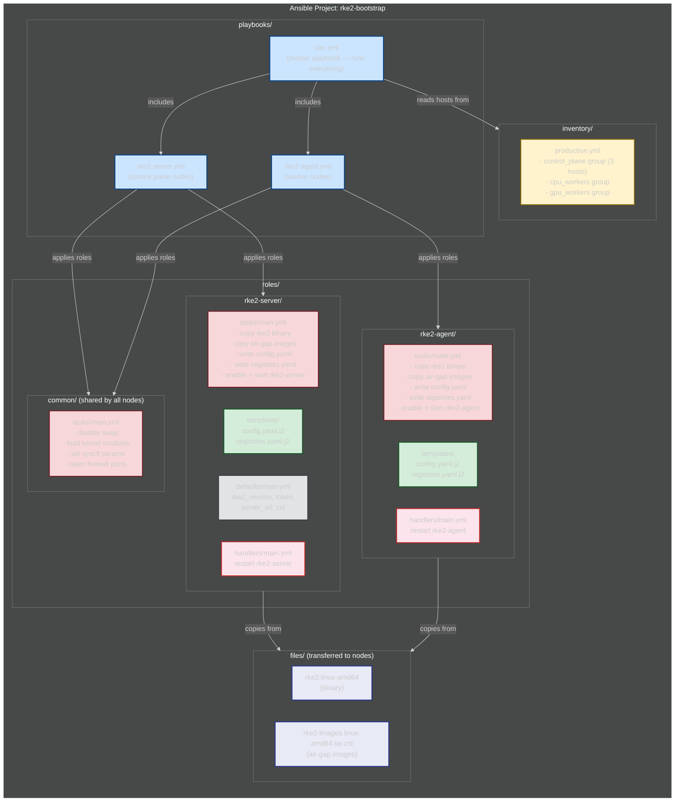

# Architecture Practice: Nightwatch RKE2 Platform (NTConcepts)

## Exercise: Draw and Narrate

**Instructions:**
1. Draw the Nightwatch infrastructure from memory — focus on RKE2 cluster setup, AWS integration, and how you operated it
2. Narrate as if Andy asked: "You mentioned RKE2 — walk me through how you set that up"
3. Time yourself: 8-10 minutes
4. Do NOT get lost in application-level details (Kubeflow workflows, auth chains). Andy is a DevOps hiring manager — he cares about the INFRASTRUCTURE, not the ML pipelines.

---

## GAPS — Review Before Each Drawing Attempt

> Add gaps here after each attempt. Read this FIRST before redrawing.

*(empty — fill in after your first attempt)*

---

## Coaching: How to Present This

### The DevOps Focus

Andy cares about HOW you built and operated the K8s infrastructure — not about Kubeflow's notebook UI or the data scientist's auth flow. Focus on:

| Andy cares about (draw this) | Andy doesn't need (mention briefly) |
|------------------------------|--------------------------------------|
| RKE2 bootstrap — air-gap binary install, config, HA | Kubeflow dashboard features |
| Node groups — control plane, CPU, GPU ASGs | KServe, Knative, KF Pipelines internals |
| AWS integration — IRSA, ECR, S3, Secrets Manager | oauth2-proxy → Keycloak auth chain steps |
| Networking — VPC, private subnets, NLB entry point | TensorBoard, MLflow |
| GitOps — ArgoCD syncing from local Git | Data scientist notebook workflow |
| Storage — EFS, RDS, how PVs connect to AWS | Kubeflow pipeline artifact storage |
| registries.yaml — how images are pulled air-gapped | |
| Cluster Autoscaler — how nodes scale | |
| Secrets — External Secrets Operator → Secrets Manager | |

### Opening Line
"At NTConcepts, I built and operated an RKE2 Kubernetes cluster on AWS — air-gapped, three control plane nodes for HA, CPU and GPU worker pools with auto-scaling, full GitOps with ArgoCD. The workload was an ML platform for twelve data scientists, but the infrastructure story is what matters: how I bootstrapped RKE2 in a disconnected environment, integrated it with AWS services, and kept it running."

### Drawing Order (DevOps-focused)

**Step 1 — Draw the AWS foundation (bottom of whiteboard):**

```
┌─── AWS Cloud (us-east-1) ────────────────────────────────────────┐
│                                                                    │
│  ┌── Core AWS Services ─────────────────────────────────────────┐  │
│  │  ECR (container images)    S3 (terraform state, artifacts)   │  │
│  │  Secrets Manager (DB passwords, API keys)                    │  │
│  │  IAM (OIDC provider, IRSA roles for pods)                   │  │
│  └──────────────────────────────────────────────────────────────┘  │
│                                                                    │
│  ┌── VPC ───────────────────────────────────────────────────────┐  │
│  │  Public Subnet:  NLB (only entry point from outside)         │  │
│  │  Private Subnets: everything else                            │  │
│  │                                                              │  │
│  │  Managed Data Services:                                      │  │
│  │    RDS PostgreSQL (3 databases: ArgoCD, Keycloak, Kubeflow)  │  │
│  │    EFS (shared storage mounted by pods)                      │  │
│  └──────────────────────────────────────────────────────────────┘  │
└────────────────────────────────────────────────────────────────────┘
```

Say: "Everything runs on AWS. ECR stores container images — in air-gap, we pre-push images here and RKE2 pulls from it via registries.yaml. S3 holds Terraform state and pipeline artifacts. Secrets Manager stores database passwords and API keys — External Secrets Operator syncs them into the cluster as K8s Secrets. IAM provides IRSA — pods assume IAM roles via service accounts instead of using instance credentials.

VPC has public and private subnets. The NLB in the public subnet is the ONLY entry point from outside. Everything else — the cluster, databases, storage — lives in private subnets. RDS PostgreSQL backs three services: ArgoCD, Keycloak, and Kubeflow. EFS provides shared storage that multiple pods mount simultaneously."

**Step 2 — Draw the RKE2 cluster (center — this is the main event):**

```
┌─── RKE2 Kubernetes Cluster (private subnets) ────────────────────┐
│                                                                    │
│  ┌── Control Plane (ASG: 3 nodes) ──────────────────────────────┐  │
│  │  m5a.large × 3                                               │  │
│  │  rke2-server with embedded etcd                              │  │
│  │  HA: 3 nodes = etcd quorum survives 1 node loss             │  │
│  └──────────────────────────────────────────────────────────────┘  │
│                                                                    │
│  ┌── Worker Nodes ──────────────────────────────────────────────┐  │
│  │                                                              │  │
│  │  CPU ASG: m5a.2xlarge                GPU ASG: g4dn.xlarge    │  │
│  │  (general workloads)                 (ML training)           │  │
│  │                                      + NVIDIA GPU Operator   │  │
│  │                                      (auto driver install)   │  │
│  │                                                              │  │
│  │  Both managed by Cluster Autoscaler                          │  │
│  │  (scales based on pending pods)                              │  │
│  └──────────────────────────────────────────────────────────────┘  │
│                                                                    │
│  ┌── Infrastructure Services (what I deployed + managed) ───────┐  │
│  │  ArgoCD          — GitOps: syncs all manifests from Git      │  │
│  │  Istio           — service mesh + ingress gateway            │  │
│  │  Cluster Autoscaler — scales node ASGs                       │  │
│  │  External Secrets — syncs Secrets Manager → K8s Secrets      │  │
│  │  Keycloak        — SSO/identity for all services             │  │
│  │  Monitoring      — Prometheus + Grafana + Loki               │  │
│  └──────────────────────────────────────────────────────────────┘  │
│                                                                    │
│  ┌── Application Workloads (ran on top — not my focus) ─────────┐  │
│  │  Kubeflow (notebooks, pipelines, model serving)              │  │
│  │  "ML platform for 12 data scientists — tripled throughput"   │  │
│  └──────────────────────────────────────────────────────────────┘  │
└────────────────────────────────────────────────────────────────────┘
```

Say: "The cluster. Three control plane nodes — m5a.large running rke2-server with embedded etcd. Three gives us quorum — survives one node loss. No external etcd cluster to manage.

Worker nodes in two ASGs. CPU pool on m5a.2xlarge for general workloads. GPU pool on g4dn.xlarge with the NVIDIA GPU Operator — when a new GPU node joins, the operator auto-detects the hardware and installs the right driver. No manual CUDA setup. Both pools managed by Cluster Autoscaler — it watches for pending pods and scales the ASG up or down.

Infrastructure services that I deployed and managed: ArgoCD for GitOps — everything syncs from a Git repo, no manual kubectl. Istio for the service mesh and ingress gateway — all traffic enters through Istio. External Secrets Operator syncs credentials from AWS Secrets Manager into K8s Secrets. Keycloak for SSO. Prometheus, Grafana, Loki for monitoring.

On top of all this, the data science team ran Kubeflow — notebooks, pipelines, model serving. But that's the application layer. The infrastructure underneath is what I owned."

**Step 3 — Draw the two key flows (arrows — pick ONE based on what Andy asks):**

**Flow A: GitOps deployment (if Andy asks "how do you deploy?")**

```
[DevOps Engineer] → git push → [argoflow Git Repo]
                                       ↓
                              [ArgoCD watches repo]
                                       ↓
                        [ArgoCD syncs to cluster]
                                       ↓
                    deploys: Istio, Keycloak, Kubeflow, Monitoring
                                       ↓
                    images pulled from ECR (via registries.yaml)
```

Say: "Pure GitOps. I push manifests to the argoflow Git repo. ArgoCD detects the change, syncs to the cluster — kubectl apply under the hood but automated. If someone manually changes something in the cluster, ArgoCD detects drift and reverts it. Images come from ECR — registries.yaml tells containerd to pull from ECR instead of Docker Hub."

**Flow B: Node scaling (if Andy asks "how does scaling work?")**

```
[New workload requests GPU] → Pod goes Pending (no GPU node available)
                                       ↓
                    [Cluster Autoscaler detects pending pod]
                                       ↓
                    [Assumes IAM role via IRSA]
                                       ↓
                    [Increases GPU ASG desired count]
                                       ↓
                    [New g4dn node joins cluster]
                                       ↓
                    [NVIDIA Operator installs GPU drivers]
                                       ↓
                    [Pod schedules → workload runs]
                                       ↓
                    [Workload completes → Autoscaler scales down]
```

Say: "When a workload needs a GPU and none's available, the pod goes Pending. Cluster Autoscaler sees it, assumes an IAM role via IRSA, and bumps the ASG desired count. New g4dn node launches, NVIDIA Operator installs drivers automatically, pod schedules. When the workload finishes and no more GPU pods are pending, Autoscaler scales the node back down. Nodes only exist when there's work — keeps costs controlled."

### What to Emphasize (DevOps perspective)

1. **RKE2 air-gap bootstrap** — "One binary, embedded etcd, runs disconnected. registries.yaml redirects all image pulls to ECR."
2. **AWS integration via IRSA** — "Pods don't use instance credentials. Each service account maps to an IAM role — least-privilege at the pod level."
3. **GitOps with ArgoCD** — "No manual kubectl. Everything in Git. Drift detected and reverted automatically."
4. **Infrastructure as code** — "Terraform for VPC, subnets, ASGs, RDS, EFS. Cluster bootstrapped via Ansible. Services deployed via ArgoCD."
5. **Monitoring** — "Prometheus for metrics, Grafana for dashboards, Loki for logs. Full observability without internet."
6. **Result** — "Tripled throughput" — but frame it as an infrastructure win: "The platform I built enabled twelve data scientists to self-serve GPU access without tickets. Tripled their throughput."

### Component Deep-Dive Prep

**RKE2 Bootstrap (know this cold — Andy asked about it):**

| Step | What happens | Air-gap detail |
|------|-------------|----------------|
| 1. Transfer binary | Download `rke2.linux-amd64` on connected side, transfer to air-gapped host | Binary + images tarball via diode or USB |
| 2. Place images | Put images tarball at `/var/lib/rancher/rke2/agent/images/` | Pre-loaded — no internet pull needed |
| 3. Configure | Write `/etc/rancher/rke2/config.yaml` — server URL, token, node labels | Ansible template renders this per node |
| 4. Configure registry | Write `/etc/rancher/rke2/registries.yaml` — point to ECR/local registry | All image pulls redirected to local |
| 5. Start server | `systemctl enable --now rke2-server` on first control plane node | Embedded etcd starts, API server comes up |
| 6. Join servers | Same on nodes 2 and 3 — they join via port 9345 with the shared token | etcd quorum forms at 3 nodes |
| 7. Join agents | `systemctl enable --now rke2-agent` on worker nodes | Workers register with API server |
| 8. Verify | `/var/lib/rancher/rke2/bin/kubectl get nodes` | All nodes Ready |

**registries.yaml (know this file — it's how air-gap works):**
```yaml
mirrors:
  docker.io:
    endpoint:
      - "https://account-id.dkr.ecr.us-east-1.amazonaws.com"
  "ghcr.io":
    endpoint:
      - "https://account-id.dkr.ecr.us-east-1.amazonaws.com"
configs:
  "account-id.dkr.ecr.us-east-1.amazonaws.com":
    auth:
      # ECR auth handled by IAM role on the node
```
"This file tells containerd: when something requests an image from docker.io or ghcr.io, redirect the pull to our ECR. The images are pre-pushed to ECR on the connected side. No internet access needed from inside the cluster."

**RKE2 Ports (memorize):**

| Port | Protocol | Purpose |
|------|----------|---------|
| 6443 | TCP | Kubernetes API server |
| 9345 | TCP | RKE2 supervisor (agent/server join) |
| 10250 | TCP | kubelet metrics |
| 2379-2380 | TCP | etcd client + peer (server nodes only) |
| 8472 | UDP | VXLAN (Canal CNI) |

**IRSA (IAM Roles for Service Accounts) — how pods get AWS access:**
1. OIDC provider configured in IAM — trusts the cluster's service account tokens
2. IAM role created with a trust policy: "only pods with service account X in namespace Y can assume this role"
3. Pod spec includes `serviceAccountName: my-sa` — K8s injects a token
4. AWS SDK in the pod exchanges the token for temporary IAM credentials
5. Result: pod-level least-privilege. Cluster Autoscaler has a role that can modify ASGs. External Secrets has a role that can read Secrets Manager. Neither can do the other's job.

"This replaces putting AWS credentials in environment variables or using instance profiles where every pod on the node gets the same permissions. IRSA means each pod gets only the AWS access it needs."

**External Secrets Operator — how secrets flow from AWS to pods:**
1. ExternalSecret CRD references a Secrets Manager entry: "get the secret named `prod/rds/password`"
2. Operator reads it from Secrets Manager (using its own IRSA role)
3. Creates a native K8s Secret with the value
4. Pod mounts the K8s Secret as an env var or file
5. Operator auto-refreshes when the source changes
"No secrets in Git. No manual creation. One source of truth in Secrets Manager, automatically synced to the cluster."

### Ansible for RKE2 — Full Playbook Walkthrough

> **Andy asked about this directly.** You need to explain the role structure, walk through the playbook, and answer "how did you bootstrap the nodes?"

**The Ansible project structure:**



**How to explain the structure to Andy:**
"Three roles. The `common` role runs on ALL nodes — disables swap, loads kernel modules, sets sysctl params, opens firewall ports. The `rke2-server` role runs on control plane nodes — copies the binary, copies air-gap images, writes config.yaml and registries.yaml from templates, starts the rke2-server service. The `rke2-agent` role is the same for workers but starts rke2-agent instead. The inventory groups the hosts: three control plane, CPU workers, GPU workers. The master playbook runs common first on all nodes, then server on the control plane group, then agent on the worker group."

**The inventory file — how Ansible knows which nodes to configure:**

```yaml
# inventory/production.yml
all:
  children:
    # Control plane — 3 nodes for HA (etcd quorum)
    control_plane:
      hosts:
        cp-1:
          ansible_host: 10.0.1.10    # private IP in VPC
        cp-2:
          ansible_host: 10.0.1.11
        cp-3:
          ansible_host: 10.0.1.12
      vars:
        rke2_type: server             # runs rke2-server

    # CPU worker nodes
    cpu_workers:
      hosts:
        cpu-1:
          ansible_host: 10.0.2.10
      vars:
        rke2_type: agent              # runs rke2-agent
        node_labels: "workload=general"

    # GPU worker nodes
    gpu_workers:
      hosts:
        gpu-1:
          ansible_host: 10.0.3.10
      vars:
        rke2_type: agent
        node_labels: "workload=gpu,nvidia.com/gpu=true"

  # Variables shared by ALL nodes
  vars:
    rke2_version: "v1.28.4+rke2r1"
    rke2_token: "{{ vault_rke2_token }}"         # from Ansible Vault
    rke2_server_url: "https://10.0.1.10:9345"    # first server node
    registry_endpoint: "https://account-id.dkr.ecr.us-east-1.amazonaws.com"
    ansible_user: ec2-user
    ansible_ssh_private_key_file: ~/.ssh/rke2-key
```

**What to understand here:**
- `children` groups nodes by role: control_plane, cpu_workers, gpu_workers
- `vars` at each level set per-group variables (rke2_type, node_labels)
- `all.vars` sets cluster-wide variables (version, token, server URL, registry)
- `vault_rke2_token` comes from Ansible Vault — encrypted, not plain text
- Ansible SSHs to each host using the private key — agentless, no software to pre-install

**The common role — what ALL nodes need (fully commented):**

```yaml
# roles/common/tasks/main.yml
# This role prepares ANY node (server or agent) for RKE2

---
# SWAP: K8s requires swap disabled — kubelet won't start with swap on
- name: Disable swap immediately
  command: swapoff -a
  changed_when: false        # don't mark as "changed" since this is idempotent

# Remove swap from fstab so it stays off after reboot
- name: Remove swap from fstab
  lineinfile:
    path: /etc/fstab
    regexp: '.*swap.*'       # match any line containing "swap"
    state: absent            # delete it

# KERNEL MODULES: K8s networking needs these — bridge traffic must pass through iptables
- name: Load required kernel modules
  modprobe:
    name: "{{ item }}"
    state: present
  loop:
    - br_netfilter           # enables bridge traffic to be processed by iptables
    - overlay                # needed for container filesystem layering

# Make modules persist across reboot
- name: Persist kernel modules
  copy:
    content: |
      br_netfilter
      overlay
    dest: /etc/modules-load.d/rke2.conf
    mode: '0644'

# SYSCTL: Network params required by K8s — allows pod traffic to flow through iptables rules
- name: Set kernel network parameters
  sysctl:
    name: "{{ item.key }}"
    value: "{{ item.value }}"
    sysctl_file: /etc/sysctl.d/99-rke2.conf    # persist to a dedicated file
    reload: yes                                  # apply immediately
  loop:
    - { key: 'net.bridge.bridge-nf-call-iptables', value: '1' }   # bridge IPv4 → iptables
    - { key: 'net.bridge.bridge-nf-call-ip6tables', value: '1' }  # bridge IPv6 → iptables
    - { key: 'net.ipv4.ip_forward', value: '1' }                  # allow IP forwarding between interfaces

# FIREWALL: Open ports that RKE2 needs for cluster communication
- name: Open RKE2 TCP ports
  firewalld:
    port: "{{ item }}/tcp"
    permanent: yes           # survives reboot
    immediate: yes           # applies now without reload
    state: enabled
  loop:
    - 6443                   # K8s API server — kubectl and pods talk to this
    - 9345                   # RKE2 supervisor — how agents join the cluster
    - 10250                  # kubelet — API server reads pod metrics from this
    - 2379                   # etcd client — only needed on server nodes but safe to open
    - 2380                   # etcd peer — server-to-server etcd replication

# VXLAN port for Canal CNI overlay networking between nodes
- name: Open VXLAN UDP port
  firewalld:
    port: 8472/udp           # Canal/Flannel VXLAN — pod-to-pod traffic across nodes
    permanent: yes
    immediate: yes
    state: enabled
```

**The rke2-server role — control plane nodes (fully commented):**

```yaml
# roles/rke2-server/tasks/main.yml
# This role installs and starts RKE2 in SERVER mode (control plane)

---
# BINARY: Copy the RKE2 binary — downloaded on connected side, transferred air-gap
- name: Copy RKE2 binary to node
  copy:
    src: files/rke2.linux-amd64          # from our local files/ directory
    dest: /usr/local/bin/rke2            # standard install location
    mode: '0755'                         # must be executable
    owner: root

# AIR-GAP IMAGES: Pre-load container images so RKE2 doesn't try to pull from internet
- name: Create images directory
  file:
    path: /var/lib/rancher/rke2/agent/images
    state: directory
    mode: '0755'

- name: Copy air-gap images tarball
  copy:
    src: files/rke2-images.linux-amd64.tar.zst    # all K8s system images bundled
    dest: /var/lib/rancher/rke2/agent/images/      # RKE2 loads these at startup
    mode: '0644'

# CONFIG: Create the RKE2 config directory
- name: Create RKE2 config directory
  file:
    path: /etc/rancher/rke2
    state: directory
    mode: '0755'

# CONFIG.YAML: Tells RKE2 how to run — token, TLS SANs, node labels
- name: Write RKE2 server config
  template:
    src: config.yaml.j2                  # Jinja2 template — variables substituted per node
    dest: /etc/rancher/rke2/config.yaml
    mode: '0600'                         # restricted — contains the cluster token
    owner: root
  notify: restart rke2-server            # if config changes, restart the service

# REGISTRIES.YAML: Redirect all image pulls to our ECR (air-gap)
- name: Write registries config
  template:
    src: registries.yaml.j2
    dest: /etc/rancher/rke2/registries.yaml
    mode: '0600'
  notify: restart rke2-server

# SYSTEMD: Install the RKE2 server systemd unit file
- name: Install RKE2 server service
  command: /usr/local/bin/rke2 server --install
  args:
    creates: /etc/systemd/system/rke2-server.service   # skip if already installed
  register: rke2_install

# START: Enable and start the service
- name: Enable and start RKE2 server
  systemd:
    name: rke2-server
    state: started
    enabled: yes                         # start on boot
    daemon_reload: yes                   # reload systemd to pick up new unit file

# WAIT: Give the API server time to come up before proceeding
- name: Wait for API server to be ready
  command: /var/lib/rancher/rke2/bin/kubectl get nodes
  register: kubectl_result
  retries: 30                            # try for up to 5 minutes
  delay: 10                              # wait 10 seconds between retries
  until: kubectl_result.rc == 0          # succeed when kubectl works
  changed_when: false
  when: rke2_install.changed             # only wait on fresh install
```

**The config.yaml.j2 template — what gets rendered per node:**

```yaml
# templates/config.yaml.j2
# RKE2 server configuration — rendered by Ansible per node


# First server bootstraps the cluster; others join via server URL

# FIRST SERVER: bootstraps cluster, no server URL needed
cluster-init: true

# JOINING SERVER: connects to first server to join etcd cluster
server: {{ rke2_server_url }}



# Shared token — all nodes use this to authenticate when joining
token: {{ rke2_token }}

# TLS SANs: additional hostnames/IPs that the API server cert is valid for
# Needed so kubectl works from the NLB IP and from other nodes
tls-san:
  - {{ ansible_host }}
  - {{ rke2_server_url | regex_replace('https://|:9345', '') }}

# Node labels — used by schedulers to place workloads on the right nodes
node-label:


  - {{ label }}



# CIS hardening profile — hardens K8s to CIS benchmark
profile: cis-1.23

# Disable servicelb — we use NLB, not RKE2's built-in load balancer
disable:
  - rke2-ingress-nginx      # we use Istio for ingress instead
```

**The registries.yaml.j2 template:**

```yaml
# templates/registries.yaml.j2
# Tells containerd to redirect image pulls to our ECR (air-gap)

mirrors:
  # When something requests docker.io images, pull from ECR instead
  docker.io:
    endpoint:
      - "{{ registry_endpoint }}"
  # Same for GitHub container registry
  ghcr.io:
    endpoint:
      - "{{ registry_endpoint }}"
  # Same for Rancher's own registry
  "docker.rancher.io":
    endpoint:
      - "{{ registry_endpoint }}"

configs:
  "{{ registry_endpoint }}":
    # ECR auth is handled by the node's IAM instance profile
    # No username/password needed — the node's role has ecr:GetAuthorizationToken
```

**The rke2-agent role (worker nodes) — same structure, key difference:**

```yaml
# roles/rke2-agent/tasks/main.yml
# Same as rke2-server EXCEPT:
# - Starts rke2-agent instead of rke2-server
# - config.yaml has server URL (joins the cluster, doesn't bootstrap)
# - No cluster-init, no etcd

# ... (copy binary, copy images, write config, write registries — same tasks)

- name: Enable and start RKE2 agent
  systemd:
    name: rke2-agent          # agent, not server
    state: started
    enabled: yes
    daemon_reload: yes
```

**The agent's config.yaml.j2 is simpler:**
```yaml
# Agent config — just needs to know where the server is and the token
server: {{ rke2_server_url }}
token: {{ rke2_token }}
node-label:


  - {{ label }}


```

**The master playbook — site.yml (ties it all together):**

```yaml
# playbooks/site.yml
# Master playbook — run this to bootstrap the entire cluster

---
# Step 1: Prepare ALL nodes (swap, kernel, firewall)
- name: Prepare all nodes for RKE2
  hosts: all
  become: true
  roles:
    - common

# Step 2: Bootstrap control plane (servers)
# serial: 1 means one server at a time — etcd needs ordered startup
- name: Bootstrap RKE2 control plane
  hosts: control_plane
  become: true
  serial: 1                    # ONE AT A TIME — first node bootstraps, others join
  roles:
    - rke2-server

# Step 3: Join worker nodes (agents)
# These can all join in parallel — they just register with the API server
- name: Join RKE2 worker nodes
  hosts: cpu_workers:gpu_workers    # both CPU and GPU groups
  become: true
  roles:
    - rke2-agent
```

**Why `serial: 1` for control plane?**
"The first control plane node bootstraps the cluster — it creates etcd, generates certificates, starts the API server. The second and third nodes JOIN the existing cluster via the server URL on port 9345. If you start all three simultaneously, they'd all try to bootstrap independently and you'd get three separate clusters. Serial execution ensures: first node bootstraps, second joins, third joins. Etcd quorum forms at three."

**How to explain the full Ansible flow to Andy:**
"I run `ansible-playbook -i inventory/production.yml playbooks/site.yml`. Ansible SSHs to every host in parallel, runs the common role — disables swap, loads kernel modules, sets network params, opens firewall ports. Then it hits the control plane nodes ONE AT A TIME — first node bootstraps the cluster with embedded etcd, second and third join via port 9345. Each gets the RKE2 binary, air-gap images, config.yaml with the token and CIS profile, and registries.yaml pointing to ECR. Then workers join in parallel — same binary, same images, but rke2-agent instead of rke2-server. Five minutes later: three-node HA control plane, CPU workers, GPU workers, all registered. ArgoCD deploys everything else from Git."

### Tradeoffs to Know

**"Why RKE2 over EKS?"**
"On-prem, air-gapped, no AWS API access from inside the cluster. EKS requires internet for the managed control plane. RKE2 bundles everything — one binary, embedded etcd, runs disconnected. Plus FIPS mode and CIS hardening built-in."

**"Why RKE2 over K3s?"**
"K3s is lighter but trades features — no FIPS, sqlite instead of etcd by default, less enterprise support. RKE2 is CIS hardened, FIPS-ready, designed for government workloads."

**"Why embedded etcd instead of external?"**
"Simpler operations — no separate etcd cluster to manage, monitor, back up. RKE2 handles etcd lifecycle automatically. For three control plane nodes, embedded etcd is the recommended approach. External etcd makes sense at much larger scale or when you need etcd shared across clusters."

**"Why ArgoCD over FluxCD?"**
"ArgoCD gives a UI — operators can see sync status, health, drift without kubectl. In a classified environment where not everyone has cluster access, that visibility matters."

**"Why NVIDIA GPU Operator instead of pre-installing drivers?"**
"Operator auto-detects GPU hardware and installs the right driver. New node type or driver upgrade? Operator handles it. Pre-installing means rebuilding AMIs for every driver change."

**"What would you change?"**
"I'd add admission policies from the start — Kyverno or OPA. We had cases where pods were deployed with no resource limits, consuming all GPU memory. Policy enforcement at the API server would catch that before it affects other workloads."

### Bridging to Anduril

"This is exactly what your aircraft network deployment could look like. RKE2 runs air-gapped — one binary, no internet dependency. You'd transfer the binary and images via diode, Ansible bootstraps the nodes, registries.yaml points to your local Nexus instead of ECR, ArgoCD syncs from local GitLab. Start with a single-node for testing, prove it works, then scale to HA. I've done every step of this."

---

## Answer Keys

- **Full architecture diagram (all components):** `ntconcepts-answers.md` Chart 3 — use this to study ALL components including the application layer
- **Whiteboard layering guide:** `ntconcepts-answers.md` Chart 3 whiteboard section — 4 layers to draw progressively
- **How to present this system:** this file's coaching section above (DevOps-focused)
- **Related:** `anduril-scenarios.md` Scenario 4 + `anduril-k8s-migration-pitch.md`
