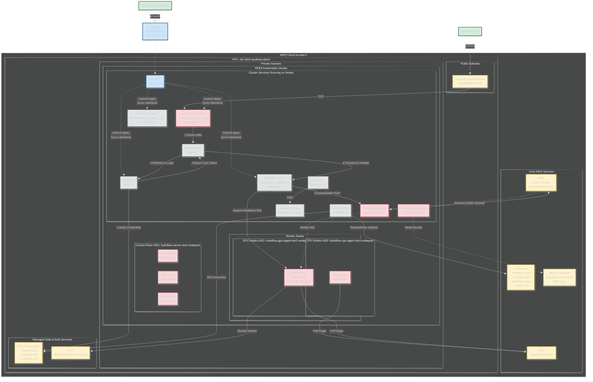

## Chart 3: Nightwatch RKE2 Platform — Full Reference

> This is the complete architecture. Use it to STUDY and memorize components. For whiteboarding, use the layered drawing guide below it.



---

### Whiteboard Drawing Guide: 4 Layers (draw progressively)

The full diagram has ~25 components. On a whiteboard you can't draw all of it. Instead, draw it in 4 layers — each takes 2-3 minutes. Andy will stop you on the layer he wants to dig into.

#### Layer 1: Infrastructure Skeleton (draw this first — 2 min)

Draw the physical layout: VPC, subnets, node groups, AWS services.

```
On the whiteboard:

┌─────────────────── AWS Cloud (us-east-1) ───────────────────┐
│                                                              │
│  ┌── Core AWS Services ──────────────────────────────────┐   │
│  │  ECR (images)   S3 (state/artifacts)   IAM (IRSA)    │   │
│  │  Secrets Manager                                       │   │
│  └────────────────────────────────────────────────────────┘   │
│                                                              │
│  ┌── VPC ────────────────────────────────────────────────┐   │
│  │  [Public Subnet: NLB]                                  │   │
│  │                                                        │   │
│  │  ┌── Private Subnets: RKE2 Cluster ───────────────┐   │   │
│  │  │  Control Plane: 3x m5a.large (HA)              │   │   │
│  │  │  CPU Workers:   m5a.2xlarge                     │   │   │
│  │  │  GPU Workers:   g4dn.xlarge + NVIDIA Operator   │   │   │
│  │  │                                                 │   │   │
│  │  │  [Cluster Services - draw in Layer 2]           │   │   │
│  │  └─────────────────────────────────────────────────┘   │   │
│  │                                                        │   │
│  │  ┌── Managed Data Services ────────────────────────┐   │   │
│  │  │  RDS PostgreSQL (ArgoCD, Keycloak, Kubeflow)    │   │   │
│  │  │  EFS (shared notebook storage)                  │   │   │
│  │  └─────────────────────────────────────────────────┘   │   │
│  └────────────────────────────────────────────────────────┘   │
└──────────────────────────────────────────────────────────────┘
```

Say: "The platform runs on AWS. Three control plane nodes for HA — m5a.large running rke2-server with embedded etcd. CPU worker pool on m5a.2xlarge for general workloads. GPU worker pool on g4dn.xlarge with the NVIDIA GPU Operator for automatic driver injection. Everything in private subnets — NLB in the public subnet is the only entry point. RDS PostgreSQL backs ArgoCD, Keycloak, and Kubeflow. EFS provides shared notebook storage across pods."

#### Layer 2: Cluster Services (add inside the cluster box — 2 min)

Now fill in what runs ON the cluster. Group by function:

```
Inside the RKE2 Cluster box, write:

  Networking:    Istio (service mesh + ingress gateway)
  Auth:          Keycloak + oauth2-proxy
  GitOps:        ArgoCD (syncs from Git)
  ML Platform:   Kubeflow (notebooks, pipelines, KServe, Knative)
  Monitoring:    Prometheus + Grafana + Loki
  Scaling:       Cluster Autoscaler
  Secrets:       External Secrets Operator → AWS Secrets Manager
```

Say: "Inside the cluster: Istio handles the service mesh and ingress. Keycloak with oauth2-proxy for SSO — data scientists don't manage credentials. ArgoCD syncs everything from a Git repo — pure GitOps, no manual kubectl. Kubeflow provides notebooks, pipelines, and model serving. Monitoring stack is Prometheus, Grafana, and Loki. Cluster Autoscaler watches for pending GPU pods. External Secrets Operator syncs credentials from AWS Secrets Manager."

#### Layer 3: Data Scientist User Flow (draw the numbered auth chain — 2 min)

Draw the user path with numbered steps:

```
[Data Scientist] --HTTPS--> [NLB] --TCP--> [Istio Ingress]
                                                  |
                                            1. Route traffic
                                                  ↓
                                           [oauth2-proxy]
                                                  |
                                          2. Redirect to login
                                                  ↓
                                            [Keycloak]
                                                  |
                                        3. Verify creds → [RDS]
                                                  |
                                        4. Return auth token
                                                  ↓
                                           [oauth2-proxy]
                                                  |
                                        5. Forward with header
                                                  ↓
                                        [Kubeflow Dashboard]
                                                  |
                                          Spawns notebook pod
                                                  ↓
                                           [GPU Node] → mounts [EFS]
```

Say: "Data scientist hits the NLB, Istio routes to oauth2-proxy, which redirects to Keycloak for login. Keycloak verifies against RDS, returns a token, oauth2-proxy injects the auth header, and the request reaches the Kubeflow dashboard. From there, the scientist launches a notebook — Kubeflow spawns a pod on a GPU node, mounts EFS for shared storage. Completely self-service — no tickets, no admin intervention."

#### Layer 4: GPU Auto-Scaling Flow (the impressive part — 2 min)

Draw the scaling loop:

```
[Kubeflow: spawn notebook requesting GPU]
            |
    Pod goes Pending (no GPU node available)
            ↓
[Cluster Autoscaler detects pending pod]
            |
    Assumes IAM role (IRSA)
            ↓
[Modifies ASG desired count]
            |
    New g4dn.xlarge node launches
            ↓
[NVIDIA GPU Operator installs drivers]
            |
    Pod schedules on new node → training starts
            ↓
[Training completes → pod terminates]
            |
    No pending GPU pods → Autoscaler scales down
```

Say: "This is the part that tripled throughput. Data scientist requests a GPU notebook. If no GPU node has capacity, the pod goes Pending. Cluster Autoscaler detects it, assumes an IAM role via IRSA, and increases the ASG desired count. New g4dn node comes up, NVIDIA Operator auto-installs GPU drivers, pod schedules, training starts. When training completes and no more GPU pods are pending, Autoscaler scales the node back down. GPU costs are controlled — nodes only exist during active training."

#### Layer 5 (optional, only if time): GitOps Flow

```
[Developer] --git push--> [argoflow Git Repo]
                                   |
                          ArgoCD watches repo
                                   ↓
                    [ArgoCD syncs manifests to cluster]
                                   |
                    Deploys: Istio, Keycloak, Kubeflow, Monitoring
                                   |
                    Images pulled from ECR
```

Say: "Everything is GitOps. I push manifests to the argoflow Git repo, ArgoCD detects the change and syncs to the cluster. No manual kubectl — drift is detected and reverted automatically. Images come from ECR."

---

### When to Stop Drawing

- If Andy says "tell me more about the auth flow" → you've already drawn Layer 3, point to it and elaborate
- If Andy says "how does the GPU scaling work?" → draw Layer 4 and explain
- If Andy says "interesting, what about the networking?" → point to Layer 1 (NLB, private subnets, Istio) and explain
- **Don't try to draw all 4 layers unprompted.** Draw Layer 1, narrate it, pause. Let Andy direct where to go deeper.
    ClusterAutoscaler -- scale ASG --> IAM
    ExtSecrets -- read --> SecretsManager
    KF_Pipelines -- artifacts --> S3
    KF_Pipelines -- metadata --> RDS
    CPU_Node1 -- pull image --> ECR
    GPU_Node1 -- pull image --> ECR
```