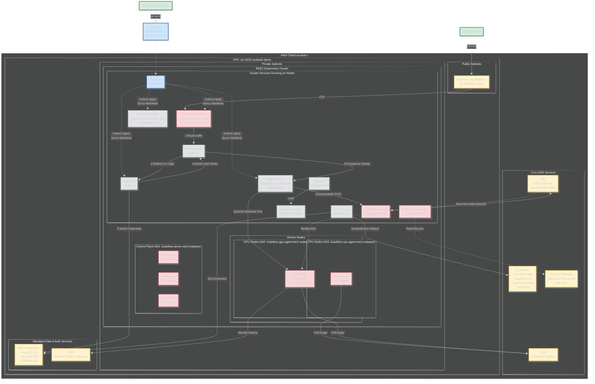
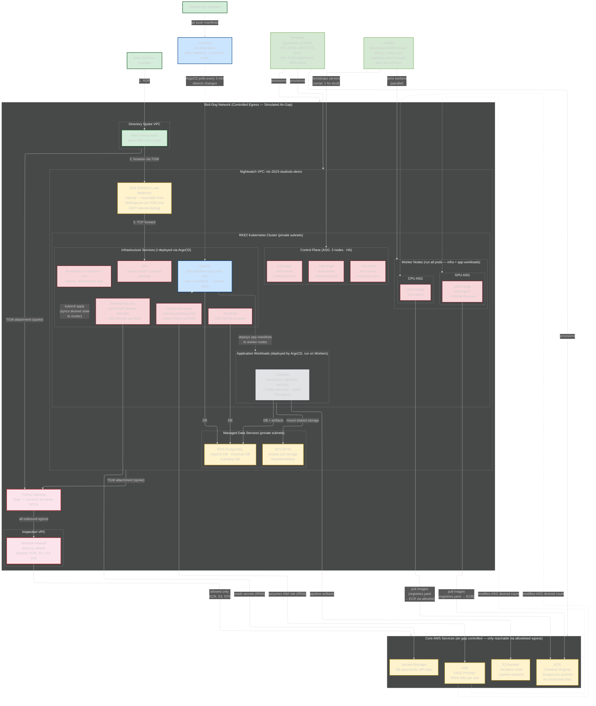

---
config:
  layout: elk
---
flowchart RL
 subgraph NFW_Resources["Network Firewall Infrastructure"]
        NFW_VPC["NFW Inspection VPC<br>10.70.0.0/16"]
        NFW["AWS Network Firewall<br>central-egress"]
        NFW_TGW_Attach["NFW TGW Attachment"]
        NFW_NAT["NAT Gateways<br>3 AZs"]
        NFW_Rules["Firewall Rules<br>- Allow Route53<br>- Allow STS<br>- Allow DNS"]
  end
 subgraph INFRA_Resources["ntconcepts-gov-infra Resources"]
        NFW_Resources
  end
 subgraph TGW_Routes["TGW Route Tables"]
        TGW_Inspect["Egress Inspection RT"]
        TGW_Return["Egress Return RT"]
  end
 subgraph AZ1["Availability Zone us-gov-west-1a"]
        Private1["Private Subnet<br>10.10.0.0/24"]
        Public1["Public Subnet<br>10.10.4.0/24"]
  end
 subgraph AZ2["Availability Zone us-gov-west-1b"]
        Private2["Private Subnet<br>10.10.1.0/24"]
        Public2["Public Subnet<br>10.10.5.0/24"]
  end
 subgraph AZ3["Availability Zone us-gov-west-1c"]
        Private3["Private Subnet<br>10.10.2.0/24"]
        Public3["Public Subnet<br>10.10.6.0/24"]
  end
 subgraph VPC_Network["gov-cui-dev-env-vpc Network"]
        TGW["Transit Gateway"]
        TGW_Routes
        AZ1
        AZ2
        AZ3
        VPC_Endpoints["VPC Endpoints<br>- S3<br>- DynamoDB<br>- EKS<br>- EC2<br>- SSM<br>- ECR<br>- Config<br>- ElastiCache"]
  end
 subgraph DIR_Resources["gov-cui-dev-env-directory Resources"]
        AD["AWS Microsoft AD"]
        Workspaces["AWS Workspaces"]
        DIR_VPC["VPC"]
        DIR_Private["Private Subnets"]
  end
 subgraph EKS_Clusters["EKS Clusters"]
        EKS1["Collab Cluster<br>AZ1"]
        EKS2["Collab Cluster<br>AZ2"]
        EKS3["Collab Cluster<br>AZ3"]
  end
 subgraph Applications["Applications"]
        GitLab["Gitlab"]
        Mattermost["ArgoCD"]
        ArgoCD["Mattermost"]
  end
 subgraph COLLAB_Resources["gov-cui-dev-env-collab Resources"]
        EKS_Clusters
        Applications
        COLLAB_VPC["VPC"]
        ALB["AWS Load Balancer"]
        Route53["Route53<br>cui.ntconcepts.dev"]
  end
 subgraph PROJ64_Network["Network Resources"]
        PROJ64_VPC["VPC<br>10.50.0.0/16"]
        PROJ64_TGW_Attach["TGW Attachment"]
        PROJ64_Private["Private Subnets<br>3 AZs"]
        PROJ64_DB["Database Subnets"]
        PROJ64_Cache["ElastiCache Subnets"]
        PROJ64_Endpoints["VPC Endpoints<br>S3, DynamoDB"]
  end
 subgraph Kubeflow_Platform["Kubeflow Platform"]
        Kubeflow["Kubeflow Service"]
        TensorBoard["Tensorbard"]
        MLflow["MLFlow"]
        Notebooks["Jupyter Notebooks"]
  end
 subgraph PROJ64_EKS["EKS p64-studiodx"]
        EKS_CPU["CPU Node Group<br>m5a.xlarge"]
        EKS_GPU_2xl["GPU Node Group<br>g4dn.2xlarge"]
        EKS_GPU_12xl["GPU Node Group<br>g4dn.12xlarge"]
        Kubeflow_Platform
  end
 subgraph PROJ64_Apps["Xpatch Application"]
        Xpatch_Server["Xpatch Server<br>g4dn.xlarge"]
        Xpatch_License["Xpatch License Server<br>t3.medium"]
        Xpatch_S3["S3: xpatch-storage"]
  end
 subgraph PROJ64_Resources["gov-proj64-studio-dx Resources"]
        PROJ64_Network
        PROJ64_EKS
        PROJ64_Apps
        PROJ64_Route53["Route53<br>prod.proj64.cui.ntconcepts.dev"]
        PROJ64_ECR["ECR<br>Cross-Account Pull"]
  end
    User["User/ML Engineer"] -- Connects to --> Workspaces
    Workspaces -- Provides --> Browser["Web Browser"]
    Browser -- Access Environment 1 --> COLLAB_Resources
    Browser -- Access Environment 2 --> PROJ64_Resources
    Browser -. Uses .-> GitLab & Mattermost & Kubeflow
    Kubeflow -- Provides --> TensorBoard & MLflow & Notebooks
    TensorBoard -- Monitors --> EKS_GPU_2xl
    MLflow -- Model Registry --> PROJ64_ECR
    Notebooks -- Compute --> EKS_CPU
    Notebooks -- GPU Compute --> EKS_GPU_2xl
    Notebooks -- Large GPU --> EKS_GPU_12xl
    TGW -. TGW Attachment .-> Private1 & Private2 & Private3 & DIR_VPC & COLLAB_VPC & PROJ64_TGW_Attach & NFW_TGW_Attach
    TGW_Inspect -- "0.0.0.0/0 to NFW" --> NFW_TGW_Attach
    NFW_TGW_Attach -- Inspection --> NFW_VPC
    NFW_VPC -- Traffic Analysis --> NFW
    NFW -- Allowed Traffic --> NFW_NAT
    NFW -- Apply Rules --> NFW_Rules
    TGW_Return -- "Return 10.10.0.0/16" --> DIR_VPC
    TGW_Return -- "Return 10.30.0.0/16" --> COLLAB_VPC
    TGW_Return -- "Return 10.50.0.0/16" --> PROJ64_TGW_Attach
    DIR_VPC -. Associated .-> TGW_Inspect
    COLLAB_VPC -. Associated .-> TGW_Inspect
    PROJ64_TGW_Attach -. Associated .-> TGW_Inspect
    NFW_TGW_Attach -. Associated .-> TGW_Return
    PROJ64_TGW_Attach -. Connected .-> PROJ64_VPC
    PROJ64_VPC -- Contains --> PROJ64_Private & PROJ64_DB & PROJ64_Cache
    PROJ64_Endpoints -. PrivateLink .-> PROJ64_Private
    EKS_CPU -- Nodes --> PROJ64_EKS
    EKS_GPU_2xl -- GPU Nodes --> PROJ64_EKS
    EKS_GPU_12xl -- GPU Nodes --> PROJ64_EKS
    PROJ64_EKS -- Uses --> PROJ64_ECR
    Xpatch_Server -- Uses License --> Xpatch_License
    Xpatch_Server -- Storage --> Xpatch_S3
    VPC_Endpoints -. PrivateLink .-> Private1 & Private2 & Private3
    COLLAB_VPC -. Uses .-> AD
    Workspaces -. Auth .-> AD
    EKS1 -. Pull Images .-> PROJ64_ECR
    EKS2 -. Pull Images .-> PROJ64_ECR
    EKS3 -. Pull Images .-> PROJ64_ECR
    PROJ64_EKS -. Uses .-> AD
    PROJ64_Route53 -. Zone Association .-> Route53
    Route53 -- DNS --> ALB
    ALB -- Routes to --> EKS1 & EKS2 & EKS3
    NFW_NAT -- Egress to Internet --> Internet[" "]
    Internet -- Return Traffic --> NFW_NAT
    NFW_VPC@{ icon: "aws:res-amazon-vpc-virtual-private-cloud-vpc", pos: "b"}
    NFW@{ icon: "aws:res-aws-network-firewall-endpoints", pos: "b"}
    NFW_TGW_Attach@{ icon: "aws:res-aws-transit-gateway-attachment", pos: "b"}
    NFW_NAT@{ icon: "aws:res-amazon-vpc-nat-gateway", pos: "b"}
    NFW_Rules@{ icon: "aws:res-aws-waf-filtering-rule", pos: "b"}
    TGW_Inspect@{ icon: "aws:res-amazon-route-53-route-table", pos: "b"}
    TGW_Return@{ icon: "aws:res-amazon-route-53-route-table", pos: "b"}
    Private1@{ icon: "aws:private-subnet", pos: "b"}
    Public1@{ icon: "aws:public-subnet", pos: "b"}
    Private2@{ icon: "aws:private-subnet", pos: "b"}
    Public2@{ icon: "aws:public-subnet", pos: "b"}
    Private3@{ icon: "aws:private-subnet", pos: "b"}
    Public3@{ icon: "aws:public-subnet", pos: "b"}
    TGW@{ icon: "aws:res-amazon-vpc-customer-gateway", pos: "b"}
    VPC_Endpoints@{ icon: "aws:res-amazon-vpc-endpoints", pos: "b"}
    AD@{ icon: "aws:res-aws-directory-service-aws-managed-microsoft-ad", pos: "b"}
    Workspaces@{ icon: "aws:arch-amazon-workspaces-family", pos: "b"}
    DIR_VPC@{ icon: "aws:arch-amazon-virtual-private-cloud", pos: "b"}
    DIR_Private@{ icon: "aws:private-subnet", pos: "b"}
    EKS1@{ icon: "aws:arch-amazon-elastic-kubernetes-service", pos: "b"}
    EKS2@{ icon: "aws:arch-amazon-elastic-kubernetes-service", pos: "b"}
    EKS3@{ icon: "aws:arch-amazon-elastic-kubernetes-service", pos: "b"}
    GitLab@{ icon: "aws:res-aws-iot-sitewise-data-streams", pos: "b"}
    Mattermost@{ icon: "aws:arch-aws-codedeploy", pos: "b"}
    ArgoCD@{ icon: "azure:windows-notification-services", pos: "b"}
    COLLAB_VPC@{ icon: "aws:arch-amazon-virtual-private-cloud", pos: "b"}
    ALB@{ icon: "aws:res-elastic-load-balancing-application-load-balancer", pos: "b"}
    Route53@{ icon: "aws:arch-amazon-route-53", pos: "b"}
    PROJ64_VPC@{ icon: "aws:arch-amazon-virtual-private-cloud", pos: "b"}
    PROJ64_TGW_Attach@{ icon: "aws:res-aws-transit-gateway-attachment", pos: "b"}
    PROJ64_Private@{ icon: "aws:private-subnet", pos: "b"}
    PROJ64_DB@{ icon: "aws:arch-amazon-rds", pos: "b"}
    PROJ64_Cache@{ icon: "aws:arch-amazon-elasticache", pos: "b"}
    PROJ64_Endpoints@{ icon: "aws:res-amazon-vpc-endpoints", pos: "b"}
    Kubeflow@{ icon: "aws:arch-amazon-sagemaker", pos: "b"}
    TensorBoard@{ icon: "fa:file-code", pos: "b"}
    MLflow@{ icon: "fa:file-code", pos: "b"}
    Notebooks@{ icon: "fa:file-code", pos: "b"}
    EKS_CPU@{ icon: "aws:arch-amazon-ec2", pos: "b"}
    EKS_GPU_2xl@{ icon: "aws:arch-amazon-ec2", pos: "b"}
    EKS_GPU_12xl@{ icon: "aws:arch-amazon-ec2", pos: "b"}
    Xpatch_Server@{ icon: "aws:arch-amazon-ec2", pos: "b"}
    Xpatch_License@{ icon: "aws:arch-amazon-ec2", pos: "b"}
    Xpatch_S3@{ icon: "aws:arch-amazon-simple-storage-service", pos: "b"}
    PROJ64_EKS@{ icon: "aws:arch-amazon-elastic-kubernetes-service", pos: "b"}
    PROJ64_Route53@{ icon: "aws:arch-amazon-route-53", pos: "b"}
    PROJ64_ECR@{ icon: "aws:arch-amazon-elastic-container-registry", pos: "b"}
    User@{ icon: "fa:circle-user", pos: "b"}
    Browser@{ icon: "azure:browser", pos: "b"}
    Internet@{ icon: "aws:res-internet-alt2", pos: "b"}
     NFW_VPC:::firewall
     NFW:::firewall
     NFW_TGW_Attach:::firewall
     NFW_NAT:::firewall
     NFW_Rules:::firewall
     TGW:::network
     VPC_Endpoints:::network
     Kubeflow:::kubeflowClass
     TensorBoard:::kubeflowClass
     MLflow:::kubeflowClass
     Notebooks:::kubeflowClass
     User:::userClass
     Browser:::userClass
     COLLAB_Resources:::collabAccount
     PROJ64_Resources:::proj64Account
    classDef rootAccount fill:#f9f,stroke:#333,stroke-width:4px
    classDef idAccount fill:#9cf,stroke:#333,stroke-width:2px
    classDef infraAccount fill:#fc9,stroke:#333,stroke-width:2px
    classDef vpcAccount fill:#cfc,stroke:#333,stroke-width:2px
    classDef dirAccount fill:#fcf,stroke:#333,stroke-width:2px
    classDef collabAccount fill:#cff,stroke:#333,stroke-width:2px
    classDef proj64Account fill:#ff9,stroke:#333,stroke-width:2px
    classDef network fill:#ff9,stroke:#333,stroke-width:2px
    classDef storage fill:#f99,stroke:#333,stroke-width:2px
    classDef firewall fill:#f66,stroke:#333,stroke-width:3px
    classDef userClass fill:#e6f3ff,stroke:#0073e6,stroke-width:3px
    classDef kubeflowClass fill:#fff0e6,stroke:#ff6600,stroke-width:3px


---
config:
  layout: elk
---
flowchart TD
 subgraph Legend["Legend"]
    direction LR
        NS["Kubernetes Namespace"]
        CP["Cloud Provider Service"]
        EX["External System"]
        K8S["Kubernetes Resource"]
  end
 subgraph KF["Kubeflow"]
        CentralDash["centraldashboard"]
        JupyterWeb["jupyter-web-app"]
        KatibController["katib-controller"]
        NotebookController["notebook-controller"]
        TensorboardController["tensorboard-controller"]
        KServe["kserve-controller"]
        Training["training-operator"]
  end
 subgraph Auth["Auth"]
        Keycloak["Keycloak"]
        OAuth["oauth2-proxy"]
  end
 subgraph IstioSystem["Istio System"]
        Ingress["istio-ingressgateway"]
        IstiodControl["istiod"]
        LocalGateway["cluster-local-gateway"]
  end
 subgraph ArgoCDNS["ArgoCD"]
        ArgoCD["argocd-server"]
        ArgoAppController["application-controller"]
  end
 subgraph CertManager["cert-manager"]
        CertMgrController["cert-manager"]
        CertWebhook["cert-manager-webhook"]
  end
 subgraph ExtDNS["external-dns"]
        ExternalDNS["external-dns"]
  end
 subgraph ExtSecrets["external-secrets"]
        ExternalSecrets["external-secrets"]
        SecretWebhook["external-secrets-webhook"]
  end
 subgraph InfraServices["Infrastructure Services"]
        ArgoCDNS
        CertManager
        ExtDNS
        ExtSecrets
  end
 subgraph K8sCluster["Kubernetes Cluster"]
        KF
        Auth
        IstioSystem
        InfraServices
  end
 subgraph CloudServices["Cloud Provider Services"]
        LoadBalancer["Load Balancer"]
        ObjectStorage["Object Storage"]
        FileStorage["File Storage"]
        DNSService["DNS Service"]
        SecretsMgmt["Secrets Management"]
  end
 subgraph CloudProvider["Cloud Service Provider Environment"]
        K8sCluster
        CloudServices
  end
 subgraph External["External Systems"]
        APIGateway["API Gateway"]
        TrinitySvc["Trinity Service"]
        SAPService["SAP Service"]
        VersionControl["Version Control System"]
  end
    VersionControl -- Git changes trigger deployments --> ArgoAppController
    ArgoAppController -- Deploys ML platform components --> KF
    ArgoAppController -- Deploys auth services --> Auth
    ArgoAppController -- Deploys service mesh --> IstioSystem
    ArgoAppController -- Deploys cert management --> CertManager
    ArgoAppController -- Deploys DNS controller --> ExtDNS
    ArgoAppController -- Deploys secrets management --> ExtSecrets
    Ingress -- Routes external traffic --> LoadBalancer
    LoadBalancer -- Forwards to --> APIGateway
    APIGateway -- Routes to --> TrinitySvc
    TrinitySvc -- Integrates with --> SAPService
    ExtSecrets -- Syncs cloud secrets --> SecretsMgmt
    ExtDNS -- Manages DNS records --> DNSService
    CertMgrController -- Issues SSL certificates --> DNSService
    OAuth -- Authenticates users --> Keycloak
    IstiodControl -- Controls mesh traffic --> Ingress
    KServe -- Manages ML model serving --> ObjectStorage
    NotebookController -- Provisions user workspaces --> FileStorage
    Ingress -- Routes ML platform traffic --> KF
    Ingress -- Routes auth requests --> Auth
     NS:::namespace
     CP:::cloud
     EX:::external
     K8S:::k8s
     CentralDash:::k8s
     JupyterWeb:::k8s
     KatibController:::k8s
     NotebookController:::k8s
     TensorboardController:::k8s
     KServe:::k8s
     Training:::k8s
     Keycloak:::k8s
     OAuth:::k8s
     Ingress:::k8s
     IstiodControl:::k8s
     LocalGateway:::k8s
     ArgoCD:::k8s
     ArgoAppController:::k8s
     CertMgrController:::k8s
     CertWebhook:::k8s
     ExternalDNS:::k8s
     ExternalSecrets:::k8s
     SecretWebhook:::k8s
     CertManager:::namespace
     ExtDNS:::namespace
     ExtSecrets:::namespace
     KF:::namespace
     Auth:::namespace
     IstioSystem:::namespace
     LoadBalancer:::cloud
     ObjectStorage:::cloud
     FileStorage:::cloud
     DNSService:::cloud
     SecretsMgmt:::cloud
     APIGateway:::external
     TrinitySvc:::external
     SAPService:::external
     VersionControl:::external
    classDef namespace fill:#e6f3ff,stroke:#666,stroke-width:2px
    classDef k8s fill:#fff,stroke:#666
    classDef external fill:#f9f9f9,stroke:#333,stroke-width:2px
    classDef cloud fill:#f3f3f3,stroke:#333,stroke-width:2px
    classDef provider fill:#f0f9ff,stroke:#333,stroke-width:3px


---

## Chart 3: Nightwatch RKE2 Platform — Full Reference

> This is the complete architecture. Use it to STUDY and memorize components. For whiteboarding, use the layered drawing guide below it.



---

## Chart 3b: Nightwatch RKE2 — DevOps-Focused (Whiteboard Version)

> **This is what you study for the whiteboard.** Infrastructure and operations — not application workflows. Draw THIS, reference Chart 3 only if Andy probes into application-level detail.



### What This DevOps-Focused Diagram Shows

**Fixes from previous version:**
- ArgoFlow is now labeled as "Git Repository (K8s manifests = source of truth)" — it's a REPO, not a tool. ArgoCD polls it every 3 min.
- ArgoCD now says "kubectl apply (syncs desired state to cluster)" — clear what "syncs manifests" means
- NLB is now "internal — reachable from Workspaces via TGW only (NOT internet-facing)"
- User access path shown: RDP → Workspaces → TGW → NLB → Istio (Bird-Dog controlled)
- Bird-Dog is now a containing box around ALL VPCs showing the spoke architecture
- Egress path clear: Nightwatch VPC → TGW → NFW → only allowlisted AWS services
- App Workloads box is INSIDE the RKE2 Cluster and labeled "deployed by ArgoCD, run on Workers"
- Ansible deploys NODES only. ArgoCD deploys EVERYTHING that runs inside the cluster.
- Terraform provisions Bird-Dog network infrastructure too (TGW, NFW rules)

**The story it tells:**
1. **The entire environment sits inside Bird-Dog** — spoke VPCs connected via Transit Gateway, all egress through Network Firewall. Deny-by-default. Only ECR, S3, STS allowlisted. No open internet.
2. **Users access via Workspaces** — RDP into AWS Workspaces in the Directory spoke, then browser through TGW to the NLB in the Nightwatch spoke. NLB is NOT internet-facing.
3. **Terraform provisions ALL AWS infrastructure** — VPC, ASGs, RDS, EFS, ECR, IAM, AND the Bird-Dog network (TGW attachment, NFW rules)
4. **Ansible bootstraps the RKE2 nodes** — binary, config, registries.yaml, firewall, service. Servers serial (etcd ordering), workers parallel.
5. **ArgoCD deploys everything IN the cluster** — polls the argoflow Git repo every 3 minutes, detects changes, runs kubectl apply to sync desired state. Deploys both infra services AND app workloads. Ansible doesn't touch applications.
6. **IRSA gives pods AWS access** — Autoscaler assumes IAM role to scale ASGs, External Secrets assumes role to read Secrets Manager. Pod-level least-privilege.
7. **registries.yaml redirects image pulls to ECR** — containerd on every node pulls from ECR via the Bird-Dog allowlist. Never hits public internet.
8. **Application workloads run ON the worker nodes** — Kubeflow pods scheduled onto CPU/GPU workers by K8s scheduler. Deployed by ArgoCD from Git, not by Ansible.

**Why the Bird-Dog connection matters for Anduril:**
"This cluster sat inside our Bird-Dog hub-and-spoke network. Users RDP'd into Workspaces, accessed services through the Transit Gateway — never direct internet. All egress went through Network Firewall with deny-by-default. Only ECR, S3, and STS endpoints were allowlisted. That's the same posture Anduril needs: controlled access in, controlled egress out. The pattern scales from 'controlled internet' to 'fully air-gapped' — same registries.yaml, same ArgoCD, just swap ECR for local Nexus and the firewall for a diode."

---

### Whiteboard Drawing Guide: 4 Layers (draw progressively)

The full diagram has ~25 components. On a whiteboard you can't draw all of it. Instead, draw it in 4 layers — each takes 2-3 minutes. Andy will stop you on the layer he wants to dig into.

#### Layer 1: Infrastructure Skeleton (draw this first — 2 min)

Draw the physical layout: VPC, subnets, node groups, AWS services.

```
On the whiteboard:

┌─────────────────── AWS Cloud (us-east-1) ───────────────────┐
│                                                              │
│  ┌── Core AWS Services ──────────────────────────────────┐   │
│  │  ECR (images)   S3 (state/artifacts)   IAM (IRSA)    │   │
│  │  Secrets Manager                                       │   │
│  └────────────────────────────────────────────────────────┘   │
│                                                              │
│  ┌── VPC ────────────────────────────────────────────────┐   │
│  │  [Public Subnet: NLB]                                  │   │
│  │                                                        │   │
│  │  ┌── Private Subnets: RKE2 Cluster ───────────────┐   │   │
│  │  │  Control Plane: 3x m5a.large (HA)              │   │   │
│  │  │  CPU Workers:   m5a.2xlarge                     │   │   │
│  │  │  GPU Workers:   g4dn.xlarge + NVIDIA Operator   │   │   │
│  │  │                                                 │   │   │
│  │  │  [Cluster Services - draw in Layer 2]           │   │   │
│  │  └─────────────────────────────────────────────────┘   │   │
│  │                                                        │   │
│  │  ┌── Managed Data Services ────────────────────────┐   │   │
│  │  │  RDS PostgreSQL (ArgoCD, Keycloak, Kubeflow)    │   │   │
│  │  │  EFS (shared notebook storage)                  │   │   │
│  │  └─────────────────────────────────────────────────┘   │   │
│  └────────────────────────────────────────────────────────┘   │
└──────────────────────────────────────────────────────────────┘
```

Say: "The platform runs on AWS. Three control plane nodes for HA — m5a.large running rke2-server with embedded etcd. CPU worker pool on m5a.2xlarge for general workloads. GPU worker pool on g4dn.xlarge with the NVIDIA GPU Operator for automatic driver injection. Everything in private subnets — NLB in the public subnet is the only entry point. RDS PostgreSQL backs ArgoCD, Keycloak, and Kubeflow. EFS provides shared notebook storage across pods."

#### Layer 2: Cluster Services (add inside the cluster box — 2 min)

Now fill in what runs ON the cluster. Group by function:

```
Inside the RKE2 Cluster box, write:

  Networking:    Istio (service mesh + ingress gateway)
  Auth:          Keycloak + oauth2-proxy
  GitOps:        ArgoCD (syncs from Git)
  ML Platform:   Kubeflow (notebooks, pipelines, KServe, Knative)
  Monitoring:    Prometheus + Grafana + Loki
  Scaling:       Cluster Autoscaler
  Secrets:       External Secrets Operator → AWS Secrets Manager
```

Say: "Inside the cluster: Istio handles the service mesh and ingress. Keycloak with oauth2-proxy for SSO — data scientists don't manage credentials. ArgoCD syncs everything from a Git repo — pure GitOps, no manual kubectl. Kubeflow provides notebooks, pipelines, and model serving. Monitoring stack is Prometheus, Grafana, and Loki. Cluster Autoscaler watches for pending GPU pods. External Secrets Operator syncs credentials from AWS Secrets Manager."

#### Layer 3: Data Scientist User Flow (draw the numbered auth chain — 2 min)

Draw the user path with numbered steps:

```
[Data Scientist] --HTTPS--> [NLB] --TCP--> [Istio Ingress]
                                                  |
                                            1. Route traffic
                                                  ↓
                                           [oauth2-proxy]
                                                  |
                                          2. Redirect to login
                                                  ↓
                                            [Keycloak]
                                                  |
                                        3. Verify creds → [RDS]
                                                  |
                                        4. Return auth token
                                                  ↓
                                           [oauth2-proxy]
                                                  |
                                        5. Forward with header
                                                  ↓
                                        [Kubeflow Dashboard]
                                                  |
                                          Spawns notebook pod
                                                  ↓
                                           [GPU Node] → mounts [EFS]
```

Say: "Data scientist hits the NLB, Istio routes to oauth2-proxy, which redirects to Keycloak for login. Keycloak verifies against RDS, returns a token, oauth2-proxy injects the auth header, and the request reaches the Kubeflow dashboard. From there, the scientist launches a notebook — Kubeflow spawns a pod on a GPU node, mounts EFS for shared storage. Completely self-service — no tickets, no admin intervention."

#### Layer 4: GPU Auto-Scaling Flow (the impressive part — 2 min)

Draw the scaling loop:

```
[Kubeflow: spawn notebook requesting GPU]
            |
    Pod goes Pending (no GPU node available)
            ↓
[Cluster Autoscaler detects pending pod]
            |
    Assumes IAM role (IRSA)
            ↓
[Modifies ASG desired count]
            |
    New g4dn.xlarge node launches
            ↓
[NVIDIA GPU Operator installs drivers]
            |
    Pod schedules on new node → training starts
            ↓
[Training completes → pod terminates]
            |
    No pending GPU pods → Autoscaler scales down
```

Say: "This is the part that tripled throughput. Data scientist requests a GPU notebook. If no GPU node has capacity, the pod goes Pending. Cluster Autoscaler detects it, assumes an IAM role via IRSA, and increases the ASG desired count. New g4dn node comes up, NVIDIA Operator auto-installs GPU drivers, pod schedules, training starts. When training completes and no more GPU pods are pending, Autoscaler scales the node back down. GPU costs are controlled — nodes only exist during active training."

#### Layer 5 (optional, only if time): GitOps Flow

```
[Developer] --git push--> [argoflow Git Repo]
                                   |
                          ArgoCD watches repo
                                   ↓
                    [ArgoCD syncs manifests to cluster]
                                   |
                    Deploys: Istio, Keycloak, Kubeflow, Monitoring
                                   |
                    Images pulled from ECR
```

Say: "Everything is GitOps. I push manifests to the argoflow Git repo, ArgoCD detects the change and syncs to the cluster. No manual kubectl — drift is detected and reverted automatically. Images come from ECR."

---

### When to Stop Drawing

- If Andy says "tell me more about the auth flow" → you've already drawn Layer 3, point to it and elaborate
- If Andy says "how does the GPU scaling work?" → draw Layer 4 and explain
- If Andy says "interesting, what about the networking?" → point to Layer 1 (NLB, private subnets, Istio) and explain
- **Don't try to draw all 4 layers unprompted.** Draw Layer 1, narrate it, pause. Let Andy direct where to go deeper.
    ClusterAutoscaler -- scale ASG --> IAM
    ExtSecrets -- read --> SecretsManager
    KF_Pipelines -- artifacts --> S3
    KF_Pipelines -- metadata --> RDS
    CPU_Node1 -- pull image --> ECR
    GPU_Node1 -- pull image --> ECR
```