# Architecture Practice: Air-Gapped Dev Environment (System Design Round)

## The Prompt
"Given a badge and laptop on your first day of work, design a foundational dev environment. Constraint: air-gapped, no internet for tools and services."

---

## HOW TO DRAW — The Question Method (12 Questions)

> Walk through these questions in order. Each one forces you to draw a section. The questions tell a STORY: you're a developer on day one, what do you need at each step?

**"I just got hired. I have a badge and a laptop. How do I become productive in an air-gapped environment?"**

| # | Question | What you draw | What you say |
|---|----------|--------------|-------------|
| 1 | "How do I get in and get on the network?" | Badge box, Laptop box (hardened RHEL, pre-loaded tools), cert auth → isolated VLAN | "Badge gets me in. Laptop is a hardened RHEL box — STIG'd, encrypted disk, pre-loaded with Git, Podman, Ansible, VS Code, SSH keys. Cert-based auth joins me to the air-gapped VLAN. No internet." |
| 2 | "How does my laptop find services?" | Internal DNS (gitlab.dev.internal, nexus.dev.internal), NTP (local time — TLS needs synced clocks) | "Internal DNS resolves all services locally. Internal NTP because air-gapped can't reach public time servers — clocks must sync for TLS cert validation and log correlation." |
| 3 | "What runs all the dev services?" | K8s cluster box (RKE2) inside the air-gapped network. Label: "All services run as pods, deployed via Helm charts, managed by ArgoCD" | "Everything runs on Kubernetes — RKE2 cluster inside the air-gapped network. Every service is a pod deployed via Helm charts stored in Nexus. ArgoCD syncs from a local Git repo — same GitOps pattern I used at NTConcepts and VivSoft." |
| 4 | "Where does source code live?" | Inside K8s: GitLab pods — gitlab-webservice, gitaly (Git storage), gitlab-registry (built-in container registry), gitlab-runner | "GitLab CE runs as K8s pods. Webservice handles the UI and API. Gitaly is the Git storage backend — handles all git operations, stores repos on a PVC. Built-in container registry for images built by the pipeline. Runner pod with Podman executor runs CI/CD jobs." |
| 5 | "How do I install packages and pull images?" | Inside K8s: Nexus pod — Docker registry, PyPI, RPM, npm, Helm repos all in one | "Nexus runs as a pod with a large PVC. One tool mirrors everything — container images from Iron Bank, Python packages, RHEL RPMs, npm, Go modules, Helm charts. All pre-transferred from the connected side. Developers point pip, dnf, and podman at Nexus — works like the public internet but local." |
| 6 | "How do packages GET into the air-gap?" | Connected side box (OUTSIDE air-gap) → Diode/media (one-way, on the boundary) → Receiving station box (INSIDE air-gap) → unpacks into Nexus | "Connected side: bundle station pulls from internet, scans with Trivy, packages into Zarf archives with checksums. Transfers via diode — hardware-enforced one-way. Receiving station is INSIDE the air-gapped network: validates checksums, unpacks images and packages into Nexus. Auditable — every transfer logged." |
| 7 | "What happens when I push code?" | Arrow: git push → GitLab → triggers Runner → pipeline: lint → build → SonarQube scan → Ansible deploy to test VM → push artifact to Nexus | "Push triggers the pipeline on the runner pod. Lint, build container with Podman, scan with SonarQube for code quality and vulnerabilities, deploy via Ansible to a test VM to validate, push passing artifact to Nexus. All automated." |
| 8 | "How do I log in to everything?" | Keycloak pod: OIDC/SSO → GitLab, Nexus, Grafana, Vault | "Keycloak pod — SSO for everything. One login. GitLab, Nexus, Grafana, Vault all integrated. Badge-linked identity if we integrate with CAC. No separate credentials per tool." |
| 9 | "Where do secrets live?" | Vault pod (Raft HA): SSH certs → test VMs, pipeline creds → runner | "Vault runs as a StatefulSet with Raft HA. SSH cert signing — Ansible gets short-lived certs per pipeline run to reach test VMs. Pipeline credentials, database passwords, API keys — all in Vault, never in Git." |
| 10 | "How is traffic secured inside the cluster?" | Istio pod: mTLS pod-to-pod, ingress gateway. cert-manager + step-ca: internal PKI | "Istio service mesh — mTLS between all pods automatically. cert-manager with step-ca as the internal CA — can't use Let's Encrypt air-gapped. Issues and rotates TLS certs for the ingress gateway and Keycloak." |
| 11 | "How do I know if something is broken?" | Prometheus + Grafana + Loki pods. Arrows: scrapes GitLab, Runner, Nexus | "Prometheus scrapes every service, Grafana for dashboards, Loki for logs. Pipeline success rates, runner utilization, Nexus disk usage — all visible without SSH'ing to anything." |
| 12 | "Where does data persist?" | PostgreSQL StatefulSet (GitLab DB, Keycloak DB, SonarQube DB). NFS for Gitaly repos, build caches, artifacts | "PostgreSQL as a StatefulSet — databases for GitLab, Keycloak, SonarQube. PVCs with Retain policy for production. NFS for Git repos via Gitaly, build caches for the runner, shared artifacts. Data survives pod restarts." |

**After all 12:** Add ArgoCD arrow: "ArgoCD deploys ALL of these services from a local Git repo via Helm charts stored in Nexus. Same GitOps pattern as my VivSoft and NTConcepts platforms — push manifests to Git, ArgoCD syncs."

Then narrate: "The whole thing runs air-gapped on K8s. Every service is a pod — GitLab, Nexus, Vault, Keycloak, monitoring, all deployed via Helm. Software enters through the transfer process — scanned, checksummed, one-way. Developers clone, code, build with Podman, push to GitLab, pipeline validates, artifact lands in Nexus. No internet at any step. And because it's K8s with ArgoCD, the whole environment is reproducible from Git — I can spin up a second environment by deploying the same Helm charts."

---

## GAPS — Review Before Each Drawing Attempt

> Add gaps here after each attempt. Read FIRST before redrawing.

*(empty — fill in after your first attempt)*

---

## Mermaid Diagram (Answer Key)

> Render this in mermaid.live after drawing from the 12 questions. Compare what you drew.

```mermaid
---
config:
  layout: elk
  theme: dark
---
flowchart TD
    subgraph Physical_Access["Physical Access & Onboarding"]
        Badge["Badge<br/>(physical access to building)"]:::physical
        Laptop["Hardened Laptop<br/>RHEL 8/9 · STIG'd · encrypted disk<br/>pre-loaded: Git, Podman, Ansible,<br/>VS Code, SSH keys"]:::physical
        VPN["Internal Network Access<br/>(badge + cert-based auth)<br/>connects to air-gapped VLAN"]:::physical
    end

    subgraph Connected_Side["Connected Side (HAS internet — separate network)"]
        Bundle["Bundle Station<br/>- Pull packages: RPM, PyPI, npm, Go<br/>- Pull images: Iron Bank, base images<br/>- Scan everything with Trivy<br/>- Package into Zarf archive<br/>- Generate manifest + checksums"]:::transfer
    end

    subgraph Transfer["Transfer Boundary (one-way)"]
        Media["Diode / Approved Media<br/>(hardware-enforced one-way)<br/>data flows IN only"]:::transfer
    end

    subgraph AirGapped_Network["Air-Gapped Network (no internet — isolated VLAN)"]
        direction TB

        subgraph Network_Services["Core Network Services (bare-metal or VM)"]
            DNS["Internal DNS<br/>gitlab.dev.internal<br/>nexus.dev.internal<br/>vault.dev.internal"]:::network
            NTP["Internal NTP<br/>(local time source)"]:::network
        end

        subgraph Receive_Station["Receiving Station (inside air-gap)"]
            Receive["Receive + Validate<br/>- Validate checksums (sha256)<br/>- Unpack archives<br/>- Push images → Nexus Docker<br/>- Push packages → Nexus repos<br/>- Log every transfer for audit"]:::transfer
        end

        subgraph K8s_Cluster["Kubernetes Cluster (RKE2 — all services run as pods)"]
            direction TB

            subgraph Infra_Services["Infrastructure Services (deployed via Helm + ArgoCD)"]
                ArgoCD_Dev["ArgoCD<br/>GitOps — syncs all services<br/>from local Git repo"]:::gitops
                Istio_Dev["Istio<br/>service mesh + ingress<br/>mTLS pod-to-pod"]:::k8s
                CertMgr_Dev["cert-manager + step-ca<br/>internal PKI (air-gap CA)"]:::k8s
            end

            subgraph Dev_Tools["Developer Tools (K8s pods — deployed via Helm charts from Nexus)"]
                subgraph GitLab_Pods["GitLab CE"]
                    GitLab["gitlab-webservice pod<br/>- Source code repos<br/>- Merge requests<br/>- Issue tracking"]:::service
                    Gitaly["gitaly pod<br/>- Git storage backend<br/>- Handles git operations"]:::service
                    GitLab_Registry["gitlab-registry pod<br/>- Built-in container registry"]:::service
                    Runner["gitlab-runner pod<br/>- Podman executor (rootless)<br/>- Runs CI/CD pipelines"]:::service
                end

                subgraph Nexus_Pods["Nexus Repository Manager"]
                    Nexus["nexus pod<br/>- Docker registry (pre-mirrored images)<br/>- PyPI mirror (Python)<br/>- RPM mirror (RHEL)<br/>- npm mirror (Node)<br/>- Helm chart repo"]:::service
                end

                subgraph Security_Pods["Security & Identity"]
                    Vault["vault pod (Raft HA)<br/>- Secrets management<br/>- SSH cert signing<br/>- Pipeline credentials"]:::service
                    Keycloak["keycloak pod<br/>- OIDC/SSO for all services<br/>- Badge-linked identity"]:::service
                    SonarQube["sonarqube pod<br/>- Static code analysis<br/>- Quality gates in pipeline"]:::service
                end

                subgraph Monitoring_Pods["Observability"]
                    Prometheus["prometheus pod<br/>- Metrics from all services"]:::service
                    Grafana["grafana pod<br/>- Dashboards"]:::service
                    Loki["loki pod<br/>- Centralized logs"]:::service
                end
            end

            subgraph Data_Layer["Persistent Data (PVCs → PVs)"]
                PG["PostgreSQL<br/>(StatefulSet)<br/>- GitLab DB<br/>- Keycloak DB<br/>- SonarQube DB"]:::data
                NFS["NFS / EFS<br/>- Git repos (Gitaly)<br/>- Build caches<br/>- Shared artifacts"]:::data
            end
        end

        subgraph Test_Targets["Test Infrastructure (outside cluster)"]
            TestVM["Test VMs / EC2 instances<br/>- Ansible deploys here<br/>- Validates playbooks<br/>- before production"]:::infra
        end
    end

    %% Developer Day 1 flow
    Developer["Developer<br/>(Day 1)"]:::user
    Developer -- "1. Badge in" --> Badge
    Developer -- "2. Boot laptop" --> Laptop
    Laptop -- "3. Cert auth →<br/>join air-gapped VLAN" --> VPN
    VPN -- "4. DNS resolves<br/>gitlab.dev.internal" --> DNS

    %% Developer daily flow
    Developer -- "5. git clone" --> GitLab
    Developer -- "6. podman build<br/>(images from Nexus)" --> Nexus
    Developer -- "7. pip install / dnf install<br/>(packages from Nexus)" --> Nexus
    Developer -- "8. git push →<br/>triggers pipeline" --> GitLab

    %% Pipeline flow
    GitLab -- "triggers" --> Runner
    Runner -- "pulls images" --> Nexus
    Runner -- "ansible-lint +<br/>ansible-playbook" --> TestVM
    Runner -- "sonarqube scan" --> SonarQube
    Runner -- "on success:<br/>push artifact" --> Nexus

    %% GitLab internal
    GitLab -- "git operations" --> Gitaly
    GitLab -- "image storage" --> GitLab_Registry

    %% ArgoCD deploys everything
    ArgoCD_Dev -. "deploys all Helm charts<br/>from local Git repo" .-> Dev_Tools
    ArgoCD_Dev -. "syncs infra services" .-> Infra_Services

    %% SSO
    Keycloak -- "SSO" --> GitLab
    Keycloak -- "SSO" --> Nexus
    Keycloak -- "SSO" --> Grafana
    Keycloak -- "SSO" --> Vault

    %% Secrets
    Vault -- "SSH certs for Ansible" --> TestVM
    Vault -- "pipeline secrets" --> Runner

    %% TLS
    CertMgr_Dev -- "issues TLS certs" --> Istio_Dev
    CertMgr_Dev -- "issues TLS certs" --> Keycloak

    %% Monitoring
    Prometheus -- "scrapes" --> GitLab
    Prometheus -- "scrapes" --> Runner
    Prometheus -- "scrapes" --> Nexus
    Grafana -- "reads" --> Prometheus
    Grafana -- "reads" --> Loki

    %% Data persistence
    GitLab -- "DB" --> PG
    Keycloak -- "DB" --> PG
    SonarQube -- "DB" --> PG
    Gitaly -- "storage" --> NFS
    Runner -- "build cache" --> NFS

    %% Transfer flow (shows physical placement)
    Bundle -- "packages archives<br/>via one-way" --> Media
    Media -- "delivers INTO<br/>air-gapped network" --> Receive
    Receive -- "unpacks images<br/>into Nexus" --> Nexus
    Receive -- "unpacks packages<br/>into Nexus" --> Nexus

    %% Ingress
    Istio_Dev -- "routes external<br/>traffic to services" --> Dev_Tools

    classDef physical fill:#d4edda,stroke:#155724,stroke-width:2px
    classDef network fill:#fce4ec,stroke:#c62828,stroke-width:2px
    classDef service fill:#cce5ff,stroke:#004085,stroke-width:2px
    classDef k8s fill:#f8d7da,stroke:#721c24,stroke-width:2px
    classDef gitops fill:#cce5ff,stroke:#004085,stroke-width:3px
    classDef infra fill:#fff3cd,stroke:#856404,stroke-width:2px
    classDef transfer fill:#e2e3e5,stroke:#383d41,stroke-width:2px
    classDef user fill:#d5e8d4,stroke:#82b366,stroke-width:2px
    classDef data fill:#d4edda,stroke:#155724,stroke-width:2px
```

### Design Narration (how to walk Taylor through it)

**"Day one. Badge in, boot the laptop — hardened RHEL, pre-loaded tools. Cert auth to join the air-gapped VLAN. No internet.**

**Everything runs on a K8s cluster inside the air-gapped network — same pattern I used at NTConcepts and VivSoft. Every service is a pod deployed via Helm charts managed by ArgoCD.**

**Source code: GitLab CE — webservice pod for the UI, gitaly pod for Git storage, built-in registry pod for container images, runner pod for CI/CD. All running in the cluster, all backed by PostgreSQL StatefulSets and NFS for persistent storage.**

**Packages: Nexus pod mirrors everything — container images, Python, RPM, npm, Go, Helm charts. One tool, all package types. Developers point their package managers at Nexus — works like the public internet but fully local.**

**How packages get in: on the connected side, a bundle station pulls from the internet, scans with Trivy, packages into Zarf-style archives with checksums. Transfer via diode — one-way hardware into the air-gap. Receiving station INSIDE the network validates checksums and unpacks into Nexus. Auditable, automated.**

**Pipeline: push code to GitLab → runner triggers → lint, build with Podman, scan with SonarQube, test by deploying Ansible to a test VM, push passing artifact to Nexus. All automated — no manual steps.**

**Security: Keycloak pod for SSO — one login for everything. Vault pod in Raft HA for secrets — SSH certs, pipeline credentials, database passwords. Istio mesh for mTLS between pods. cert-manager with step-ca as the internal CA for TLS certificates.**

**Observability: Prometheus, Grafana, Loki — all pods inside the cluster. Zero internet. Full visibility into pipeline health, runner utilization, service status.**

**The whole environment is reproducible from Git — ArgoCD syncs everything. Need a second environment? Deploy the same Helm charts to a new cluster. Need to update a service? Push to Git, ArgoCD syncs. Drift? ArgoCD detects and reverts. Same GitOps pattern I've built twice before."**

### Architectural Decisions / Tradeoffs Andy or Taylor Might Probe

| Decision | Why | Alternative rejected |
|----------|-----|---------------------|
| GitLab CE over GitHub Enterprise | Self-hosted, free, built-in container registry, runners | GitHub requires license, less self-contained |
| Nexus over Artifactory | Handles all repo types (Docker, PyPI, RPM, npm, Helm) in one tool, free OSS version | Artifactory is better but costs money, more complex |
| Podman over Docker | Rootless by default, daemonless, SELinux compatible, no root attack surface | Docker requires daemon running as root |
| Vault over file-based secrets | Centralized, auditable, auto-rotation, RBAC per team | Files: no audit trail, no rotation, scattered |
| Keycloak over LDAP-only | Full OIDC/SSO, MFA, can integrate with badge/CAC, web-based admin | LDAP: auth only, no SSO across tools |
| Diode over USB | Automated, auditable, one-way hardware-enforced | USB: manual, human error, physical security risk |
| SonarQube in pipeline | Catches vulns before merge, quality gates block bad code | Manual review: inconsistent, slow, misses things |

### What Makes This Answer Strong
1. **Addresses "first day"** — badge in, laptop, immediate productivity path
2. **Every tool justified** — not just "we need GitLab" but WHY GitLab over alternatives
3. **Air-gap is designed in, not bolted on** — Nexus mirrors, transfer process, no internet assumptions anywhere
4. **Security layered** — physical (badge), network (isolated VLAN), identity (Keycloak SSO), secrets (Vault), code (SonarQube)
5. **Operational concerns covered** — monitoring, logging, alerting
6. **Transfer process explicit** — how software ENTERS the air-gap (connected → bundle → scan → transfer → unpack → Nexus)

---

