# Architecture Practice: Air-Gapped Dev Environment (System Design Round)

## The Prompt
"Given a badge and laptop on your first day of work, design a foundational dev environment. Constraint: air-gapped, no internet for tools and services."

---

## HOW TO DRAW — The Question Method (12 Questions)

> Walk through these questions in order. Each one forces you to draw a section. The questions tell a STORY: you're a developer on day one, what do you need at each step?

**"I just got hired. I have a badge and a laptop. How do I become productive in an air-gapped environment?"**

| # | Question | What you draw | What you say |
|---|----------|--------------|-------------|
| 1 | "How do I get in and get on the network?" | Badge box, Laptop box (hardened RHEL, pre-loaded tools), cert auth → isolated VLAN | "Badge gets me in. Laptop is a hardened RHEL box — STIG'd, encrypted disk, pre-loaded with Git, Podman, Ansible, VS Code, SSH keys. Cert-based auth joins me to the air-gapped VLAN. No internet." |
| 2 | "How does my laptop find services?" | DNS server box (bind/dnsmasq — resolves gitlab.dev.internal etc.), NTP server box (chronyd — local time source, can't reach pool.ntp.org) | "Self-hosted DNS server running bind — resolves all service hostnames locally. Self-hosted NTP running chronyd — air-gapped can't reach public time servers. Clocks MUST sync for TLS cert validation and log correlation. Both run on bare-metal or VMs, not in the K8s cluster — they need to be up BEFORE the cluster boots." |
| 3 | "What runs all the dev services?" | K8s cluster box (RKE2 on bare-metal nodes) inside the air-gapped network. Label: "All services run as pods, deployed via Helm charts, managed by ArgoCD" | "Everything runs on RKE2 — bare-metal nodes running Kubernetes. Same distribution I deployed at NTConcepts: bundled binary, embedded etcd, Canal CNI, CIS hardened. Every service is a pod deployed via Helm charts stored in Nexus. ArgoCD syncs from a local Git repo. Ansible bootstraps the nodes — same roles I wrote before." |
| 4 | "Where does source code live?" | Inside K8s: GitLab pods — gitlab-webservice, gitaly (Git storage), gitlab-registry (built-in container registry), gitlab-runner | "GitLab CE runs as K8s pods. Webservice handles the UI and API. Gitaly is the Git storage backend — handles all git operations, stores repos on a PVC. Built-in container registry for images built by the pipeline. Runner pod with Podman executor runs CI/CD jobs." |
| 5 | "How do I install packages and pull images?" | Inside K8s: Nexus pod — Docker registry, PyPI, RPM, npm, Helm repos all in one | "Nexus runs as a pod with a large PVC. One tool mirrors everything — container images from Iron Bank, Python packages, RHEL RPMs, npm, Go modules, Helm charts. All pre-transferred from the connected side. Developers point pip, dnf, and podman at Nexus — works like the public internet but local." |
| 6 | "How do packages GET into the air-gap?" | Connected side box (OUTSIDE air-gap) → Diode/media (one-way, on the boundary) → Receiving station box (INSIDE air-gap) → unpacks into Nexus | "Connected side: mirror station uses skopeo to copy images, pip download for Python, reposync for RPMs — scans everything with Trivy, generates checksums. Transfers via diode — hardware-enforced one-way. Receiving station is INSIDE the air-gapped network: validates checksums, pushes images and packages into Nexus. For full platform deployments at scale, I'd use Zarf to bundle Helm charts + images together — but for populating package mirrors, direct mirroring is simpler." |
| 7 | "What happens when I push code?" | Arrow: git push → GitLab → triggers Runner → pipeline: lint → build → SonarQube scan → Ansible deploy to test VM → push artifact to Nexus | "Push triggers the pipeline on the runner pod. Lint, build container with Podman, scan with SonarQube. If the project includes Ansible playbooks, the pipeline also runs ansible-lint then deploys the playbook to a test VM — a disposable EC2 instance outside the cluster that simulates a production server. If the playbook works there, it's validated. If it fails, pipeline fails. Push passing artifact to Nexus." |
| 8 | "How do I log in to everything?" | Keycloak pod: OIDC/SSO → GitLab, Nexus, Grafana, Vault | "Keycloak pod — SSO for everything. One login. GitLab, Nexus, Grafana, Vault all integrated. Badge-linked identity if we integrate with CAC. No separate credentials per tool." |
| 9 | "Where do secrets live?" | Vault pod (Raft HA): SSH certs → test VMs, pipeline creds → runner | "Vault runs as a StatefulSet with Raft HA. SSH cert signing — Ansible gets short-lived certs per pipeline run to reach test VMs. Pipeline credentials, database passwords, API keys — all in Vault, never in Git." |
| 10 | "How is traffic secured inside the cluster?" | Istio pod: mTLS pod-to-pod, ingress gateway. cert-manager + step-ca: internal PKI | "Istio service mesh — mTLS between all pods automatically. cert-manager with step-ca as the internal CA — can't use Let's Encrypt air-gapped. Issues and rotates TLS certs for the ingress gateway and Keycloak." |
| 11 | "How do I know if something is broken?" | Prometheus + Grafana + Loki pods. Arrows: scrapes GitLab, Runner, Nexus | "Prometheus scrapes every service, Grafana for dashboards, Loki for logs. Pipeline success rates, runner utilization, Nexus disk usage — all visible without SSH'ing to anything." |
| 12 | "Where does data persist?" | PostgreSQL StatefulSet (GitLab DB, Keycloak DB, SonarQube DB) with PVCs backed by local disk or NFS. NFS server (on-prem) for Gitaly repos, build caches, artifacts | "PostgreSQL as a StatefulSet — databases for GitLab, Keycloak, SonarQube. PVCs backed by local disk on the nodes or an on-prem NFS server — no EBS or EFS, this is bare-metal. Retain policy so data survives pod restarts. NFS server for Git repos via Gitaly, build caches for the runner, shared artifacts. One NFS box serves the whole cluster." |

| 13 | "How does all of this get stood up?" | Ansible box (bootstraps RKE2 nodes — same roles as Nightwatch). ArgoCD repo box on local GitLab: apps/ directory + charts/ directory. DevOps engineer manages both. | "Two tools. Ansible bootstraps the bare-metal nodes — same common/server/agent roles I wrote at NTConcepts. Once the RKE2 cluster is running, ArgoCD takes over. The ArgoCD repo — hosted on the local GitLab — has two directories: apps/ with an Application YAML per service, and charts/ with the Helm chart for each service. ArgoCD polls the repo, syncs everything. No Terraform — bare-metal doesn't need cloud provisioning. Ansible for nodes, ArgoCD for services." |
| 14 | "What does the ArgoCD repo look like inside?" | Draw the directory: apps/ has one YAML per service (gitlab.yaml, nexus.yaml, vault.yaml, etc). charts/ has one Helm chart dir per service. App-of-apps pattern: one parent Application points to apps/, ArgoCD discovers all children. | "apps directory has one Application YAML per service — each one says 'deploy this Helm chart from charts/ to this namespace.' charts directory has the Helm charts — values.yaml for config, templates/ for K8s manifests. App-of-apps pattern: one parent Application points to apps/, ArgoCD discovers everything automatically. Add a new service? Write the chart, write the Application YAML, push to Git. ArgoCD handles the rest." |

**After all 14:** Narrate: "The whole thing runs air-gapped on bare-metal K8s. Ansible bootstraps the nodes, ArgoCD deploys every service from Git. Software enters through the physical diode — scanned, checksummed, one-way. Developers clone, code, build with Podman, push to GitLab, pipeline validates, artifact lands in Nexus. No internet, no cloud. And because it's K8s with ArgoCD, the whole environment is reproducible — spin up another environment by running the same Ansible playbook and letting ArgoCD sync the same Helm charts."

---

## GAPS — Review Before Each Drawing Attempt

> Add gaps here after each attempt. Read FIRST before redrawing.

*(empty — fill in after your first attempt)*

---

## Mermaid Diagram (Answer Key)

> Render this in mermaid.live after drawing from the 12 questions. Compare what you drew.

```mermaid
---
config:
  layout: elk
  theme: dark
---
flowchart TD
    subgraph Physical_Access["Physical Access & Onboarding"]
        Badge["Badge<br/>(physical access to building)"]:::physical
        Laptop["Hardened Laptop<br/>RHEL 8/9 · STIG'd · encrypted disk<br/>pre-loaded: Git, Podman, Ansible,<br/>VS Code, SSH keys"]:::physical
        VPN["Internal Network Access<br/>(badge + cert-based auth)<br/>connects to air-gapped VLAN"]:::physical
    end

    subgraph Connected_Side["Connected Side (HAS internet — separate network)"]
        Bundle["Bundle / Mirror Station<br/>- skopeo copy images from Iron Bank<br/>- pip download Python packages<br/>- reposync RPM repos<br/>- npm pack Node packages<br/>- Scan everything with Trivy<br/>- Generate manifest + sha256 checksums<br/>- Package into transfer archive"]:::transfer
    end

    subgraph Transfer["Transfer Boundary (one-way)"]
        Media["Diode / Approved Media<br/>(hardware-enforced one-way)<br/>data flows IN only"]:::transfer
    end

    subgraph AirGapped_Network["Air-Gapped Network (no internet — isolated VLAN)"]
        direction TB

        subgraph Network_Services["Core Network Services (bare-metal or VM)"]
            DNS["DNS Server (bind / dnsmasq)<br/>dev.internal zone<br/>gitlab.dev.internal → Ingress IP<br/>nexus.dev.internal → Ingress IP<br/>vault.dev.internal → Ingress IP"]:::network
            NTP["NTP Server (chronyd)<br/>local time source<br/>(air-gap can't reach pool.ntp.org<br/>— clocks must sync for TLS + logs)"]:::network
        end

        subgraph Receive_Station["Receiving Station (inside air-gap)"]
            Receive["Receive + Validate<br/>- Validate checksums (sha256)<br/>- Unpack archives<br/>- Push images → Nexus Docker<br/>- Push packages → Nexus repos<br/>- Log every transfer for audit"]:::transfer
        end

        subgraph K8s_Cluster["RKE2 Kubernetes Cluster (bare-metal nodes — all services run as pods)"]
            direction TB

            subgraph Infra_Services["Infrastructure Services (deployed via Helm + ArgoCD)"]
                ArgoCD_Dev["ArgoCD<br/>GitOps — syncs all services<br/>from local Git repo"]:::gitops
                Istio_Dev["Istio<br/>service mesh + ingress<br/>mTLS pod-to-pod"]:::k8s
                CertMgr_Dev["cert-manager + step-ca<br/>internal PKI (air-gap CA)"]:::k8s
            end

            subgraph Dev_Tools["Developer Tools (K8s pods — deployed via Helm charts from Nexus)"]
                subgraph GitLab_Pods["GitLab CE"]
                    GitLab["gitlab-webservice pod<br/>- Source code repos<br/>- Merge requests<br/>- Issue tracking"]:::service
                    Gitaly["gitaly pod<br/>- Git storage backend<br/>- Handles git operations"]:::service
                    GitLab_Registry["gitlab-registry pod<br/>- Built-in container registry"]:::service
                    Runner["gitlab-runner pod<br/>- Podman executor (rootless)<br/>- Runs CI/CD pipelines"]:::service
                end

                subgraph Nexus_Pods["Nexus Repository Manager"]
                    Nexus["nexus pod<br/>- Docker registry (pre-mirrored images)<br/>- PyPI mirror (Python)<br/>- RPM mirror (RHEL)<br/>- npm mirror (Node)<br/>- Helm chart repo"]:::service
                end

                subgraph Security_Pods["Security & Identity"]
                    Vault["vault pod (Raft HA)<br/>- Secrets management<br/>- SSH cert signing<br/>- Pipeline credentials"]:::service
                    Keycloak["keycloak pod<br/>- OIDC/SSO for all services<br/>- Badge-linked identity"]:::service
                    SonarQube["sonarqube pod<br/>- Static code analysis<br/>- Quality gates in pipeline"]:::service
                end

                subgraph Monitoring_Pods["Observability"]
                    Prometheus["prometheus pod<br/>- Metrics from all services"]:::service
                    Grafana["grafana pod<br/>- Dashboards"]:::service
                    Loki["loki pod<br/>- Centralized logs"]:::service
                end
            end

            subgraph Data_Layer["Persistent Data (PVCs → PVs)"]
                PG["PostgreSQL<br/>(StatefulSet)<br/>- GitLab DB<br/>- Keycloak DB<br/>- SonarQube DB"]:::data
                NFS["NFS Server (on-prem)<br/>- Git repos (Gitaly storage)<br/>- Build caches (runner)<br/>- Shared artifacts"]:::data
            end
        end

        subgraph Test_Targets["Ansible Test Targets (standalone VMs — outside K8s cluster)"]
            TestVM["Test VMs (bare-metal or hypervisor)<br/>- Disposable 'practice servers'<br/>- Pipeline runs ansible-playbook here<br/>- Validates: does the playbook work?<br/>- If yes → safe to run in production<br/>- If no → pipeline fails, dev fixes"]:::infra
        end
    end

    %% Developer Day 1 flow
    Developer["Developer<br/>(Day 1)"]:::user
    Developer -- "1. Badge in" --> Badge
    Developer -- "2. Boot laptop" --> Laptop
    Laptop -- "3. Cert auth →<br/>join air-gapped VLAN" --> VPN
    VPN -- "4. DNS resolves<br/>gitlab.dev.internal" --> DNS

    %% Developer daily flow
    Developer -- "5. git clone" --> GitLab
    Developer -- "6. podman build<br/>(images from Nexus)" --> Nexus
    Developer -- "7. pip install / dnf install<br/>(packages from Nexus)" --> Nexus
    Developer -- "8. git push →<br/>triggers pipeline" --> GitLab

    %% Pipeline flow
    GitLab -- "triggers" --> Runner
    Runner -- "pulls images" --> Nexus
    Runner -- "ansible-lint +<br/>ansible-playbook" --> TestVM
    Runner -- "sonarqube scan" --> SonarQube
    Runner -- "on success:<br/>push artifact" --> Nexus

    %% GitLab internal
    GitLab -- "git operations" --> Gitaly
    GitLab -- "image storage" --> GitLab_Registry

    %% ArgoCD deploys everything
    ArgoCD_Dev -. "deploys all Helm charts<br/>from local Git repo" .-> Dev_Tools
    ArgoCD_Dev -. "syncs infra services" .-> Infra_Services

    %% SSO
    Keycloak -- "SSO" --> GitLab
    Keycloak -- "SSO" --> Nexus
    Keycloak -- "SSO" --> Grafana
    Keycloak -- "SSO" --> Vault

    %% Secrets
    Vault -- "SSH certs for Ansible" --> TestVM
    Vault -- "pipeline secrets" --> Runner

    %% TLS
    CertMgr_Dev -- "issues TLS certs" --> Istio_Dev
    CertMgr_Dev -- "issues TLS certs" --> Keycloak

    %% Monitoring
    Prometheus -- "scrapes" --> GitLab
    Prometheus -- "scrapes" --> Runner
    Prometheus -- "scrapes" --> Nexus
    Grafana -- "reads" --> Prometheus
    Grafana -- "reads" --> Loki

    %% Data persistence
    GitLab -- "DB" --> PG
    Keycloak -- "DB" --> PG
    SonarQube -- "DB" --> PG
    Gitaly -- "storage" --> NFS
    Runner -- "build cache" --> NFS

    %% Transfer flow (shows physical placement)
    Bundle -- "packages archives<br/>via one-way" --> Media
    Media -- "delivers INTO<br/>air-gapped network" --> Receive
    Receive -- "unpacks images<br/>into Nexus" --> Nexus
    Receive -- "unpacks packages<br/>into Nexus" --> Nexus

    %% Ingress
    Istio_Dev -- "routes external<br/>traffic to services" --> Dev_Tools

    %% BOOTSTRAP: How the cluster + services get set up
    subgraph Bootstrap["Infrastructure Bootstrap (how it all gets stood up)"]
        Ansible_Boot["Ansible<br/>(bootstraps RKE2 nodes)<br/>- common role: swap, kernel,<br/>  firewall, sysctl<br/>- rke2-server role: binary,<br/>  config.yaml, registries.yaml<br/>- rke2-agent role: workers<br/>- serial:1 for etcd ordering"]:::iac
    end

    subgraph GitOps_Repo["ArgoCD Git Repository (hosted on local GitLab)"]
        ArgoRepo["devenv-argoflow repo<br/>(source of truth for all K8s services)"]:::gitops
        subgraph Repo_Structure["Repo Structure"]
            direction LR
            Apps_Dir["apps/<br/>├── gitlab.yaml<br/>├── nexus.yaml<br/>├── vault.yaml<br/>├── keycloak.yaml<br/>├── sonarqube.yaml<br/>├── monitoring.yaml<br/>├── istio.yaml<br/>└── cert-manager.yaml"]:::gitops
            Charts_Dir["charts/<br/>├── gitlab/ (Helm chart)<br/>├── nexus/ (Helm chart)<br/>├── vault/ (Helm chart)<br/>├── keycloak/ (Helm chart)<br/>├── sonarqube/ (Helm chart)<br/>├── monitoring/ (Helm chart)<br/>├── istio/ (Helm chart)<br/>└── cert-manager/ (Helm chart)"]:::gitops
        end
    end

    %% Bootstrap flow
    Ansible_Boot -- "bootstraps bare-metal nodes<br/>(installs RKE2, starts cluster)" --> K8s_Cluster
    ArgoRepo -. "ArgoCD polls every 3 min<br/>syncs Helm charts to cluster" .-> ArgoCD_Dev
    Apps_Dir -- "Application YAMLs<br/>define what to deploy" --> ArgoRepo
    Charts_Dir -- "Helm charts<br/>define how to deploy" --> ArgoRepo

    %% DevOps Engineer manages the repo
    DevOps["DevOps Engineer"]:::user -- "manages ArgoCD repo +<br/>Ansible playbooks" --> ArgoRepo
    DevOps -- "runs ansible-playbook<br/>for node bootstrap" --> Ansible_Boot

    classDef physical fill:#d4edda,stroke:#155724,stroke-width:2px
    classDef network fill:#fce4ec,stroke:#c62828,stroke-width:2px
    classDef service fill:#cce5ff,stroke:#004085,stroke-width:2px
    classDef k8s fill:#f8d7da,stroke:#721c24,stroke-width:2px
    classDef gitops fill:#cce5ff,stroke:#004085,stroke-width:3px
    classDef infra fill:#fff3cd,stroke:#856404,stroke-width:2px
    classDef transfer fill:#e2e3e5,stroke:#383d41,stroke-width:2px
    classDef user fill:#d5e8d4,stroke:#82b366,stroke-width:2px
    classDef data fill:#d4edda,stroke:#155724,stroke-width:2px
    classDef iac fill:#d5e8d4,stroke:#82b366,stroke-width:2px
```



### Design Narration (how to walk Taylor through it)

**"Day one. Badge in, boot the laptop — hardened RHEL, pre-loaded tools. Cert auth to join the air-gapped VLAN. No internet. No cloud. Fully on-prem.**

**Core network services first: self-hosted DNS running bind for name resolution — gitlab.dev.internal, nexus.dev.internal. Self-hosted NTP running chronyd — clocks must sync for TLS and logging. These run on bare-metal or VMs, NOT in the K8s cluster — they need to be up before the cluster boots.**

**Everything else runs on RKE2 — Kubernetes on bare-metal nodes. Same distribution I deployed at NTConcepts: bundled binary, embedded etcd, Canal CNI, CIS hardened. Ansible bootstraps the nodes — same roles I wrote before. Every service is a pod deployed via Helm charts managed by ArgoCD from a local Git repo.**

**Source code: GitLab CE as K8s pods — webservice for the UI, gitaly for Git storage, built-in registry for container images, runner with Podman executor for CI/CD. All backed by PostgreSQL StatefulSets and an on-prem NFS server for persistent storage.**

**Packages: Nexus pod mirrors everything — container images, Python, RPM, npm, Go, Helm charts. One tool, all package types. Developers point pip, dnf, and podman at Nexus — works like the public internet but fully local.**

**How packages get in: on the connected side — a SEPARATE network with internet — a mirror station uses skopeo to copy images, pip download for Python, reposync for RPMs. Scans everything with Trivy, generates checksums. Transfer via physical diode — one-way hardware, data flows in only. Receiving station INSIDE the air-gapped network validates checksums and pushes into Nexus. Every transfer logged.**

**Pipeline: push code to GitLab → runner triggers → lint, build with Podman, scan with SonarQube, test by deploying Ansible to a test VM — a disposable bare-metal or VM target. Push passing artifact to Nexus.**

**Security: Keycloak pod for SSO — one login for everything. Vault pod in Raft HA for secrets — SSH certs for Ansible, pipeline credentials, database passwords. Istio mesh for mTLS between pods. cert-manager with step-ca as the internal CA — self-hosted, no Let's Encrypt.**

**Observability: Prometheus, Grafana, Loki — all pods inside the cluster. Full visibility, zero internet dependency.**

**The whole environment is reproducible from Git. Need a second environment? Ansible bootstraps new nodes, ArgoCD deploys the same Helm charts. Same GitOps pattern I've built at NTConcepts and VivSoft — just on bare-metal instead of cloud."**

### Architectural Decisions / Tradeoffs Andy or Taylor Might Probe

| Decision | Why | Alternative rejected |
|----------|-----|---------------------|
| Fully on-prem over GovCloud | True air-gap — no cloud dependency, no internet paths at all. Full ownership. Matches Anduril's on-prem programs. More ops overhead (self-hosted DNS, NTP, storage) but zero cloud vendor risk. | GovCloud: managed services are easier but adds cloud dependency. For true air-gap, on-prem is the honest answer. |
| RKE2 on bare-metal over EKS | No cloud control plane dependency. Bundled binary, embedded etcd, runs fully disconnected. CIS hardened, FIPS ready. Ansible bootstraps nodes — same roles I wrote at NTConcepts. | EKS: managed but requires internet for control plane API. Can't run truly air-gapped. |
| Self-hosted PostgreSQL (StatefulSet) over RDS | Runs inside the cluster, no cloud dependency. StatefulSet gives stable identity + dedicated PVCs. | RDS: managed but requires VPC endpoints and cloud account — defeats on-prem purpose. |
| On-prem NFS over EFS | Dedicated NFS server — simple, reliable, no cloud. One box serves the cluster. | EFS: managed NFS but cloud-dependent. On-prem NFS is standard for air-gapped. |
| K8s (RKE2) for all services over manual installs | Every service as a pod — declarative, reproducible, GitOps via ArgoCD. Need a new environment? Ansible + same Helm charts. | Manual installs: config drift, no rollback, hard to reproduce. Same problems I fixed at IBM. |
| GitLab CE over GitHub Enterprise | Self-hosted, free, built-in container registry and runners. Runs as K8s pods. | GitHub requires license, less self-contained for air-gap |
| Nexus over Artifactory | Handles ALL repo types in one tool (Docker, PyPI, RPM, npm, Helm). Free OSS version. | Artifactory is more feature-rich but costs money, more complex setup |
| Podman over Docker | Rootless by default, daemonless, SELinux compatible. Anduril already uses Podman. | Docker requires daemon as root — bigger attack surface |
| Direct mirroring over Zarf for dev env | skopeo copy + pip download + reposync — simpler for populating mirrors. Zarf is for full platform bundle deployment. | Zarf for dev env is overkill — it bundles Helm charts + images, which matters for deploying platforms, not populating package mirrors |
| Vault over file-based secrets | Centralized, auditable, auto-rotation, RBAC per team, SSH cert signing | Files: no audit trail, no rotation, scattered across machines |
| Keycloak over LDAP-only | Full OIDC/SSO, MFA, badge/CAC integration, web admin | LDAP: auth only, no SSO across tools |
| ArgoCD for service deployment over Terraform | Terraform for INFRA (VPC, EKS, IAM). ArgoCD for SERVICES (GitLab, Nexus, Vault — all Helm charts). Same IaC/GitOps split as VivSoft. | Deploying K8s services via Terraform is possible but wrong tool — no drift detection, no continuous reconciliation |

---

## Deep Understanding — Components Taylor Will Probe

### PKI: cert-manager + step-ca — What Each Does and Why

Think of it as two roles:

**step-ca = the CA (Certificate Authority)** — the thing that CREATES certificates
- It's like a stamp factory. It holds the root key and signs certificates.
- In the real world, Let's Encrypt is a public CA. But we're air-gapped — can't reach Let's Encrypt.
- So we run our OWN CA inside the cluster: step-ca.
- It says: "I am the authority. I vouch that gitlab.dev.internal is real."

**cert-manager = the automation** — the thing that REQUESTS and RENEWS certificates
- It watches Kubernetes for "I need a cert for this hostname" requests (Certificate CRDs)
- It talks to step-ca: "Hey, give me a TLS cert for gitlab.dev.internal"
- step-ca signs it, cert-manager stores it as a Kubernetes Secret
- When the cert is about to expire, cert-manager automatically renews it

**How they connect to everything:**
```
cert-manager requests cert → step-ca signs it → cert stored as K8s Secret
                                                        ↓
                                              Istio ingress gateway uses it (HTTPS for all services)
                                              Keycloak uses it (HTTPS for login)
                                              GitLab uses it (HTTPS for git clone)
```

**Why it matters:** Without PKI, either everything is HTTP (insecure) or someone manually creates and rotates certs (breaks at 2am when they expire). cert-manager + step-ca = automated, internal HTTPS everywhere, no internet needed.

**How to say it:** "We can't use Let's Encrypt — we're air-gapped. So we run our own CA with step-ca inside the cluster. cert-manager automates certificate requests and renewal. When Istio's ingress gateway needs a TLS cert for gitlab.dev.internal, cert-manager asks step-ca to sign it, stores it as a K8s Secret, and renews it before it expires. Automated internal PKI — no manual cert management."

---

### GitLab Runner + CI/CD + Ansible — How the Pipeline Works

**The flow:**
```
Developer pushes code to GitLab
    → GitLab reads .gitlab-ci.yml
    → GitLab tells the Runner: "run this pipeline"
    → Runner spins up a container (Podman) for each job
    → Inside that container, the job's script runs
```

**Where Ansible fits in:** One of the pipeline JOBS runs `ansible-playbook`. The runner container has Ansible installed. From inside that container, Ansible SSHes out to a test VM and configures it.

```
Runner container (inside K8s cluster)
    → runs: ansible-playbook -i inventory deploy.yml
    → SSH connection → Test VM (outside the cluster, bare-metal or VM)
    → Ansible configures the Test VM (installs packages, deploys configs, starts services)
```

**"Should the service already be running on the test VM?"**
No — that's the whole point. The test VM is a clean/disposable machine. The Ansible playbook is supposed to SET IT UP from scratch. If the playbook succeeds → it works, pipeline passes. If it fails → dev fixes the playbook.

**"What if it's a container? Why would we need Ansible?"**
Two different deployment targets:

| Target | How to deploy | Why |
|--------|--------------|-----|
| **Container/pod** (runs in K8s) | Helm chart + ArgoCD | If the app runs as a container in K8s, you write a Helm chart. ArgoCD deploys it. No Ansible needed. |
| **Bare-metal/VM** (runs outside K8s) | Ansible playbook | If the app runs on a traditional server (not K8s), you need Ansible to SSH in and configure it. |

Anduril uses BOTH — their services run on bare-metal with Podman and Compose (not K8s yet). So they need Ansible to configure those servers. The pipeline validates the Ansible playbook against a test VM before it runs in production.

**How to say it:** "If the workload is a container, you deploy it with Helm and ArgoCD — no Ansible needed. But if the workload runs on a traditional server — like Anduril's current setup with Podman on bare-metal — you need Ansible to SSH in and configure it. The pipeline runs the Ansible playbook against a disposable test VM to validate it works before running against production."

---

### Vault — What It Connects To and Why

Vault is the central secrets store. It connects to things that NEED secrets:

```
Vault
 ├── → Runner: pipeline credentials (registry passwords, deploy tokens, API keys)
 ├── → Test VMs: SSH certificates (Ansible gets short-lived certs to connect)
 ├── → PostgreSQL: database passwords (GitLab, Keycloak, SonarQube DB credentials)
 ├── → Keycloak: OIDC client secrets
 └── → Any app that needs secrets: reads from Vault instead of hardcoding
```

**Why Vault over just putting secrets in GitLab CI variables or files:**
- **Audit trail** — Vault logs who accessed what secret and when
- **Auto-rotation** — Vault can rotate database passwords automatically
- **SSH cert signing** — instead of copying a static SSH key everywhere, Vault issues short-lived certificates per pipeline run. Key is valid for 5 minutes, expires, never stored on disk.
- **RBAC** — team A can access their secrets, team B can't see them

**How to say it:** "Vault is the central secrets store. The runner pulls pipeline credentials from it — deploy keys, registry passwords. Ansible gets short-lived SSH certs from Vault's SSH secret engine — valid for one pipeline run, then they expire. Database passwords for PostgreSQL live in Vault, not in config files. Everything is audited — who accessed what, when."

---

### NFS / Persistent Storage on Bare-Metal

**NFS = Network File System.** A shared folder over the network. One server has a big disk, other machines mount it like a local folder.

**EFS = Elastic File System.** AWS's managed version of NFS. Same concept — shared storage over network — but AWS runs it. We can't use EFS because we're on-prem, not in AWS.

**How it connects to K8s on bare-metal — the full chain:**

```
Physical Layer:
  NFS Server (one machine with big disks, e.g. 10TB)
    → exports /data/gitaly, /data/builds, /data/artifacts over the network

K8s Layer:
  PV (PersistentVolume) = "Here's a piece of storage K8s knows about"
    → type: NFS
    → server: 10.0.1.100
    → path: /data/gitaly

  PVC (PersistentVolumeClaim) = "A pod's request for storage"
    → "I need 50Gi of storage"
    → K8s matches it to a PV

  Pod (Gitaly) = "Uses the PVC as a mounted directory"
    → volumeMount: /var/opt/gitlab/git-data
    → This actually reads/writes to the NFS server over the network
```

**What actually happens when Gitaly writes a file:**
```
Gitaly pod writes a Git repo file
  → writes to /var/opt/gitlab/git-data (inside the container)
  → that path is a PVC mount
  → PVC is bound to a PV
  → PV points to NFS server at 10.0.1.100:/data/gitaly
  → file actually lands on the NFS server's physical disk
  → if the pod restarts or moves to another node, PVC reconnects to same NFS path
  → data survives
```

**Why this matters on bare-metal vs cloud:**
- In AWS: use EBS (block storage per node) or EFS (shared NFS). AWS manages the disks.
- On bare-metal: YOU manage the NFS server. Physical machine with disks. Configure exports, mount points, backups.
- K8s doesn't care which one — PV/PVC is the abstraction layer. The pod doesn't know if storage is NFS, EBS, or local disk.

**How to say it:** "On bare-metal, we run an NFS server — one machine with large disks that exports shared directories over the network. In K8s, we create PersistentVolumes that point to those NFS paths. Pods claim storage through PVCs — Gitaly gets /data/gitaly for Git repos, the runner gets /data/builds for build caches. If the pod restarts or moves to another node, it reconnects to the same NFS path — data persists. Same concept as EFS in AWS, but self-hosted."

---

### ArgoCD — How to Explain It Well

**The problem ArgoCD solves:**
Without ArgoCD, to deploy GitLab you'd run `helm install gitlab charts/gitlab/`. To update, `helm upgrade`. To deploy 15 services, you run 15 commands. If someone manually changes something in the cluster, you don't know. Things drift.

**What ArgoCD does:**
1. You put a Git repo on local GitLab with two directories:
   - `apps/` — one Application YAML per service (says WHAT to deploy)
   - `charts/` — one Helm chart per service (says HOW to deploy)

2. ArgoCD watches this repo (polls every 3 minutes — no webhooks in air-gap)

3. For each Application YAML, ArgoCD:
   - Reads the Helm chart
   - Renders it into K8s manifests
   - Compares rendered manifests vs what's actually in the cluster
   - If they differ → syncs (applies the changes)

**Example — deploying GitLab:**
```yaml
# apps/gitlab.yaml (the Application CRD)
apiVersion: argoproj.io/v1alpha1
kind: Application
metadata:
  name: gitlab
  namespace: argocd
spec:
  source:
    repoURL: https://gitlab.dev.internal/devops/argoflow.git
    path: charts/gitlab          # where the Helm chart lives
    targetRevision: main
  destination:
    server: https://kubernetes.default.svc
    namespace: gitlab
  syncPolicy:
    automated:
      prune: true      # delete resources removed from Git
      selfHeal: true   # revert manual changes to match Git
```

**App-of-apps pattern:**
Instead of ArgoCD watching 15 Application YAMLs individually, you create ONE parent Application that points to the `apps/` directory. ArgoCD discovers all the children automatically.

```
Parent Application → watches apps/ directory
  → finds gitlab.yaml → deploys GitLab
  → finds nexus.yaml → deploys Nexus
  → finds vault.yaml → deploys Vault
  → ... all 15 services
```

**Adding a new service:**
1. Write the Helm chart in `charts/new-service/`
2. Write the Application YAML in `apps/new-service.yaml`
3. `git push`
4. ArgoCD picks it up in 3 minutes, deploys it automatically

**Key features to mention:**
- **Drift detection** — someone manually scales a deployment? ArgoCD reverts it to match Git (selfHeal)
- **Prune** — remove a service from Git? ArgoCD deletes it from the cluster
- **Rollback** — bad deploy? `git revert` → ArgoCD syncs back to the old version
- **Reproducible** — need a second environment? Point ArgoCD at same repo with different values. Same exact stack.

**How to say it:** "ArgoCD is the GitOps engine. It watches a Git repo on local GitLab — polls every 3 minutes since we can't use webhooks air-gapped. The repo has two directories: apps/ with one Application YAML per service that says 'deploy this Helm chart to this namespace,' and charts/ with the actual Helm charts. I use the app-of-apps pattern — one parent Application points to apps/, ArgoCD discovers all children automatically. If someone manually changes something in the cluster, selfHeal reverts it. If I remove a service from Git, prune deletes it. The whole environment is defined in Git — reproducible, auditable, rollbackable."

---

### What Makes This Answer Strong
1. **Addresses "first day"** — badge in, laptop, immediate productivity path
2. **Every tool justified** — not just "we need GitLab" but WHY GitLab over alternatives
3. **Air-gap is designed in, not bolted on** — Nexus mirrors, transfer process, no internet assumptions anywhere
4. **Security layered** — physical (badge), network (isolated VLAN), identity (Keycloak SSO), secrets (Vault), code (SonarQube)
5. **Operational concerns covered** — monitoring, logging, alerting
6. **Transfer process explicit** — how software ENTERS the air-gap (connected → bundle → scan → transfer → unpack → Nexus)

---

