# Architecture Practice: Air-Gapped Dev Environment (System Design Round)

## The Prompt
"Given a badge and laptop on your first day of work, design a foundational dev environment. Constraint: air-gapped, no internet for tools and services."

---

## HOW TO DRAW — The Question Method (12 Questions)

> Walk through these questions in order. Each one forces you to draw a section. The questions tell a STORY: you're a developer on day one, what do you need at each step?

**"I just got hired. I have a badge and a laptop. How do I become productive in an air-gapped environment?"**

| # | Question | What you draw | What you say |
|---|----------|--------------|-------------|
| 1 | "How do I physically get in and get on the network?" | Badge box (physical access), Laptop box (hardened RHEL, encrypted, pre-loaded tools), VPN/cert auth box (connects to isolated VLAN) | "Badge gets me in the building. Laptop is a hardened RHEL box — STIG'd, encrypted disk, pre-loaded with Git, Podman, Ansible, VS Code, SSH keys. I connect to the internal network via VPN with cert-based auth. No internet — isolated VLAN." |
| 2 | "How does my laptop find services on this network?" | Internal DNS box (resolves gitlab.dev.internal, nexus.dev.internal, vault.dev.internal), NTP box (local time — can't reach pool.ntp.org), DHCP box | "Internal DNS — resolves all service hostnames locally. Internal NTP because air-gapped can't reach public time servers — clocks need to sync for TLS, logging, and Kerberos. DHCP or static IP assignment for the VLAN." |
| 3 | "Where does the source code live?" | GitLab CE box: repos, MRs, issue tracking, built-in container registry | "Local GitLab CE — self-hosted, no github.com. Source code, merge request reviews, issue tracking. Built-in container registry so we don't need a separate one for images built by the pipeline. Everything stays internal." |
| 4 | "How do I install packages and pull container images?" | Nexus box with 3 sub-sections: Docker registry (pre-mirrored images), Package repos (PyPI, RPM, npm, Go), Helm repo | "Can't pip install from PyPI or dnf install from the internet. Nexus Repository Manager mirrors everything — Python packages, RHEL RPMs, npm modules, Go module proxy, container images, Helm charts. All pre-transferred from the connected side. One tool handles ALL package types." |
| 5 | "How do packages GET into this air-gapped network?" | Transfer flow: Connected side → Bundle station (pull + scan + checksum) → Approved media (diode/USB/CDS) → Receiving station → unpacks into Nexus | "On the connected side, a bundle station pulls packages and images, scans with Trivy, generates a manifest with checksums, packages into an archive. Transfer via diode or approved media — one-way, hardware-enforced. On the air-gapped side, a receiving station validates checksums, unpacks into Nexus repos. Automated, auditable, every transfer logged." |
| 6 | "What happens when I push code?" | GitLab Runner box: Podman executor (rootless), pipeline stages: lint → build → scan → test → push artifact | "GitLab Runner with a Podman executor — rootless, pulls images from Nexus. Push triggers the pipeline: lint the code, build the container image, scan with SonarQube for vulnerabilities, test by running Ansible against a test VM, push passing artifacts to Nexus. All automated, no manual steps." |
| 7 | "How does the pipeline test Ansible deployments?" | Test VM/container box: Ansible deploys playbooks here, validates configs before production | "Test targets — EC2 instances or local VMs inside the air-gapped network. The pipeline runs ansible-lint first, then actually deploys the playbook to the test target. If it fails, pipeline fails — blocked before production. Vault provides SSH certs so the runner can reach the test VMs securely." |
| 8 | "How do I log in to everything?" | Keycloak box: OIDC/SSO for GitLab, Nexus, Grafana, Vault. Badge-linked identity. | "Keycloak for single sign-on. One login for everything — GitLab, Nexus, Grafana, Vault. Badge-linked identity if we're integrating with CAC or physical badge systems. No managing separate credentials per tool." |
| 9 | "Where do secrets live?" | Vault box: secrets management, SSH cert signing, pipeline credentials, database passwords. Arrow: Vault → Runner (pipeline secrets), Vault → Test VMs (SSH certs) | "HashiCorp Vault. Secrets management — database passwords, API keys, pipeline credentials. SSH certificate signing — Ansible needs certs to reach test VMs, Vault issues short-lived certs per pipeline run. No hardcoded secrets anywhere — no .env files, no plain text in Git." |
| 10 | "How do I know if something is broken?" | Prometheus + Grafana + Loki box. Arrows from all services → Prometheus. | "Prometheus scrapes metrics from every service — GitLab, runners, Nexus, test VMs. Grafana for dashboards: pipeline success rates, runner utilization, disk space. Loki for centralized log aggregation — if a build fails, I search Loki instead of SSH'ing to the runner. All internal, zero internet." |
| 11 | "How do I build container images?" | Podman build host box: rootless builds, Trivy offline scanning, push to Nexus registry | "Podman for container builds — rootless by default, no daemon, SELinux compatible. Build the image, scan with Trivy offline, push to Nexus Docker registry. If I'm on my laptop, same thing: podman build locally, push to Nexus when ready." |
| 12 | "Where do shared files and build caches go?" | NFS / shared storage box: artifacts, build caches, datasets, Git LFS backend | "NFS for shared storage — build caches so the runner doesn't re-download dependencies every run, shared datasets if teams need common test data, Git LFS backend for large files. Mounted by GitLab and the runner." |

**After all 12:** Write the summary metrics and narrate:
"The whole thing runs air-gapped. Software enters through the transfer process — approved, scanned, checksummed. Developers work locally: clone, code, build with Podman, test with Ansible, push to GitLab, pipeline validates, artifact lands in Nexus. No internet needed at any step."

---

## GAPS — Review Before Each Drawing Attempt

> Add gaps here after each attempt. Read FIRST before redrawing.

*(empty — fill in after your first attempt)*

---

## Mermaid Diagram (Answer Key)

> Render this in mermaid.live after drawing from the 12 questions. Compare what you drew.

```mermaid
---
config:
  layout: elk
  theme: dark
---
flowchart TD
    subgraph Physical_Access["Physical Access & Onboarding"]
        Badge["Badge<br/>(physical access to building + SCIF)"]:::physical
        Laptop["Hardened Laptop<br/>RHEL 8/9 · STIG'd · encrypted disk<br/>no USB unless approved<br/>pre-loaded with: Git, Podman, Ansible,<br/>IDE (VS Code), SSH keys"]:::physical
        VPN["Internal VPN / Network Access<br/>(badge + cert-based auth)<br/>connects to air-gapped VLAN"]:::physical
    end

    subgraph AirGapped_Network["Air-Gapped Network (no internet — isolated VLAN)"]
        direction TB

        subgraph DNS_NTP["Core Network Services"]
            DNS["Internal DNS Server<br/>resolves: gitlab.dev.internal<br/>nexus.dev.internal<br/>vault.dev.internal"]:::network
            NTP["Internal NTP Server<br/>(air-gapped can't reach<br/>pool.ntp.org — need local)"]:::network
            DHCP["DHCP / Static IP Assignment<br/>(laptop gets IP on internal VLAN)"]:::network
        end

        subgraph Dev_Services["Developer Services (all local — no internet)"]
            direction TB

            subgraph GitLab_Stack["GitLab CE (Self-Hosted)"]
                GitLab["GitLab CE Server<br/>- Source code repos<br/>- Merge request reviews<br/>- Issue tracking<br/>- Container registry (built-in)"]:::service
                Runner["GitLab Runner<br/>- Podman executor (rootless)<br/>- Runs CI/CD pipelines<br/>- Pulls images from Nexus<br/>- Ansible jobs via runner"]:::service
            end

            subgraph Registry_Stack["Nexus Repository Manager"]
                Nexus_Docker["Nexus Docker Registry<br/>- Container images (pre-mirrored)<br/>- RHEL base, Python, Node, Go<br/>- Iron Bank images if DoD"]:::service
                Nexus_Pkg["Nexus Package Repos<br/>- PyPI mirror (Python packages)<br/>- RPM mirror (RHEL packages)<br/>- npm mirror (Node packages)<br/>- Go module proxy"]:::service
                Nexus_Helm["Nexus Helm Repo<br/>- Helm charts for internal tools<br/>- Versioned, signed"]:::service
            end

            subgraph Security_Stack["Security & Identity"]
                Vault["HashiCorp Vault<br/>- Secrets management<br/>- SSH cert signing<br/>- Database credentials<br/>- API keys"]:::service
                Keycloak["Keycloak (OIDC/SSO)<br/>- Single sign-on for all services<br/>- GitLab, Nexus, Vault, Grafana<br/>- Badge-linked identity"]:::service
                SonarQube["SonarQube<br/>- Static code analysis<br/>- Security vulnerability scanning<br/>- Quality gates in pipeline"]:::service
            end

            subgraph Monitoring_Stack["Observability"]
                Prometheus["Prometheus<br/>- Metrics from all services<br/>- Runner utilization<br/>- Disk/CPU/memory alerts"]:::service
                Grafana["Grafana<br/>- Dashboards for devs + ops<br/>- Pipeline success rates<br/>- Resource utilization"]:::service
                Loki["Loki<br/>- Centralized log aggregation<br/>- GitLab logs, runner logs,<br/>  Ansible output logs"]:::service
            end
        end

        subgraph Build_Test["Build & Test Infrastructure"]
            direction LR
            TestVM["Test Target VMs / Containers<br/>- EC2 instances or local VMs<br/>- Ansible deploys playbooks here<br/>- Validates configs before prod"]:::infra
            PodmanHost["Podman Build Host<br/>- Rootless container builds<br/>- Image scanning (Trivy offline)<br/>- Push to Nexus Docker registry"]:::infra
        end

        subgraph Storage["Shared Storage"]
            NFS["NFS / Shared Storage<br/>- Artifact storage<br/>- Build caches<br/>- Shared datasets<br/>- Git LFS backend"]:::infra
        end
    end

    subgraph Transfer_Layer["Package Transfer (how software gets INTO the air-gap)"]
        direction TB
        Connected["Connected Side<br/>(has internet)"]:::transfer
        Bundle["Bundle Station<br/>- Pull packages: RPM, PyPI, npm, Go<br/>- Pull images: Iron Bank, base images<br/>- Scan everything with Trivy<br/>- Package into transfer archive<br/>- Generate manifest + checksums"]:::transfer
        Media["Approved Transfer Media<br/>- Diode (one-way hardware)<br/>- Encrypted USB (if approved)<br/>- Cross-domain solution<br/>- Checksum verified on both sides"]:::transfer
        Receive["Receiving Station<br/>- Validate checksums<br/>- Unpack into Nexus repos<br/>- Update package indexes<br/>- Log every transfer for audit"]:::transfer
    end

    %% Developer workflow
    Developer["Developer<br/>(Day 1)"]:::user
    Developer -- "1. Badge in<br/>get physical access" --> Badge
    Developer -- "2. Boot laptop<br/>connect to internal network" --> Laptop
    Laptop -- "3. VPN/cert auth<br/>join air-gapped VLAN" --> VPN
    VPN -- "4. DNS resolves<br/>gitlab.dev.internal" --> DNS

    %% Daily developer flow
    Developer -- "5. git clone<br/>from local GitLab" --> GitLab
    Developer -- "6. Write code locally<br/>on laptop" --> Laptop
    Developer -- "7. podman build<br/>using Nexus images" --> Nexus_Docker
    Developer -- "8. pip install / dnf install<br/>from Nexus mirrors" --> Nexus_Pkg
    Developer -- "9. git push<br/>triggers pipeline" --> GitLab

    %% Pipeline flow
    GitLab -- "triggers" --> Runner
    Runner -- "pulls base images" --> Nexus_Docker
    Runner -- "runs ansible-lint<br/>+ ansible-playbook" --> TestVM
    Runner -- "runs SonarQube scan" --> SonarQube
    Runner -- "on success: pushes<br/>artifact to Nexus" --> Nexus_Docker

    %% SSO
    Keycloak -- "SSO for" --> GitLab
    Keycloak -- "SSO for" --> Nexus_Docker
    Keycloak -- "SSO for" --> Grafana
    Keycloak -- "SSO for" --> Vault

    %% Secrets
    Vault -- "SSH certs for<br/>Ansible → test VMs" --> TestVM
    Vault -- "pipeline secrets<br/>(registry creds, API keys)" --> Runner

    %% Monitoring
    Prometheus -- "scrapes" --> GitLab
    Prometheus -- "scrapes" --> Runner
    Prometheus -- "scrapes" --> Nexus_Docker
    Prometheus -- "scrapes" --> TestVM
    Grafana -- "reads" --> Prometheus
    Grafana -- "reads" --> Loki

    %% Storage
    NFS -- "shared artifacts" --> GitLab
    NFS -- "build cache" --> Runner

    %% Transfer flow (how packages get in)
    Connected -- "pulls from internet" --> Bundle
    Bundle -- "transfers via" --> Media
    Media -- "delivers to" --> Receive
    Receive -- "unpacks into" --> Nexus_Pkg
    Receive -- "unpacks into" --> Nexus_Docker

    classDef physical fill:#d4edda,stroke:#155724,stroke-width:2px
    classDef network fill:#fce4ec,stroke:#c62828,stroke-width:2px
    classDef service fill:#cce5ff,stroke:#004085,stroke-width:2px
    classDef infra fill:#fff3cd,stroke:#856404,stroke-width:2px
    classDef transfer fill:#e2e3e5,stroke:#383d41,stroke-width:2px
    classDef user fill:#d5e8d4,stroke:#82b366,stroke-width:2px
```

### Design Narration (how to walk Taylor through it)

**"Day one. I badge in, boot my laptop — it's a hardened RHEL box, pre-loaded with Git, Podman, Ansible, and an IDE. I connect to the internal network via VPN with cert-based auth. No internet — I'm on an isolated VLAN.**

**First thing I need: code. Local GitLab CE — I clone repos, create branches, push MRs. No github.com.**

**Second: packages. I can't pip install from PyPI or dnf install from the internet. Nexus Repository Manager mirrors everything — Python packages, RPM repos, npm, Go modules, container images. All pre-transferred from the connected side via an approved transfer process: bundle on the connected side, scan with Trivy, verify checksums, transfer via diode or approved media, unpack into Nexus.**

**Third: CI/CD. GitLab Runner with a Podman executor — rootless, pulls images from Nexus. When I push code, the pipeline runs: lint, build containers, scan with SonarQube, test by deploying Ansible playbooks to test VMs, push passing artifacts to Nexus.**

**Fourth: security. Keycloak for SSO across everything — GitLab, Nexus, Grafana, Vault. One login. Vault handles secrets: SSH certs for Ansible to reach test VMs, pipeline credentials, database passwords. No hardcoded secrets anywhere.**

**Fifth: observability. Prometheus scrapes metrics from all services, Grafana for dashboards, Loki for centralized logs. I can see if the runner is overloaded, if builds are failing, if Nexus is running out of disk.**

**The whole thing runs air-gapped. Software enters through the transfer process — approved, scanned, checksummed. Developers work locally: clone, code, build with Podman, test with Ansible, push to GitLab, pipeline validates, artifact lands in Nexus. No internet needed at any step."**

### Architectural Decisions / Tradeoffs Andy or Taylor Might Probe

| Decision | Why | Alternative rejected |
|----------|-----|---------------------|
| GitLab CE over GitHub Enterprise | Self-hosted, free, built-in container registry, runners | GitHub requires license, less self-contained |
| Nexus over Artifactory | Handles all repo types (Docker, PyPI, RPM, npm, Helm) in one tool, free OSS version | Artifactory is better but costs money, more complex |
| Podman over Docker | Rootless by default, daemonless, SELinux compatible, no root attack surface | Docker requires daemon running as root |
| Vault over file-based secrets | Centralized, auditable, auto-rotation, RBAC per team | Files: no audit trail, no rotation, scattered |
| Keycloak over LDAP-only | Full OIDC/SSO, MFA, can integrate with badge/CAC, web-based admin | LDAP: auth only, no SSO across tools |
| Diode over USB | Automated, auditable, one-way hardware-enforced | USB: manual, human error, physical security risk |
| SonarQube in pipeline | Catches vulns before merge, quality gates block bad code | Manual review: inconsistent, slow, misses things |

### What Makes This Answer Strong
1. **Addresses "first day"** — badge in, laptop, immediate productivity path
2. **Every tool justified** — not just "we need GitLab" but WHY GitLab over alternatives
3. **Air-gap is designed in, not bolted on** — Nexus mirrors, transfer process, no internet assumptions anywhere
4. **Security layered** — physical (badge), network (isolated VLAN), identity (Keycloak SSO), secrets (Vault), code (SonarQube)
5. **Operational concerns covered** — monitoring, logging, alerting
6. **Transfer process explicit** — how software ENTERS the air-gap (connected → bundle → scan → transfer → unpack → Nexus)

---

