# Architecture Practice: Air-Gapped Software Delivery Pipeline

## The Prompt
"Design a secure software delivery pipeline that takes application code from development teams and gets it deployed to production servers in an air-gapped classified environment. Multiple teams share the platform. You have bare-metal servers, no cloud."

---

## HOW TO DRAW — The Question Method (14 Questions)

> Same method as the dev environment. Walk through in order. Each question forces you to draw a section.

**"Multiple dev teams need to ship code to production in a classified air-gap. How do I build the pipeline?"**

| # | Question | What you draw | What you say |
|---|----------|--------------|-------------|
| 1 | "Who uses this and how do they get in?" | Dev Team A box, Dev Team B box, Dev Team C box. Arrows through badge + hardened laptop → air-gapped VLAN. | "Multiple dev teams — each with their own repos and namespaces. Developers get in with a badge and a hardened RHEL laptop. Cert auth to the air-gapped VLAN. No internet." |
| 2 | "How do machines find each other?" | DNS server (bind) + NTP server (chronyd). Outside the main platform. | "Self-hosted DNS resolves all internal hostnames — gitlab.internal, nexus.internal, prod-01.internal. NTP with chronyd keeps clocks synced — mandatory for TLS validation, log correlation, and cert expiry checks. Both on bare-metal, up before everything else." |
| 3 | "Where does code live?" | GitLab CE box: webservice, gitaly, registry. Inside: Team A repo, Team B repo, Team C repo. | "GitLab CE — self-hosted. Each team gets their own project group with RBAC. Gitaly stores repos on persistent storage. Built-in container registry for team images. Merge request workflow with approvals before anything hits main." |
| 4 | "How do teams get dependencies?" | Nexus box: Docker, PyPI, RPM, npm, Helm, raw. Arrows from all teams to Nexus. | "Nexus mirrors every package type — container images, Python, RPM, npm, Helm charts, raw binaries. All pre-staged from the connected side. Teams configure pip, dnf, podman, npm to point here. One source for everything." |
| 5 | "How do dependencies get into the air-gap?" | Connected side → scan + checksum → diode → receiving station → Nexus. | "Connected side mirrors from approved sources — Iron Bank for images, vendor repos for packages. Trivy scans everything, generates sha256 manifests. Physical diode transfers one-way into the air-gap. Receiving station validates checksums, pushes into Nexus. Every transfer logged and auditable." |
| 6 | "What runs the pipeline?" | GitLab Runner pool: 3-5 runner pods with Podman executor. Tags: team-a, team-b, shared. | "Runner pool — multiple runners as K8s pods with Podman executor. Tagged runners for team isolation — team-a jobs run on team-a runners. Shared runners for common tasks like linting. Runners pull images from Nexus only, never public registries." |
| 7 | "What does the pipeline do?" | Pipeline stages: lint → unit-test → build → scan → integration-test → publish → deploy-staging → approve → deploy-prod. | "Full pipeline. Lint checks code style and YAML syntax. Unit tests run in the build image. Build creates the container image with Podman. Scan runs Trivy for CVEs and SonarQube for code quality — fails on HIGH or CRITICAL. Integration test deploys to a staging environment and runs smoke tests. Publish pushes the passing image to Nexus with the commit SHA tag. Deploy to staging is automatic, deploy to production requires manual approval gate." |
| 8 | "How is the image built securely?" | Inside build stage: Podman build → base image from Nexus (Iron Bank hardened) → Trivy scan → SonarQube scan → image signed → pushed to Nexus. | "Build uses Podman — rootless, no daemon. Base images come from Nexus, sourced from Iron Bank — pre-hardened and scanned. After build, Trivy scans the final image for vulnerabilities. SonarQube scans the source code. If either finds HIGH or CRITICAL issues, pipeline fails. Passing image gets signed with cosign for supply chain integrity, then pushed to Nexus tagged with the commit SHA. Immutable tags — never overwrite." |
| 9 | "How do you handle multi-tenancy?" | Namespace boxes: namespace team-a, namespace team-b, namespace team-c. RBAC arrows. ResourceQuota labels. NetworkPolicy walls between namespaces. | "Each team gets a K8s namespace with RBAC — team A can only deploy to their namespace. ResourceQuotas limit CPU and memory per team so no one hogs the cluster. NetworkPolicies isolate namespaces — team A pods cannot talk to team B pods unless explicitly allowed. Vault policies scope secrets per team — team A reads only team-a secrets." |
| 10 | "Where do secrets and credentials live?" | Vault (Raft HA) box. Arrows: → runner (pipeline creds), → prod servers (deploy creds), → PostgreSQL (DB passwords), → teams (app secrets scoped by namespace). | "Vault as a StatefulSet with Raft HA. Each team has a Vault policy scoped to their path — team-a can only read secrets under secret/team-a. Pipeline credentials for the runner — registry push tokens, SSH keys for deployment. Database passwords injected at deploy time, never in Git. SSH cert signing for Ansible — short-lived certs per deployment, expire after use." |
| 11 | "How does code get to production servers?" | Two paths: Path A (containers): ArgoCD watches GitLab repo → syncs Helm charts to prod namespace. Path B (bare-metal): Ansible playbook runs from runner → SSH to prod servers. | "Two deployment paths depending on the workload. If it's a containerized app, ArgoCD deploys it — watches a GitOps repo on GitLab, syncs Helm charts to the production namespace. If it's a bare-metal service, the pipeline runs ansible-playbook — SSH from the runner to the production server using Vault-signed short-lived certs. Both paths require the manual approval gate before production." |
| 12 | "How is traffic secured?" | Istio mesh: mTLS pod-to-pod. cert-manager + step-ca: internal PKI. Ingress gateway → routes to services. | "Istio service mesh — automatic mTLS between all pods. No plaintext traffic inside the cluster. cert-manager with step-ca as the internal CA — issues and auto-renews TLS certs for the ingress gateway, GitLab, Nexus, Vault. Can't use Let's Encrypt air-gapped so we run our own CA." |
| 13 | "How do you know if the pipeline or production is broken?" | Prometheus + Grafana + Loki + AlertManager. Arrows: scrapes GitLab, runners, Nexus, prod apps. AlertManager → on-call. | "Prometheus scrapes everything — pipeline metrics from GitLab, runner utilization, Nexus disk usage, production app health. Grafana dashboards per team — each team sees their pipeline success rate, deployment frequency, mean time to recovery. Loki aggregates logs from all services. AlertManager fires alerts to the on-call channel when pipelines fail repeatedly or production health degrades." |
| 14 | "How does all of this get stood up and maintained?" | Ansible box → bootstraps K8s nodes. ArgoCD repo on GitLab: platform-apps/ (GitLab, Nexus, Vault, Istio) + team-apps/ (team workloads). | "Ansible bootstraps the bare-metal nodes — installs RKE2, configures networking, hardens with STIGs. Once the cluster is up, ArgoCD deploys everything from a GitOps repo on local GitLab. Two directories: platform-apps for shared services like GitLab, Nexus, Vault, Istio — managed by the platform team. team-apps for each team's workloads — teams own their Helm charts, platform team owns the namespace and quota config. App-of-apps pattern — one parent Application discovers everything." |

**After all 14:** "The whole delivery platform runs air-gapped on bare-metal K8s. Multiple teams share it with namespace isolation, RBAC, network policies, and scoped secrets. Code goes through lint, test, build, scan, and approval before production. Container workloads deploy via ArgoCD, bare-metal workloads via Ansible. Every image is scanned, signed, and stored with immutable tags. Software enters through the diode — scanned, checksummed, one-way. The platform itself is GitOps — reproducible from Git, Ansible for nodes, ArgoCD for services."

---

## GAPS — Review Before Each Drawing Attempt

> Add gaps here after each attempt. Read FIRST before redrawing.

*(empty — fill in after your first attempt)*

---

## Mermaid Diagram (Answer Key)

```mermaid
---
config:
  layout: elk
  theme: dark
---
flowchart TD
    subgraph Dev_Teams["Development Teams (air-gapped VLAN)"]
        TeamA["Team A<br/>3-5 developers"]:::user
        TeamB["Team B<br/>3-5 developers"]:::user
        TeamC["Team C<br/>3-5 developers"]:::user
        Laptop["Hardened Laptop<br/>RHEL · STIG'd · Git, Podman,<br/>VS Code, SSH keys"]:::physical
    end

    subgraph Connected_Side["Connected Side (HAS internet — separate network)"]
        Mirror["Mirror Station<br/>- skopeo copy from Iron Bank<br/>- pip download, reposync, npm pack<br/>- Trivy scan all artifacts<br/>- Generate sha256 manifest<br/>- Package transfer archive"]:::transfer
    end

    subgraph Diode["Transfer Boundary"]
        HWDiode["Physical Diode<br/>(hardware one-way)<br/>data flows IN only"]:::transfer
    end

    subgraph AirGap["Air-Gapped Classified Network"]
        direction TB

        subgraph Network_Svcs["Core Network Services (bare-metal)"]
            DNS["DNS (bind)<br/>gitlab.internal<br/>nexus.internal<br/>vault.internal<br/>prod-*.internal"]:::network
            NTP["NTP (chronyd)<br/>local time source<br/>syncs for TLS + logs"]:::network
        end

        subgraph Receive["Receiving Station"]
            RX["Receive + Validate<br/>- sha256 checksum verify<br/>- Unpack + push to Nexus<br/>- Audit log every transfer"]:::transfer
        end

        subgraph K8s_Platform["RKE2 Kubernetes Platform (bare-metal nodes)"]
            direction TB

            subgraph Source_Control["Source Control"]
                GitLab["GitLab CE<br/>- webservice (UI/API)<br/>- gitaly (Git storage)<br/>- registry (team images)<br/>- RBAC per team group"]:::service
            end

            subgraph Package_Store["Package & Artifact Storage"]
                Nexus["Nexus<br/>- Docker registry (Iron Bank)<br/>- PyPI, RPM, npm mirrors<br/>- Helm chart repo<br/>- Raw binary repo"]:::service
            end

            subgraph Runner_Pool["GitLab Runner Pool"]
                RunnerA["Runner (tag: team-a)<br/>Podman executor"]:::service
                RunnerB["Runner (tag: team-b)<br/>Podman executor"]:::service
                RunnerShared["Runner (tag: shared)<br/>Podman executor"]:::service
            end

            subgraph Pipeline_Stages["Pipeline Stages"]
                Lint["lint<br/>yamllint, shellcheck<br/>ansible-lint"]:::pipeline
                UnitTest["unit-test<br/>pytest, go test"]:::pipeline
                Build["build<br/>Podman build<br/>base from Iron Bank"]:::pipeline
                Scan["scan<br/>Trivy (CVE)<br/>SonarQube (code)"]:::pipeline
                IntTest["integration-test<br/>deploy to staging<br/>smoke tests"]:::pipeline
                Publish["publish<br/>cosign sign<br/>push to Nexus<br/>tag: commit SHA"]:::pipeline
                DeployStaging["deploy-staging<br/>auto via ArgoCD"]:::pipeline
                Approve["approval gate<br/>manual approval<br/>required for prod"]:::pipeline
                DeployProd["deploy-prod<br/>ArgoCD or Ansible"]:::pipeline
            end

            subgraph Multi_Tenancy["Multi-Tenancy Isolation"]
                NSA["namespace: team-a<br/>RBAC + ResourceQuota<br/>+ NetworkPolicy"]:::k8s
                NSB["namespace: team-b<br/>RBAC + ResourceQuota<br/>+ NetworkPolicy"]:::k8s
                NSC["namespace: team-c<br/>RBAC + ResourceQuota<br/>+ NetworkPolicy"]:::k8s
            end

            subgraph Security_Layer["Security & Identity"]
                Vault["Vault (Raft HA)<br/>- secrets per team path<br/>- SSH cert signing<br/>- pipeline creds<br/>- DB passwords"]:::service
                Keycloak["Keycloak<br/>SSO/OIDC for all<br/>CAC integration"]:::service
                Istio["Istio<br/>mTLS pod-to-pod<br/>ingress gateway"]:::k8s
                CertMgr["cert-manager + step-ca<br/>internal PKI<br/>auto-renew TLS certs"]:::k8s
            end

            subgraph Observability["Observability"]
                Prom["Prometheus<br/>scrapes all services"]:::service
                Grafana["Grafana<br/>dashboards per team"]:::service
                Loki["Loki<br/>centralized logs"]:::service
                AlertMgr["AlertManager<br/>pipeline + prod alerts"]:::service
            end

            subgraph Data_Layer["Persistent Data"]
                PG["PostgreSQL (StatefulSet)<br/>GitLab DB, Keycloak DB,<br/>SonarQube DB"]:::data
                NFS["NFS Server (on-prem)<br/>Git repos, build cache,<br/>artifacts, team data"]:::data
            end
        end

        subgraph Prod_Servers["Production Servers (bare-metal, outside K8s)"]
            ProdA["Prod servers: Team A<br/>containerized or bare-metal"]:::infra
            ProdB["Prod servers: Team B<br/>containerized or bare-metal"]:::infra
            ProdC["Prod servers: Team C<br/>containerized or bare-metal"]:::infra
        end

        subgraph Deploy_Methods["Deployment Paths"]
            ArgoCD["ArgoCD<br/>GitOps for containers<br/>polls Git repo 3min<br/>app-of-apps pattern<br/>selfHeal + prune"]:::gitops
            AnsibleDeploy["Ansible<br/>for bare-metal deploys<br/>SSH with Vault certs"]:::iac
        end
    end

    %% Developer flow
    TeamA -- "git push" --> GitLab
    TeamB -- "git push" --> GitLab
    TeamC -- "git push" --> GitLab

    %% Pipeline flow
    GitLab -- "triggers" --> RunnerA
    GitLab -- "triggers" --> RunnerB
    GitLab -- "triggers" --> RunnerShared
    RunnerA --> Lint --> UnitTest --> Build --> Scan --> IntTest --> Publish --> DeployStaging --> Approve --> DeployProd
    Build -- "pulls base image" --> Nexus
    Scan -- "code scan" --> GitLab
    Publish -- "push signed image" --> Nexus

    %% Deployment paths
    DeployProd -- "containers" --> ArgoCD
    DeployProd -- "bare-metal" --> AnsibleDeploy
    ArgoCD -- "syncs Helm charts" --> NSA
    ArgoCD -- "syncs Helm charts" --> NSB
    ArgoCD -- "syncs Helm charts" --> NSC
    AnsibleDeploy -- "SSH + Vault certs" --> ProdA
    AnsibleDeploy -- "SSH + Vault certs" --> ProdB
    AnsibleDeploy -- "SSH + Vault certs" --> ProdC

    %% ArgoCD repo
    ArgoCD -. "polls GitOps repo<br/>on local GitLab" .-> GitLab

    %% Transfer flow
    Mirror -- "archive" --> HWDiode
    HWDiode -- "one-way" --> RX
    RX -- "images + packages" --> Nexus

    %% Security connections
    Keycloak -- "SSO" --> GitLab
    Keycloak -- "SSO" --> Nexus
    Keycloak -- "SSO" --> Grafana
    Keycloak -- "SSO" --> Vault
    Vault -- "pipeline creds" --> RunnerA
    Vault -- "pipeline creds" --> RunnerB
    Vault -- "SSH certs" --> AnsibleDeploy
    Vault -- "team secrets" --> NSA
    Vault -- "team secrets" --> NSB
    Vault -- "team secrets" --> NSC
    Vault -- "DB passwords" --> PG
    CertMgr -- "TLS certs" --> Istio
    CertMgr -- "TLS certs" --> Keycloak
    Istio -- "routes traffic" --> Source_Control
    Istio -- "routes traffic" --> Package_Store

    %% Monitoring
    Prom -- "scrapes" --> GitLab
    Prom -- "scrapes" --> RunnerShared
    Prom -- "scrapes" --> Nexus
    Prom -- "scrapes" --> ProdA
    Grafana -- "reads" --> Prom
    Grafana -- "reads" --> Loki
    AlertMgr -- "reads" --> Prom

    %% Data
    GitLab -- "DB" --> PG
    Keycloak -- "DB" --> PG
    GitLab -- "git storage" --> NFS
    RunnerShared -- "build cache" --> NFS

    %% Bootstrap
    subgraph Bootstrap["Bootstrap (how it gets stood up)"]
        AnsibleBoot["Ansible<br/>bootstraps RKE2 nodes<br/>STIG hardening"]:::iac
        GitOpsRepo["GitOps Repo on GitLab<br/>platform-apps/ (shared)<br/>team-apps/ (per team)"]:::gitops
    end

    AnsibleBoot -- "installs RKE2" --> K8s_Platform
    GitOpsRepo -. "ArgoCD syncs" .-> ArgoCD

    classDef user fill:#d5e8d4,stroke:#82b366,stroke-width:2px
    classDef physical fill:#d4edda,stroke:#155724,stroke-width:2px
    classDef network fill:#fce4ec,stroke:#c62828,stroke-width:2px
    classDef service fill:#cce5ff,stroke:#004085,stroke-width:2px
    classDef k8s fill:#f8d7da,stroke:#721c24,stroke-width:2px
    classDef gitops fill:#cce5ff,stroke:#004085,stroke-width:3px
    classDef pipeline fill:#fff3cd,stroke:#856404,stroke-width:2px
    classDef infra fill:#fff3cd,stroke:#856404,stroke-width:2px
    classDef transfer fill:#e2e3e5,stroke:#383d41,stroke-width:2px
    classDef data fill:#d4edda,stroke:#155724,stroke-width:2px
    classDef iac fill:#d5e8d4,stroke:#82b366,stroke-width:2px
```

---

## Architectural Decisions / Tradeoffs

| Decision | Why | Alternative rejected |
|----------|-----|---------------------|
| Tagged runners per team | Team isolation — team A builds can't access team B secrets or cache. Shared runner for common tasks. | Single shared pool: simpler but no isolation. One team's bad build could affect others. |
| Namespace isolation with RBAC + NetworkPolicy + ResourceQuota | Defense in depth — RBAC controls who, NetworkPolicy controls what talks to what, ResourceQuota prevents resource hogging. | Separate clusters per team: maximum isolation but massive ops overhead. Namespaces are the right balance. |
| Manual approval gate before production | Classified environment — human review before prod deploy. Audit trail of who approved what. | Fully automated: faster but no human checkpoint. Not appropriate for classified. |
| cosign image signing | Supply chain integrity — verify the image in prod is exactly what the pipeline built. Tamper detection. | No signing: simpler but can't prove image wasn't modified between build and deploy. |
| Two deployment paths (ArgoCD + Ansible) | Some workloads are containers (ArgoCD), some are bare-metal services (Ansible). Real environments have both. | ArgoCD only: doesn't handle bare-metal. Ansible only: no GitOps drift detection for containers. |
| Vault with per-team policies | Secrets isolation — team A can't read team B secrets. Audit trail per access. SSH cert signing eliminates static keys. | GitLab CI variables: no cross-team isolation, no audit trail, no auto-rotation. |
| Scoped Grafana dashboards per team | Each team sees their own pipeline and app metrics without seeing other teams' data. | Single dashboard: information overload, potential data leak between teams. |
| Immutable image tags (commit SHA) | Never overwrite an image. If prod is running sha-abc123, you can always trace it back to the exact commit. | latest tag: convenient but no traceability. Two deploys could run different code under the same tag. |
| Iron Bank base images | Pre-hardened, pre-scanned, DoD-approved. Reduces CVE surface from the start. | Public Docker Hub images: faster to get but unhardened, unknown provenance, won't pass security review. |

---

## What Makes This Different From the Dev Environment Design

| Dev Environment | Software Delivery Pipeline |
|----------------|--------------------------|
| Focus: developer productivity on day one | Focus: code-to-production flow for multiple teams |
| Single-team assumed | Multi-tenancy: namespaces, RBAC, scoped secrets |
| Pipeline validates Ansible playbooks against test VMs | Full pipeline: lint → test → build → scan → sign → stage → approve → prod |
| No approval gate | Manual approval gate before production (classified requirement) |
| No image signing | cosign image signing for supply chain integrity |
| ArgoCD deploys dev tools | ArgoCD deploys production workloads + Ansible for bare-metal prod servers |
| Monitoring for ops visibility | Monitoring scoped per team with alerting to on-call |

The core infrastructure is the same: RKE2, GitLab, Nexus, Vault, Keycloak, Istio, cert-manager, NFS, Ansible bootstrap, ArgoCD GitOps, physical diode transfer. The difference is the multi-team layer on top and the production deployment focus.
