# DoD Kubernetes Platform — Architecture Reference


> **Purpose:** Principal engineer interview prep. Study this to explain the platform end-to-end with confidence and depth.
> Mermaid diagrams work as whiteboard references — open in VS Code (Mermaid extension), GitLab preview, or [mermaid.live](https://mermaid.live).


---


## Table of Contents


1. [Platform Overview](#1-platform-overview)
2. [Architecture Approach](#2-architecture-approach)
3. [Repository Ecosystem](#3-repository-ecosystem)
4. [Deployment Tools Hierarchy](#4-deployment-tools-hierarchy)
5. [Cluster Stack Layers](#5-cluster-stack-layers)
6. [Configuration-as-Code (Kapitan)](#6-configuration-as-code-kapitan)
7. [CI/CD Pipeline](#7-cicd-pipeline)
8. [Package & Bundle Build System](#8-package--bundle-build-system)
9. [Networking Architecture](#9-networking-architecture)
10. [Security Architecture](#10-security-architecture)
11. [Crossplane & Infrastructure Automation](#11-crossplane--infrastructure-automation)
12. [Environment Topology & GitOps Lifecycle](#12-environment-topology--gitops-lifecycle)
13. [Quick Reference](#13-quick-reference)


---


## 1. Platform Overview


This is a **multi-tenant Kubernetes platform for DoD cyber operations**, deployed on **AWS GovCloud** in **air-gapped environments**. The platform provides a standardized runtime that mission application teams deploy onto — they get identity, secrets, observability, GitOps delivery, and a hardened service mesh out of the box.


**What makes this platform technically interesting:**


- **Air-gapped by design** — clusters have zero internet access. Every container image, Helm chart, and manifest must be pre-packaged and transferred. This fundamentally shapes the tooling choices (Zarf, UDS, in-cluster registries).
- **Multi-environment, multi-tenant** — development, staging (left/right), and production environments across separate AWS accounts. Each environment is reproducible from Git configuration alone.
- **Defense-in-depth security** — hardened AMIs (~90% STIG compliance), Iron Bank container images, Istio mTLS everywhere, Kyverno admission policies, Neuvector runtime security, Vault for secrets, Keycloak for identity.
- **GitOps-driven lifecycle** — every environment is declared in Git. A pipeline compiles configuration, provisions infrastructure, and deploys 20+ services in sequence. No manual steps, no SSH-and-fix.
- **10+ repositories, 20+ deployed services** — the platform spans infrastructure provisioning (Terraform), configuration management (Kapitan), package building (Zarf/UDS), pipeline orchestration (GitLab CI), and in-cluster GitOps (FluxCD).


**Scope of responsibility:** I own the full platform — infrastructure through application delivery. This includes architecture direction, merge request reviews across all repos, cross-team coordination with application teams and security, release management, and hands-on engineering across every layer of the stack.


---


## 2. Architecture Approach


The platform follows a **layered design** with strict separation of concerns. Each layer can be updated independently, and the boundaries between layers are the key architectural decisions.


### Core Design Decisions


| Decision | Rationale |
|----------|-----------|
| **Separate configuration from infrastructure** | Configuration (Kapitan/jcrs-cac) and infrastructure (Terraform/kraken) live in different repos. This was a hard lesson from the legacy platform — when deploying to classified environments, configs can't move back down from high to low side. Tight coupling made that painful. |
| **Air-gap-first packaging** | Instead of retrofitting internet-connected tooling for air-gap, the entire deploy chain is built around Zarf packages that bundle images + manifests. This is the #1 constraint that drives tooling choices. |
| **Layered bundle deployment** | Core platform services (Istio, monitoring, policy) deploy as one bundle. Enterprise services (Vault, Keycloak, ArgoCD) deploy as a second bundle on top. Mission apps come last. Each layer has a clean dependency boundary. |
| **GitOps with FluxCD inside, GitLab CI outside** | GitLab CI handles the outer loop (infra provisioning, package deployment). FluxCD handles the inner loop (in-cluster reconciliation of Helm releases). This separation means Flux continuously enforces desired state even after the pipeline finishes. |
| **Crossplane for tenant self-service** | Instead of manually provisioning Vault policies or RDS instances, teams declare what they need as Kubernetes custom resources. Crossplane reconciles them. This scales multi-tenancy without requiring platform team intervention for every request. |


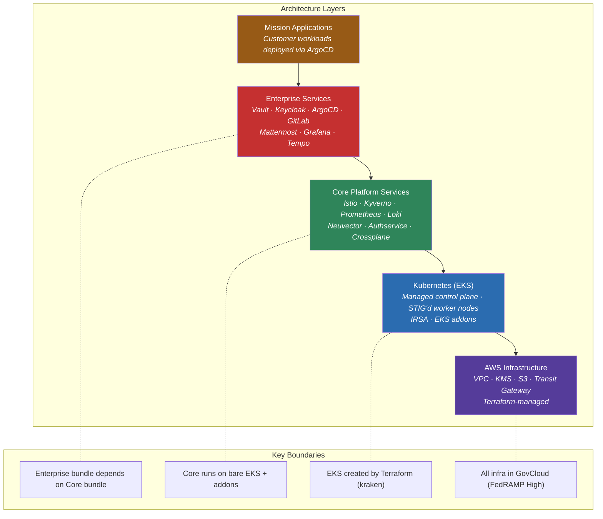


### Why This Matters


The layered approach means I can upgrade Istio without touching Vault, roll out a new Keycloak version without rebuilding infrastructure, or spin up an entirely new environment by pointing the pipeline at a new Kapitan target. Each layer is independently versionable, testable, and deployable. This is what makes the platform maintainable at scale despite the complexity.


---


## 3. Repository Ecosystem


The platform spans 10+ repositories, each with a specific responsibility. No single repo does everything — the separation is deliberate and reflects the architecture layers.


| Repository | What It Owns | Key Output |
|------------|-------------|------------|
| **jcrs-cac** | Configuration-as-Code (Kapitan) | Compiled deployment scripts + config YAML |
| **leviathan** | Package factory (Zarf/UDS) | Zarf packages + UDS bundles uploaded to S3 |
| **release-automation** | CI/CD pipeline orchestration | End-to-end deployed environments |
| **kraken** | Infrastructure-as-Code (Terraform) | EKS clusters, VPC, IAM, security groups |
| **jcrs-e** | Deployment container image | Docker image containing all tools (kubectl, helm, zarf, terraform, kapitan) |
| **jcrs-e-docs** | Customer-facing documentation | Architecture docs, onboarding guides, networking diagrams |
| **jcrse-zarf-init** | Custom Zarf init package | In-cluster container registry + Zarf agent |
| **image-builder** | STIG'd AMI builder | RHEL 8/9 AMIs with ~90% DISA STIG compliance |
| **jcrs-profile-operator** | K8s operator for deployment profiles | Profile lifecycle management |
| **team-automation** | Automation bots | MR validation, registry cleanup, Renovate dependency updates |


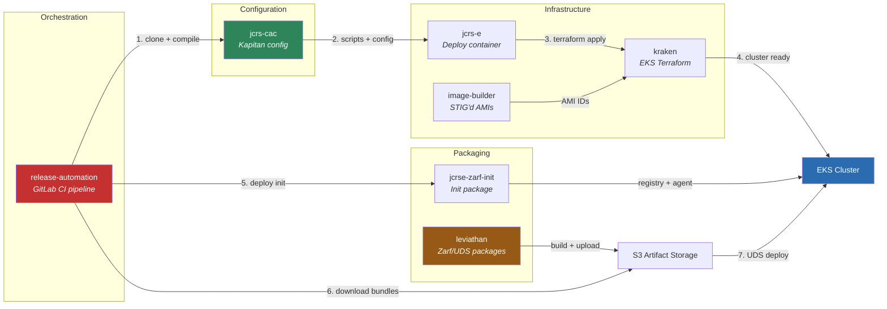


### Data Flow


1. **Leviathan** builds Zarf packages and UDS bundles → uploads to **S3**
2. **jcrs-cac** defines environment-specific config → **Kapitan** compiles to deployment scripts
3. **release-automation** pipeline clones jcrs-cac, runs Kapitan, executes compiled scripts
4. Scripts invoke **kraken** (Terraform) for infrastructure, download bundles from **S3**, deploy with **UDS/Zarf**


### Why This Matters


Every repo has a single responsibility. Configuration changes don't require rebuilding packages. Infrastructure changes don't require recompiling config. Package version bumps don't require infrastructure changes. This separation means different engineers can work on different layers concurrently, and the blast radius of any change is contained to its layer. I review MRs across all of these repos and ensure architectural consistency.


---


## 4. Deployment Tools Hierarchy


The tooling stack is layered, and **each layer exists because of a specific constraint**.


| Layer | Tool | What It Solves |
|-------|------|---------------|
| 5 | **Kapitan** | One template → many environments. DRY config via class inheritance + Jinja2 |
| 4 | **UDS** (Unicorn Delivery Service) | Orchestrate 20+ Zarf packages in correct dependency order |
| 3 | **Zarf** | Bundle Helm charts + container images for air-gapped deployment |
| 2 | **Helm** | Template Kubernetes manifests with variables and conditionals |
| 1 | **kubectl** | Apply raw YAML to the Kubernetes API — everything ends up here |


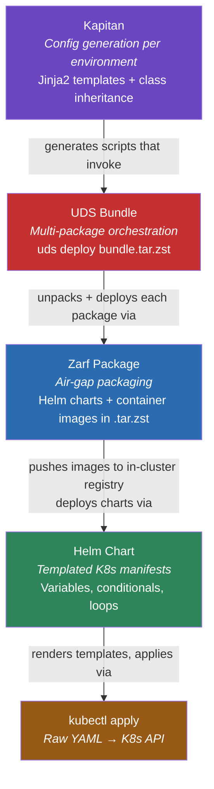


### Why This Matters


- **Air-gap is the fundamental constraint.** Clusters can't reach the internet, so Zarf pre-bundles every container image and Helm chart into a self-contained `.tar.zst` archive. At deploy time, Zarf pushes images to an in-cluster registry at `127.0.0.1:31999`.
- **UDS solves dependency ordering.** We deploy 20+ packages and they have ordering requirements — CRDs must exist before resources that use them, the service mesh must be up before services register with it. UDS handles this sequencing.
- **Kapitan prevents config drift.** Without it, we'd have separate shell scripts and YAML files per environment, maintained by hand. With Kapitan, one Jinja2 template compiles to environment-specific output — change the template once, all environments update.
- **Big Bang** is the DoD's reference architecture for hardened Kubernetes. Our Zarf packages wrap Big Bang's Helm charts with Iron Bank images. The Big Bang umbrella chart creates FluxCD resources that handle in-cluster reconciliation.


---


## 5. Cluster Stack Layers


Every cluster follows the same layered architecture. This is what I'd draw on a whiteboard when asked "walk me through your platform."


```mermaid
graph TB
   subgraph L5["Layer 5: Mission Applications"]
       APP1["Mission Apps<br/>JAWS, CyberAlly, OpenCTI"]
       APP2["Customer Services"]
   end


   subgraph L4["Layer 4: Enterprise Services — enterprise bundle"]
       ARGO["ArgoCD<br/><i>GitOps CD</i>"]
       VAULT["Vault<br/><i>Secrets (Raft HA)</i>"]
       KC["Keycloak<br/><i>Identity/SSO</i>"]
       MM["Mattermost<br/><i>Chat/ChatOps</i>"]
       VIZ["Grafana · Kiali · Tempo<br/><i>Visualization</i>"]
       GL["GitLab · Nexus<br/><i>DevOps lifecycle</i>"]
   end


   subgraph L3["Layer 3: Core Platform — core bundle"]
       ISTIO["Istio<br/><i>Service mesh + mTLS</i>"]
       PROM["Prometheus + Alloy<br/><i>Metrics + log collection</i>"]
       LOKI["Loki<br/><i>Log aggregation</i>"]
       KYV["Kyverno<br/><i>Policy engine</i>"]
       NEU["Neuvector<br/><i>Container security</i>"]
       AUTH["Authservice<br/><i>SSO proxy</i>"]
       CERT["Cert-Manager<br/><i>TLS certificates</i>"]
       XP["Crossplane<br/><i>Cloud resources</i>"]
   end


   subgraph L2["Layer 2: Kubernetes — kraken"]
       EKS["Amazon EKS<br/><i>Managed control plane</i>"]
       ADDONS["EKS Addons<br/><i>vpc-cni · coredns · efs-csi</i>"]
       IRSA["IRSA<br/><i>IAM Roles for Service Accounts</i>"]
       ASG["Cluster Autoscaler"]
   end


   subgraph L1["Layer 1: AWS Infrastructure — Terraform"]
       VPC["VPC + Private Subnets"]
       KMS["KMS Encryption"]
       S3["S3 Storage"]
       TGW["Transit Gateway"]
       RDS["RDS (via Crossplane)"]
   end


   subgraph L0["Layer 0: AWS GovCloud"]
       GOV["GovCloud Account<br/><i>FedRAMP High · us-gov-west-1</i>"]
   end


   L5 --> L4
   L4 --> L3
   L3 --> L2
   L2 --> L1
   L1 --> L0


   style L5 fill:#975a16,color:#fff
   style L4 fill:#c53030,color:#fff
   style L3 fill:#2f855a,color:#fff
   style L2 fill:#2b6cb0,color:#fff
   style L1 fill:#553c9a,color:#fff
   style L0 fill:#1a365d,color:#fff
```


### Layer Details


**Layer 0 — AWS GovCloud:** FedRAMP High authorized. Region `us-gov-west-1`. All resources encrypted with KMS.


**Layer 1 — Infrastructure (Terraform):** VPC with private subnets, KMS keys for encryption at rest, S3 for artifact storage, Transit Gateway connecting cluster VPCs to the parent organization's network. Managed by the **kraken** repo.


**Layer 2 — Kubernetes (EKS):** Managed EKS control plane, worker node groups running on STIG'd AMIs (RHEL 8/9), EKS addons (vpc-cni, coredns, efs-csi), Cluster Autoscaler. **IRSA is mandatory** — we lock down IMDSv2 with hop count = 1, which blocks all pod-level instance metadata access. Every pod must use IAM Roles for Service Accounts.


**Layer 3 — Core Platform (core bundle):** Istio service mesh with automatic mTLS, Kyverno for admission policy enforcement, Prometheus + Alloy + Loki for full observability stack, Neuvector for runtime container security, Authservice for SSO proxy, Cert-Manager + Trust-Manager for certificate lifecycle, Crossplane for cloud resource management, external-dns, aws-load-balancer-controller.


**Layer 4 — Enterprise Services (enterprise bundle):** ArgoCD for GitOps app delivery, Vault for secrets management (Raft HA, multi-tenant, Crossplane-automated policies), Keycloak for identity/SSO (OIDC, MFA, CAC auth, Crossplane-provisioned RDS backend), Mattermost for ChatOps, GitLab + Nexus for DevOps lifecycle, Grafana/Kiali/Tempo for visualization and tracing, Crossplane claims (RDS for Keycloak, Vault policies for tenants).


**Layer 5 — Mission Apps:** Customer workloads deployed via ArgoCD after security approval. Teams get the full platform (mesh, identity, secrets, observability) without managing any of it.


### Why This Matters


The layered model means mission app teams don't think about infrastructure, networking, or security plumbing — they get it all from the platform. When something breaks at Layer 3 (say, an Istio upgrade), the blast radius is contained and I can debug it without touching Layer 4 or 5. The clean layer boundaries also make it possible to version and release each layer independently.


---


## 6. Configuration-as-Code (Kapitan)


### The Problem Kapitan Solves


We have multiple environments (dev, staging-left, staging-right, production) plus per-developer ephemeral clusters. Each needs slightly different config (AWS account, domain, resource sizes, bundle versions) but the same overall structure. Without Kapitan, we'd maintain separate scripts and YAML files per environment — a recipe for drift and human error.


### Inventory Structure


```
jcrs-cac/
├── inventory/
│   ├── targets/                   ← Entry point: one file per cluster
│   │   ├── developers.yml             (shared dev cluster)
│   │   ├── release-test.yml           (release validation)
│   │   └── csanchez-vault-test.yml    (ephemeral test cluster)
│   └── classes/                   ← Reusable config modules
│       ├── defaults/              ← Service defaults (bb-vault.yml, bb-keycloak.yml, ...)
│       ├── environments/          ← AWS account/region settings
│       ├── releases/              ← Bundle version pins (latest.yml)
│       ├── outputs/               ← What files Kapitan generates
│       ├── persistent/            ← Persistent cluster settings (Vault HA, Keycloak RDS)
│       └── jcrse-common.yml       ← Aggregator: includes 20+ default classes
├── templates/                     ← Jinja2 templates → shell scripts + YAML
└── compiled/                      ← Output (one folder per target, not committed)
```


### CaC / IaC Separation


This repo is **configuration only** — zero Terraform, zero raw manifests. This was a deliberate architectural decision based on lessons from the legacy platform (Taurus). When we deploy to classified (high-side) environments, configuration overrides on the high side can't flow back down to the low side. If IaC and CaC are tightly coupled in one repo, this becomes extremely painful. Keeping them separate means:
- Infrastructure scripts live in **kraken** and **jcrs-e**
- Kubernetes manifests live in **leviathan** (as Zarf packages)
- Configuration and environment-specific values live in **jcrs-cac**


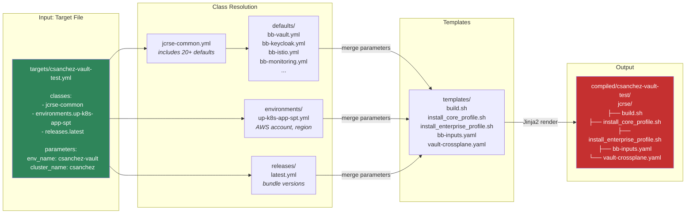


### How Compilation Works


1. **Read target** — loads `inventory/targets/<name>.yml`
2. **Resolve classes** — follows `classes:` list, recursively merging all parameters (20+ default classes)
3. **Merge parameters** — later classes override earlier; target params have highest priority
4. **Render templates** — Jinja2 substitution: `{{ i.release_info.bundle_version }}` → `v0.9.27-test`
5. **Write output** — compiled scripts and YAML files in `compiled/<target>/jcrse/`


### Why This Matters


Kapitan's class inheritance model is what makes the platform manageable. A new developer can create a target file in 5 lines (reference the common class, set an environment, pin a release version, set a cluster name) and get a fully compiled set of deployment scripts. When I need to change a Vault default across all environments, I change one file (`defaults/bb-vault.yml`) and every target picks it up. The alternative — maintaining per-environment scripts by hand — simply doesn't scale.


---


## 7. CI/CD Pipeline


### 7-Stage Pipeline Architecture


The release-automation repo defines a GitLab CI pipeline with **sequential stages**. Stages 2–4 use a **two-jobs-per-stage pattern**: one deployment job (toggled by a boolean variable) and one verification job (always runs). This design means you can deploy only the layers you need and verify everything is healthy before proceeding.


```mermaid
sequenceDiagram
   participant DEV as Developer
   participant GL as GitLab CI
   participant CAC as jcrs-cac
   participant KAP as Kapitan
   participant TF as Terraform (kraken)
   participant ZARF as Zarf/UDS
   participant S3 as S3 Artifacts
   participant EKS as EKS Cluster


   DEV->>GL: Trigger pipeline with toggle variables


   rect rgb(50, 50, 80)
       Note over GL,KAP: Stage 1: PREP
       GL->>CAC: Clone config repo (branch specified by variable)
       GL->>KAP: kapitan compile -t <target>
       KAP-->>GL: Compiled scripts + YAML
   end


   rect rgb(80, 50, 50)
       Note over GL,TF: Stage 2: INFRASTRUCTURE
       GL->>TF: build_infrastructure.sh
       TF-->>GL: VPC, subnets, IAM, KMS, S3
   end


   rect rgb(50, 80, 50)
       Note over GL,EKS: Stage 3: CLUSTER
       GL->>TF: build.sh (kraken Terraform)
       TF-->>EKS: EKS cluster + node groups on STIG'd AMIs
   end


   rect rgb(80, 80, 50)
       Note over GL,EKS: Stage 4: ZARF INIT
       GL->>S3: Download zarf-init package
       GL->>ZARF: zarf_initialize.sh
       ZARF-->>EKS: In-cluster registry + Gitea + Zarf agent
   end


   rect rgb(50, 80, 80)
       Note over GL,EKS: Stage 5: CORE PLATFORM
       GL->>S3: Download core bundle
       GL->>ZARF: install_core_profile.sh
       ZARF-->>EKS: Istio, Kyverno, Prometheus, Neuvector, Crossplane
   end


   rect rgb(80, 50, 80)
       Note over GL,EKS: Stage 6: ENTERPRISE SERVICES
       GL->>S3: Download enterprise bundle
       GL->>ZARF: install_enterprise_profile.sh
       ZARF-->>EKS: Vault, Keycloak, ArgoCD + Crossplane claims
   end


   rect rgb(60, 60, 60)
       Note over GL,EKS: Stage 7: DESTROY (after TTL expires)
       GL->>TF: destroy.sh
       TF-->>EKS: Cluster terminated
   end
```


### Pipeline Toggle Variables


| Variable | Default | What It Controls |
|----------|---------|-----------------|
| `DEPLOY_INFRASTRUCTURE` | `false` | VPC, IAM, S3, KMS via Terraform |
| `DEPLOY_CLUSTER` | `false` | EKS cluster creation via kraken |
| `DEPLOY_ZARF` | `false` | Zarf initialization (in-cluster registry) |
| `DEPLOY_JCRS_CORE` | `false` | Core platform bundle deployment |
| `DEPLOY_UPMS_BUNDLE` | `false` | Enterprise services bundle deployment |
| `JCRS_CAC_VERSION` | `main` | Branch/tag of config repo |
| `JCRS_CAC_TARGET` | `example` | Kapitan target to compile |
| `AUTO_DELETE_IN` | `8 hours` | Cluster TTL (or `never` for persistent) |
| `IS_PERSISTENT` | `false` | Enable Vault HA / Keycloak RDS |


### Why This Matters


- **Toggle-based deployment** is the key pattern. Need to update only Vault? Set `DEPLOY_UPMS_BUNDLE=true`, everything else `false`. The pipeline skips infrastructure and core, deploys only the enterprise bundle. This saves 45+ minutes on a full pipeline run.
- **Verification jobs always run** regardless of whether the deploy job ran. This catches configuration drift — if someone manually changed something in the cluster, verification detects it.
- **Idempotent stages** — every stage can be safely rerun. Terraform won't recreate existing resources, Zarf won't redeploy unchanged packages. This is critical for reliability.
- **Ephemeral clusters auto-delete** after TTL. Developers spin up test clusters that self-destruct in 8 hours. Persistent clusters (staging, production) use `never`. This keeps cloud costs under control.


---


## 8. Package & Bundle Build System


### The Build Pipeline (Leviathan)


Leviathan is the **package factory**. It defines every Zarf package and UDS bundle, builds them via GitLab CI's parallel matrix, and uploads artifacts to S3. The pipeline and deployment are decoupled — builds happen on an internet-connected runner, deployments happen in air-gapped environments.


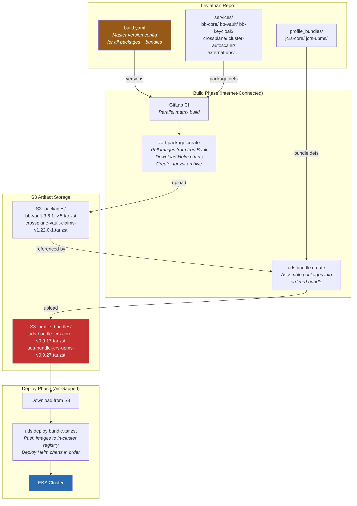


### Version Flow


```
build.yaml (defines what gets built and at what version)
   ↓
Zarf packages built → uploaded to S3
   ↓
UDS bundles assembled from specific package versions → uploaded to S3
   ↓
jcrs-cac/inventory/classes/releases/latest.yml (pins what gets deployed)
   ↓
Kapitan compiles → deployment scripts reference exact bundle versions
```


### Bundle Architecture


| Order | Bundle | Contents | Depends On |
|-------|--------|----------|------------|
| 1st | **jcrs-core** (core bundle) | Istio, monitoring, cert-manager, Kyverno, Crossplane, Neuvector | None — this is the foundation |
| 2nd | **jcrs-upms** (enterprise bundle) | Keycloak, Vault, ArgoCD, Crossplane claims, visualization | Core bundle must be deployed first |


The core bundle **must** be deployed before the enterprise bundle. Core provides the service mesh, certificate infrastructure, and Crossplane providers that enterprise services depend on.


### Why This Matters


- **build.yaml is the single source of truth** for every package version. Version bumping is a one-file change with cascading effects — bump a package version in build.yaml, rebuild, and the new version flows through to bundles, then to deployment config.
- **Build and deploy are fully decoupled.** Packages are built once on an internet-connected runner and can be deployed to any number of air-gapped clusters. The S3 bucket acts as the artifact bridge.
- **Two package types exist**: BB-generated packages (created from the Big Bang umbrella chart using `generate-big-bang-zarf-package`) and custom Zarf packages (with explicit `zarf.yaml`). Understanding this distinction matters when troubleshooting or adding new services.


---


## 9. Networking Architecture


The platform handles four distinct traffic patterns. The network design reflects the security requirements of a DoD environment — defense in depth at every hop.


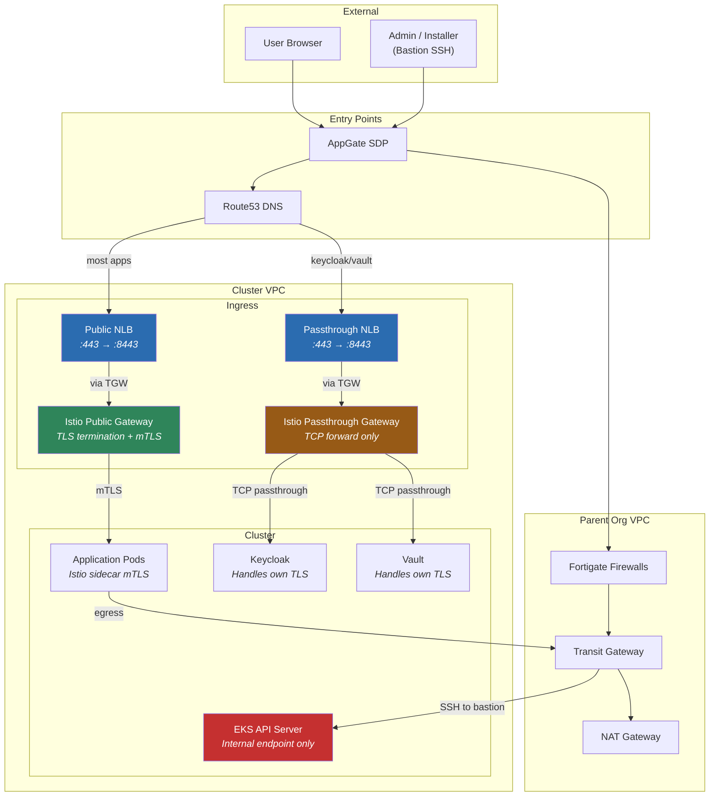


### Four Traffic Patterns


**1. Public Application Ingress (most services):**
Route53 → Public NLB (:443) → worker node :8443 → Istio Public Gateway → **TLS terminated, re-encrypted as mTLS** through the mesh → istio-proxy sidecar → app container.


**2. Passthrough Ingress (Keycloak, Vault):**
Route53 → Passthrough NLB (:443) → worker node :8443 → Istio Passthrough Gateway → **TCP forwarded directly** (no TLS termination) → app pod handles its own TLS. This is required because Keycloak and Vault need to handle client certificate authentication / PKI directly.


**3. Kubernetes API Access:**
Internal endpoint only — **never exposed to the internet**. Access is through bastion host: AppGate → parent org → Transit Gateway → bastion SSH → `kubectl` to internal EKS API. Engineers use `sshuttle` for routing.


**4. Cluster Egress:**
Cluster VPC → Transit Gateway → parent org VPC → NAT Gateway → internet. Each cluster sits on its own VPC with its own CIDR; egress routes through a shared Transit Gateway.


### IMDS and IRSA Security


We lock down **IMDSv2** with hop count = 1 on all worker node launch templates. This blocks pod-level access to instance metadata, which means **every pod must use IRSA** (IAM Roles for Service Accounts) for any AWS API access — including cluster services like the node join agent, EBS CSI driver, EFS CSI driver, cluster autoscaler, load balancer controller, and external-dns.


### Why This Matters


The two-gateway pattern (public vs passthrough) is an architectural decision I can explain in detail. Most services get TLS terminated at the mesh gateway, which gives us centralized certificate management and uniform mTLS. But Keycloak and Vault need end-to-end TLS because they support direct client certificate authentication — if we terminated TLS at the gateway, we'd lose the client cert. This is a security tradeoff that shows understanding of both networking and application requirements.


---


## 10. Security Architecture


### Defense-in-Depth


Security isn't a single layer — it's baked into every level of the stack.


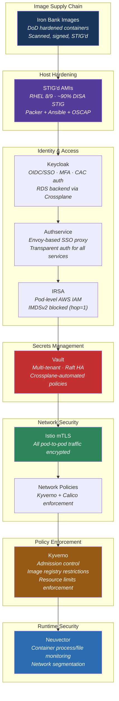


### Security Components


| Component | What It Does | Key Detail |
|-----------|-------------|------------|
| **Iron Bank** | Hardened container images | All images from `registry1.dso.mil/ironbank/` — DoD-scanned, signed, STIG'd |
| **STIG'd AMIs** | Hardened node OS | RHEL 8/9 via Packer + Ansible, ~90% DISA STIG compliance, OSCAP report at build time |
| **Keycloak** | Identity provider | OIDC/SSO, MFA, CAC smart card auth. RDS backend provisioned by Crossplane |
| **Authservice** | SSO proxy | Envoy-based transparent auth injected via Istio — services don't implement auth themselves |
| **Vault** | Secrets management | Multi-tenant with per-team policies automated via Crossplane XRDs. Raft HA for persistent clusters |
| **Istio** | Service mesh | Automatic mTLS on all pod-to-pod traffic. Zero-trust networking |
| **Kyverno** | Policy engine | Admission control at the API server: blocks non-Iron Bank images, enforces resource limits and labels |
| **Neuvector** | Runtime security | Container process/file monitoring, vulnerability scanning, network micro-segmentation |
| **IRSA** | Pod IAM roles | IMDSv2 locked down (hop=1). Every pod authenticates to AWS via service account, not instance profile |


### Why This Matters


This is a **zero-trust architecture**. Istio mTLS means every service-to-service call is encrypted and mutually authenticated — even within the same cluster. Kyverno blocks any image not from Iron Bank at the admission controller level — it never even gets scheduled. Vault ensures secrets are never stored in Git. The STIG'd AMIs mean the host OS meets DoD baselines before a single container runs. When I talk about security, I can trace the trust chain from the container image provenance (Iron Bank) through the host OS (STIG'd AMI) through the network (Istio mTLS) through access control (Keycloak + Authservice) through secrets (Vault) to runtime monitoring (Neuvector).


---


## 11. Crossplane & Infrastructure Automation


### The Problem


Without Crossplane, every time a new application team needs a Vault policy or an RDS database, the platform team has to manually provision it. This doesn't scale when you have multiple tenants.


### How It Works


Crossplane extends Kubernetes so that cloud resources (Vault policies, RDS instances, S3 buckets) can be managed as Kubernetes custom resources. Teams declare what they need in YAML, and Crossplane reconciles it.


| Crossplane Concept | What It Does | Example |
|--------------------|-------------|---------|
| **XRD** (CompositeResourceDefinition) | Defines a new custom resource type | Creates a `VaultPolicy` kind in the K8s API |
| **Composition** | Maps the custom resource to actual cloud API calls | VaultPolicy claim → Vault HTTP API `POST /v1/sys/policies` |
| **ProviderConfig** | Auth config for the cloud provider | Vault token or AWS IRSA credentials |
| **Claim** | The resource request a team creates | "Create a policy named 'admin' in Vault" |


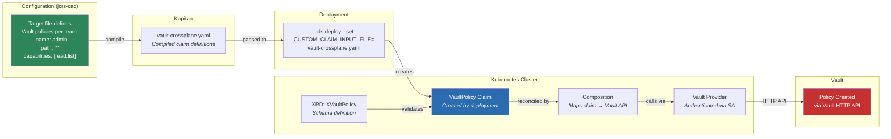


### Use Cases


| Use Case | Mechanism | What Gets Created |
|----------|-----------|------------------|
| **Vault policies** | XVaultPolicy XRD + Composition | ACL policies for each tenant team — automated per-cluster |
| **Keycloak database** | Crossplane AWS provider + Claims | RDS PostgreSQL instance as Keycloak's backend |
| **S3 buckets** | Crossplane AWS provider + Claims | Per-team artifact storage buckets |


### Why This Matters


Crossplane turns infrastructure provisioning into a Kubernetes-native, declarative, GitOps-compatible workflow. Teams don't need AWS console access or Vault admin privileges. They define what they need in their Kapitan target, the pipeline compiles it into claim YAML, and Crossplane reconciles it. The DeploymentRuntimeConfig handles TLS certificate mounting so the Crossplane provider can securely communicate with Vault. This is a key part of our multi-tenancy story — platform self-service at scale.


---


## 12. Environment Topology & GitOps Lifecycle


### Environment Promotion


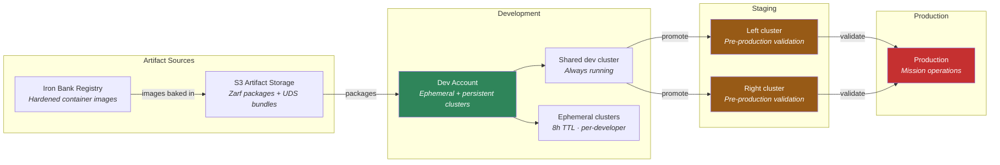


### Environment Types


| Environment | Purpose | Cluster Lifetime |
|-------------|---------|-----------------|
| **Development** | Feature development, integration testing | Ephemeral (8h auto-delete) + persistent shared cluster |
| **Staging Left/Right** | Pre-production validation with full stack | Persistent |
| **Production** | Mission operations | Persistent (Vault HA, Keycloak RDS) |


### Release Cadence


- **Friday:** Release kickoff — tag repos, trigger package builds
- **Monday:** Deploy to staging (left/right) for validation
- **Tuesday:** Promote to production


### End-to-End GitOps Flow


This is how a change flows from a developer's keyboard to a running cluster.


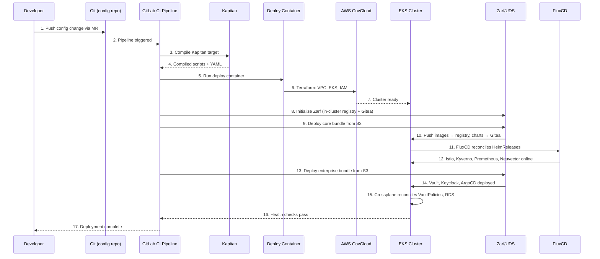


### In-Cluster GitOps (FluxCD)


Once Zarf deploys packages, **FluxCD takes over** inside the cluster for continuous reconciliation:


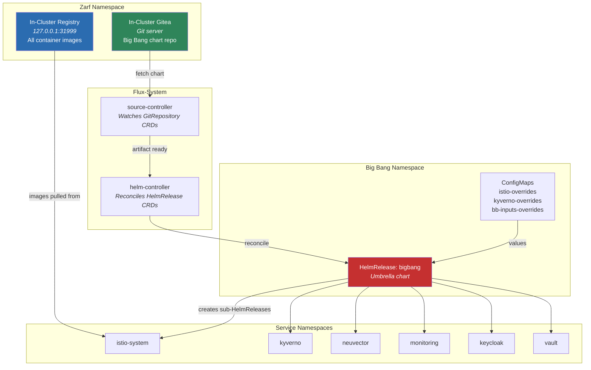


### Key Architectural Insight


The Big Bang umbrella chart **does not directly deploy applications**. It creates FluxCD resources (GitRepository + HelmRelease) for each component. FluxCD then independently reconciles each one. This gives us:
- **Selective upgrades** — update Istio without touching Vault
- **Failure isolation** — if Neuvector fails to reconcile, Keycloak is unaffected
- **Drift detection** — if someone manually changes something in-cluster, FluxCD reverts it


### Configuration Override Precedence


Values merge in this order (later overrides earlier):
1. Big Bang chart defaults
2. Package-level overrides (`gen-*.yaml` — baked into Zarf packages at build time)
3. Deploy-time overrides (`bb-inputs.yaml` — compiled by Kapitan from environment config)
4. Individual package ConfigMaps/Secrets


### Why This Matters


GitOps means **every environment change starts as a merge request**. There's a full audit trail. The pipeline is the only path to production — no SSH-and-fix. Inside the cluster, FluxCD provides continuous reconciliation, so the cluster always converges to the declared state. The in-cluster registry and Gitea enable all of this to work in air-gapped environments where there's no access to external registries or repos. Understanding this dual-loop (GitLab CI outer loop + FluxCD inner loop) is key to explaining the platform's reliability model.


---


## 13. Quick Reference


### Technology Stack


| Category | Components |
|----------|-----------|
| **Cloud** | AWS GovCloud, EKS, S3, KMS, RDS, Route53, IAM, VPC, Transit Gateway |
| **Infrastructure-as-Code** | Terraform, Packer, Ansible |
| **Configuration Management** | Kapitan (Jinja2 + YAML class inheritance) |
| **Packaging** | Zarf (air-gap), UDS (orchestration), Helm (templating) |
| **GitOps** | FluxCD (in-cluster reconciliation), ArgoCD (app delivery) |
| **Service Mesh** | Istio (automatic mTLS, traffic management, ingress gateways) |
| **Identity** | Keycloak (OIDC/SSO/MFA/CAC), Authservice (Envoy SSO proxy) |
| **Secrets** | HashiCorp Vault (Raft HA, multi-tenant, Crossplane-automated) |
| **Policy** | Kyverno (Kubernetes admission control) |
| **Security** | Neuvector (runtime), Iron Bank (images), STIG'd AMIs (hosts) |
| **Observability** | Prometheus, Grafana, Loki, Alloy, Tempo, Kiali |
| **Cloud Resources** | Crossplane (XRDs, Compositions, Claims) |
| **CI/CD** | GitLab CI/CD (7-stage release pipeline) |
| **Collaboration** | Mattermost, GitLab |


### Repository One-Liners


| Repo | What It Does |
|------|-------------|
| `jcrs-cac` | Kapitan config → compiled deployment scripts per environment |
| `leviathan` | Builds Zarf packages + UDS bundles → uploads to S3 |
| `release-automation` | 7-stage GitLab CI pipeline that orchestrates everything |
| `kraken` | Terraform modules for EKS + VPC + IAM |
| `jcrs-e` | Docker image with all deployment tools (kubectl, helm, zarf, terraform, kapitan) |
| `jcrs-e-docs` | Customer-facing architecture, networking, and onboarding documentation |
| `jcrse-zarf-init` | Custom Zarf init package (in-cluster registry + agent) |
| `image-builder` | STIG'd RHEL 8/9 AMIs via Packer + Ansible (~90% DISA STIG) |
| `team-automation` | Automation bots for MR validation, registry cleanup, Renovate |


### Pipeline Stages at a Glance


```
1. PREP         → Clone config repo, compile Kapitan target
2. INFRA        → Terraform: VPC, IAM, S3, KMS
3. CLUSTER      → Terraform (kraken): EKS + STIG'd node groups
4. ZARF INIT    → In-cluster registry + Gitea + Zarf agent
5. CORE         → UDS deploy: Istio, Kyverno, Prometheus, Neuvector, Crossplane
6. ENTERPRISE   → UDS deploy: Vault, Keycloak, ArgoCD, Crossplane claims
7. DESTROY      → Terraform destroy (after TTL expires)
```


---


*All Mermaid diagrams render in VS Code (Mermaid extension), GitLab markdown preview, or [mermaid.live](https://mermaid.live).*


